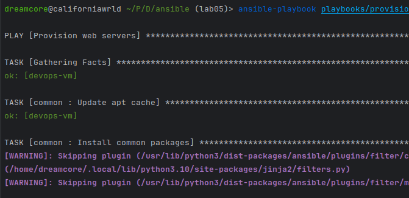
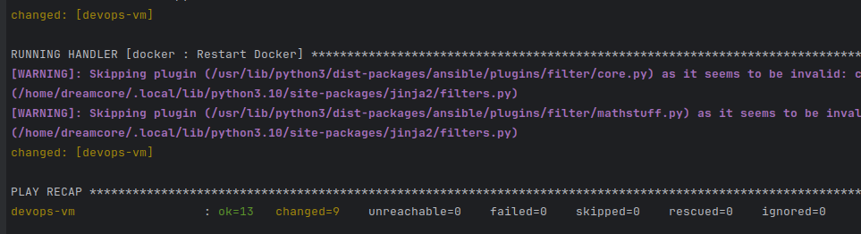
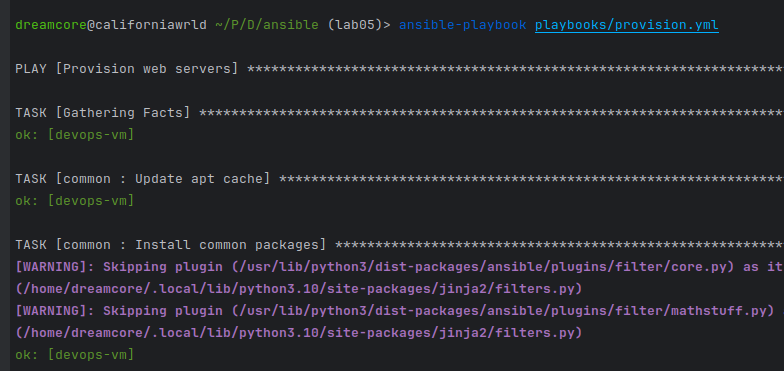
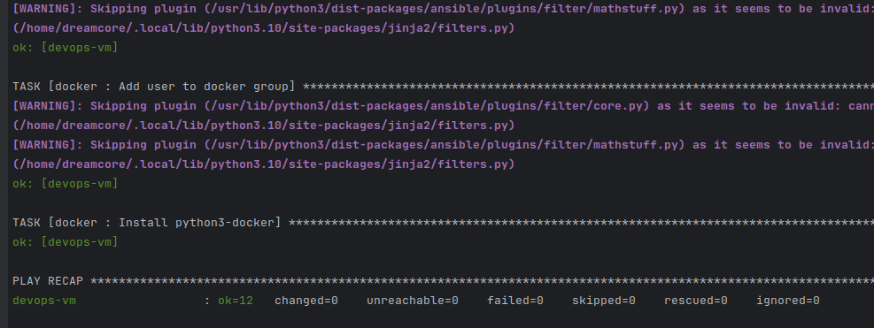
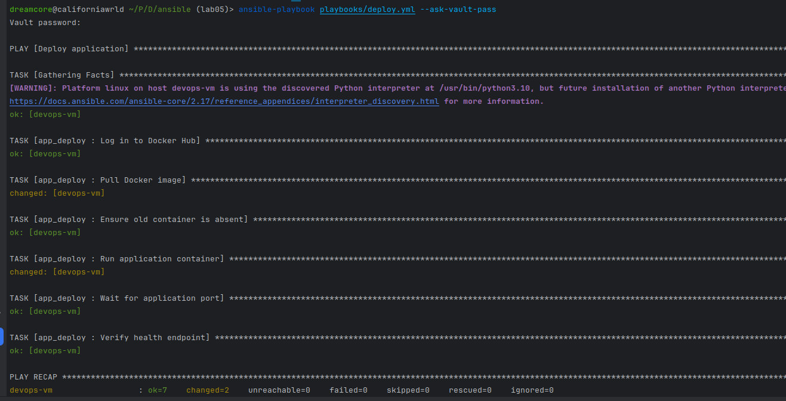
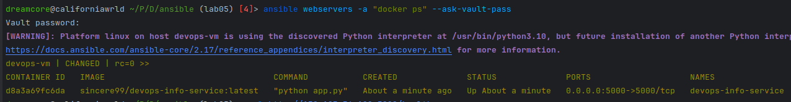
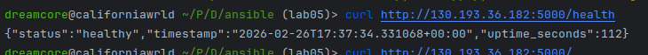
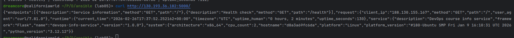

## Architecture overview
- ansible [core 2.17.14]
- python 3.10.12
- target VM OS and version:
  - OS: Ubuntu 22.04 LTS
  - Hostname: devops-vm
  - Docker installed via Ansible role

### Role structure
```
ansible/
├── inventory/
│   ├── hosts.ini
│   └── group_vars/
│       └── all.yml (Vault encrypted)
├── roles/
│   ├── common/
│   ├── docker/
│   └── app_deploy/
├── playbooks/
│   ├── provision.yml
│   └── deploy.yml
```

### Why roles instead of monolithic playbooks?
Roles provide:
- Modular structure
- Separation of concerns 
- Reusability
- Better maintainability
- Clear dependency management
- Monolithic playbooks become hard to scale and maintain in production environments.

## Roles Documentation
### Role: common
- Purpose:
  - Performs base system configuration:
  - Updates apt cache
  - Installs base packages
  - Configures system settings
- Variables
  - No critical external variables required.
- Handlers 
  - Example: Restart services if configuration changes
- Dependencies:
  - No dependencies.

### Role: docker
- Purpose:
  - Installs and configures Docker:
  - Adds Docker repository
  - Installs Docker Engine
  - Enables Docker service

- Variables:
  - docker_users (optional)
  - docker_package_name

- Handlers:
  - Restart Docker service (if configuration changes)

- Dependencies:
  - Depends on common role.

### Role: app_deploy
- Purpose:
  - Deploys application container:
  - Docker login
  - Pull image
  - Remove old container
  - Run container
  - Perform health check

- Variables:
  - Defined in Vault (inventory/group_vars/all.yml):
  - dockerhub_username
  - dockerhub_password
  - app_name
  - docker_image
  - docker_image_tag
  - app_port
  - app_container_name

- Handlers:
  - Optional:
  - Restart container if configuration changes

- Dependencies:
  - Depends on docker role.

## Idempotency Demonstration
### First run
```
dreamcore@californiawrld ~/P/D/ansible (lab05)> ansible-playbook playbooks/provision.yml 

PLAY [Provision web servers] ********************************************************************************************************************************************************************************************

TASK [Gathering Facts] **************************************************************************************************************************************************************************************************
ok: [devops-vm]

TASK [common : Update apt cache] ****************************************************************************************************************************************************************************************
ok: [devops-vm]

TASK [common : Install common packages] *********************************************************************************************************************************************************************************
[WARNING]: Skipping plugin (/usr/lib/python3/dist-packages/ansible/plugins/filter/core.py) as it seems to be invalid: cannot import name 'environmentfilter' from 'jinja2.filters'
(/home/dreamcore/.local/lib/python3.10/site-packages/jinja2/filters.py)
[WARNING]: Skipping plugin (/usr/lib/python3/dist-packages/ansible/plugins/filter/mathstuff.py) as it seems to be invalid: cannot import name 'environmentfilter' from 'jinja2.filters'
(/home/dreamcore/.local/lib/python3.10/site-packages/jinja2/filters.py)
changed: [devops-vm]

TASK [common : Set timezone] ********************************************************************************************************************************************************************************************
[WARNING]: Skipping plugin (/usr/lib/python3/dist-packages/ansible/plugins/filter/core.py) as it seems to be invalid: cannot import name 'environmentfilter' from 'jinja2.filters'
(/home/dreamcore/.local/lib/python3.10/site-packages/jinja2/filters.py)
[WARNING]: Skipping plugin (/usr/lib/python3/dist-packages/ansible/plugins/filter/mathstuff.py) as it seems to be invalid: cannot import name 'environmentfilter' from 'jinja2.filters'
(/home/dreamcore/.local/lib/python3.10/site-packages/jinja2/filters.py)
changed: [devops-vm]

TASK [docker : Remove old Docker versions] ******************************************************************************************************************************************************************************
ok: [devops-vm]

TASK [docker : Add Docker GPG key] **************************************************************************************************************************************************************************************
changed: [devops-vm]

TASK [docker : Add Docker repository] ***********************************************************************************************************************************************************************************
[WARNING]: Skipping plugin (/usr/lib/python3/dist-packages/ansible/plugins/filter/core.py) as it seems to be invalid: cannot import name 'environmentfilter' from 'jinja2.filters'
(/home/dreamcore/.local/lib/python3.10/site-packages/jinja2/filters.py)
[WARNING]: Skipping plugin (/usr/lib/python3/dist-packages/ansible/plugins/filter/mathstuff.py) as it seems to be invalid: cannot import name 'environmentfilter' from 'jinja2.filters'
(/home/dreamcore/.local/lib/python3.10/site-packages/jinja2/filters.py)
changed: [devops-vm]

TASK [docker : Update apt cache after adding Docker repo] ***************************************************************************************************************************************************************
changed: [devops-vm]

TASK [docker : Install Docker packages] *********************************************************************************************************************************************************************************
[WARNING]: Skipping plugin (/usr/lib/python3/dist-packages/ansible/plugins/filter/core.py) as it seems to be invalid: cannot import name 'environmentfilter' from 'jinja2.filters'
(/home/dreamcore/.local/lib/python3.10/site-packages/jinja2/filters.py)
[WARNING]: Skipping plugin (/usr/lib/python3/dist-packages/ansible/plugins/filter/mathstuff.py) as it seems to be invalid: cannot import name 'environmentfilter' from 'jinja2.filters'
(/home/dreamcore/.local/lib/python3.10/site-packages/jinja2/filters.py)
changed: [devops-vm]

TASK [docker : Ensure Docker service is running and enabled] ************************************************************************************************************************************************************
[WARNING]: Skipping plugin (/usr/lib/python3/dist-packages/ansible/plugins/filter/core.py) as it seems to be invalid: cannot import name 'environmentfilter' from 'jinja2.filters'
(/home/dreamcore/.local/lib/python3.10/site-packages/jinja2/filters.py)
[WARNING]: Skipping plugin (/usr/lib/python3/dist-packages/ansible/plugins/filter/mathstuff.py) as it seems to be invalid: cannot import name 'environmentfilter' from 'jinja2.filters'
(/home/dreamcore/.local/lib/python3.10/site-packages/jinja2/filters.py)
ok: [devops-vm]

TASK [docker : Add user to docker group] ********************************************************************************************************************************************************************************
[WARNING]: Skipping plugin (/usr/lib/python3/dist-packages/ansible/plugins/filter/core.py) as it seems to be invalid: cannot import name 'environmentfilter' from 'jinja2.filters'
(/home/dreamcore/.local/lib/python3.10/site-packages/jinja2/filters.py)
[WARNING]: Skipping plugin (/usr/lib/python3/dist-packages/ansible/plugins/filter/mathstuff.py) as it seems to be invalid: cannot import name 'environmentfilter' from 'jinja2.filters'
(/home/dreamcore/.local/lib/python3.10/site-packages/jinja2/filters.py)
changed: [devops-vm]

TASK [docker : Install python3-docker] **********************************************************************************************************************************************************************************
changed: [devops-vm]

RUNNING HANDLER [docker : Restart Docker] *******************************************************************************************************************************************************************************
[WARNING]: Skipping plugin (/usr/lib/python3/dist-packages/ansible/plugins/filter/core.py) as it seems to be invalid: cannot import name 'environmentfilter' from 'jinja2.filters'
(/home/dreamcore/.local/lib/python3.10/site-packages/jinja2/filters.py)
[WARNING]: Skipping plugin (/usr/lib/python3/dist-packages/ansible/plugins/filter/mathstuff.py) as it seems to be invalid: cannot import name 'environmentfilter' from 'jinja2.filters'
(/home/dreamcore/.local/lib/python3.10/site-packages/jinja2/filters.py)
changed: [devops-vm]

PLAY RECAP **************************************************************************************************************************************************************************************************************
devops-vm                  : ok=13   changed=9    unreachable=0    failed=0    skipped=0    rescued=0    ignored=0 
```





### Second run
```
dreamcore@californiawrld ~/P/D/ansible (lab05)> ansible-playbook playbooks/provision.yml

PLAY [Provision web servers] ********************************************************************************************************************************************************************************************

TASK [Gathering Facts] **************************************************************************************************************************************************************************************************
ok: [devops-vm]

TASK [common : Update apt cache] ****************************************************************************************************************************************************************************************
ok: [devops-vm]

TASK [common : Install common packages] *********************************************************************************************************************************************************************************
[WARNING]: Skipping plugin (/usr/lib/python3/dist-packages/ansible/plugins/filter/core.py) as it seems to be invalid: cannot import name 'environmentfilter' from 'jinja2.filters'
(/home/dreamcore/.local/lib/python3.10/site-packages/jinja2/filters.py)
[WARNING]: Skipping plugin (/usr/lib/python3/dist-packages/ansible/plugins/filter/mathstuff.py) as it seems to be invalid: cannot import name 'environmentfilter' from 'jinja2.filters'
(/home/dreamcore/.local/lib/python3.10/site-packages/jinja2/filters.py)
ok: [devops-vm]

TASK [common : Set timezone] ********************************************************************************************************************************************************************************************
[WARNING]: Skipping plugin (/usr/lib/python3/dist-packages/ansible/plugins/filter/core.py) as it seems to be invalid: cannot import name 'environmentfilter' from 'jinja2.filters'
(/home/dreamcore/.local/lib/python3.10/site-packages/jinja2/filters.py)
[WARNING]: Skipping plugin (/usr/lib/python3/dist-packages/ansible/plugins/filter/mathstuff.py) as it seems to be invalid: cannot import name 'environmentfilter' from 'jinja2.filters'
(/home/dreamcore/.local/lib/python3.10/site-packages/jinja2/filters.py)
ok: [devops-vm]

TASK [docker : Remove old Docker versions] ******************************************************************************************************************************************************************************
ok: [devops-vm]

TASK [docker : Add Docker GPG key] **************************************************************************************************************************************************************************************
ok: [devops-vm]

TASK [docker : Add Docker repository] ***********************************************************************************************************************************************************************************
[WARNING]: Skipping plugin (/usr/lib/python3/dist-packages/ansible/plugins/filter/core.py) as it seems to be invalid: cannot import name 'environmentfilter' from 'jinja2.filters'
(/home/dreamcore/.local/lib/python3.10/site-packages/jinja2/filters.py)
[WARNING]: Skipping plugin (/usr/lib/python3/dist-packages/ansible/plugins/filter/mathstuff.py) as it seems to be invalid: cannot import name 'environmentfilter' from 'jinja2.filters'
(/home/dreamcore/.local/lib/python3.10/site-packages/jinja2/filters.py)
ok: [devops-vm]

TASK [docker : Update apt cache after adding Docker repo] ***************************************************************************************************************************************************************
ok: [devops-vm]

TASK [docker : Install Docker packages] *********************************************************************************************************************************************************************************
[WARNING]: Skipping plugin (/usr/lib/python3/dist-packages/ansible/plugins/filter/core.py) as it seems to be invalid: cannot import name 'environmentfilter' from 'jinja2.filters'
(/home/dreamcore/.local/lib/python3.10/site-packages/jinja2/filters.py)
[WARNING]: Skipping plugin (/usr/lib/python3/dist-packages/ansible/plugins/filter/mathstuff.py) as it seems to be invalid: cannot import name 'environmentfilter' from 'jinja2.filters'
(/home/dreamcore/.local/lib/python3.10/site-packages/jinja2/filters.py)
ok: [devops-vm]

TASK [docker : Ensure Docker service is running and enabled] ************************************************************************************************************************************************************
[WARNING]: Skipping plugin (/usr/lib/python3/dist-packages/ansible/plugins/filter/core.py) as it seems to be invalid: cannot import name 'environmentfilter' from 'jinja2.filters'
(/home/dreamcore/.local/lib/python3.10/site-packages/jinja2/filters.py)
[WARNING]: Skipping plugin (/usr/lib/python3/dist-packages/ansible/plugins/filter/mathstuff.py) as it seems to be invalid: cannot import name 'environmentfilter' from 'jinja2.filters'
(/home/dreamcore/.local/lib/python3.10/site-packages/jinja2/filters.py)
ok: [devops-vm]

TASK [docker : Add user to docker group] ********************************************************************************************************************************************************************************
[WARNING]: Skipping plugin (/usr/lib/python3/dist-packages/ansible/plugins/filter/core.py) as it seems to be invalid: cannot import name 'environmentfilter' from 'jinja2.filters'
(/home/dreamcore/.local/lib/python3.10/site-packages/jinja2/filters.py)
[WARNING]: Skipping plugin (/usr/lib/python3/dist-packages/ansible/plugins/filter/mathstuff.py) as it seems to be invalid: cannot import name 'environmentfilter' from 'jinja2.filters'
(/home/dreamcore/.local/lib/python3.10/site-packages/jinja2/filters.py)
ok: [devops-vm]

TASK [docker : Install python3-docker] **********************************************************************************************************************************************************************************
ok: [devops-vm]

PLAY RECAP **************************************************************************************************************************************************************************************************************
devops-vm                  : ok=12   changed=0    unreachable=0    failed=0    skipped=0    rescued=0    ignored=0 
```



### Analysis
During the first run, tasks such as package installation, Docker repository addition, and user group modification showed "changed" status because the system state was being modified for the first time.

During the second run, all tasks returned "ok" because the desired state was already achieved. Ansible did not reapply changes, demonstrating idempotency.

### Explanation
Nothing changes in second time since Ansible works according to the `Make the system match the declared state` principle, not `Run commands blindly`

### What makes roles idempotent?
- apt module checks installed packages
- service module checks service state
- docker_container ensures desired state
- state: present / absent / started
- Ansible compares desired state with current state before applying changes.

## Ansible Vault Usage
### Secure Credential Storage
#### Credentials stored in:
`inventory/group_vars/all.yml`

#### Encrypted using:
`ansible-vault encrypt inventory/group_vars/all.yml`

#### Example Encrypted File
``
$ANSIBLE_VAULT;1.1;AES256
66646236363039363432366233313036353862373639623335303863353530396165303535623064
``

#### Vault Password Management

Vault password provided via: `--ask-vault-pass`

Alternative: `--vault-password-file ~/.vault_pass.txt
`
#### Why Vault is Important?
- Prevents credentials from being stored in plain text
- Safe to commit encrypted files to Git
- Required for production-grade infrastructure

## Deployment Verification
### Terminal output from deployment
```
dreamcore@californiawrld ~/P/D/ansible (lab05)> ansible-playbook playbooks/deploy.yml --ask-vault-pass
Vault password: 

PLAY [Deploy application] ***********************************************************************************************************************************************************************************************

TASK [Gathering Facts] **************************************************************************************************************************************************************************************************
[WARNING]: Platform linux on host devops-vm is using the discovered Python interpreter at /usr/bin/python3.10, but future installation of another Python interpreter could change the meaning of that path. See
https://docs.ansible.com/ansible-core/2.17/reference_appendices/interpreter_discovery.html for more information.
ok: [devops-vm]

TASK [app_deploy : Log in to Docker Hub] ********************************************************************************************************************************************************************************
ok: [devops-vm]

TASK [app_deploy : Pull Docker image] ***********************************************************************************************************************************************************************************
changed: [devops-vm]

TASK [app_deploy : Ensure old container is absent] **********************************************************************************************************************************************************************
ok: [devops-vm]

TASK [app_deploy : Run application container] ***************************************************************************************************************************************************************************
changed: [devops-vm]

TASK [app_deploy : Wait for application port] ***************************************************************************************************************************************************************************
ok: [devops-vm]

TASK [app_deploy : Verify health endpoint] ******************************************************************************************************************************************************************************
ok: [devops-vm]

PLAY RECAP **************************************************************************************************************************************************************************************************************
devops-vm                  : ok=7    changed=2    unreachable=0    failed=0    skipped=0    rescued=0    ignored=0 
```


### Container status: docker ps output


### Health check verification


### Main endpoint check



## Key Decisions
#### Why use roles instead of plain playbooks?
- Roles improve structure, readability, and scalability. They allow modular infrastructure design following best DevOps practices.

#### How do roles improve reusability?
- Roles encapsulate functionality and can be reused across multiple playbooks and environments without duplication.

#### What makes a task idempotent?

- A task is idempotent when repeated execution does not change the system state if it is already in the desired state.

#### How do handlers improve efficiency?

- Handlers run only when notified by a changed task, preventing unnecessary service restarts and reducing downtime.

#### Why is Ansible Vault necessary?

- It protects sensitive data such as credentials, API tokens, and passwords, enabling secure infrastructure automation.


## Challenges (Optional)
- Vault variables not loading → fixed by moving group_vars inside inventory/
- Docker image not found → resolved by pushing image to Docker Hub
- Ansible version mismatch → upgraded to 2.17
