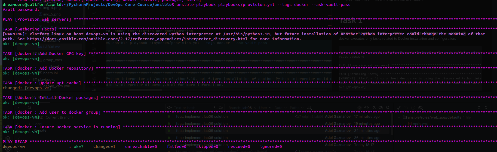
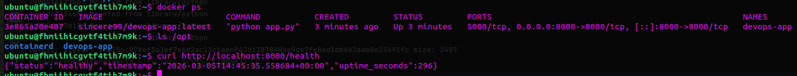
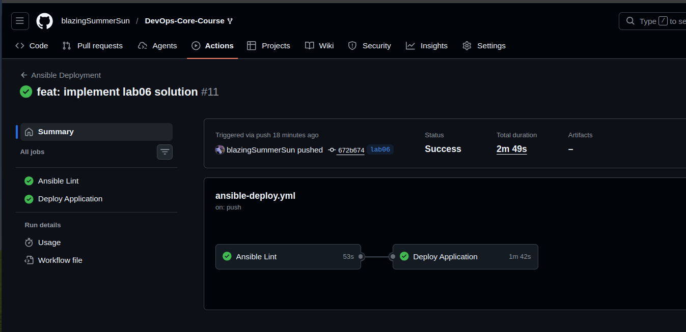
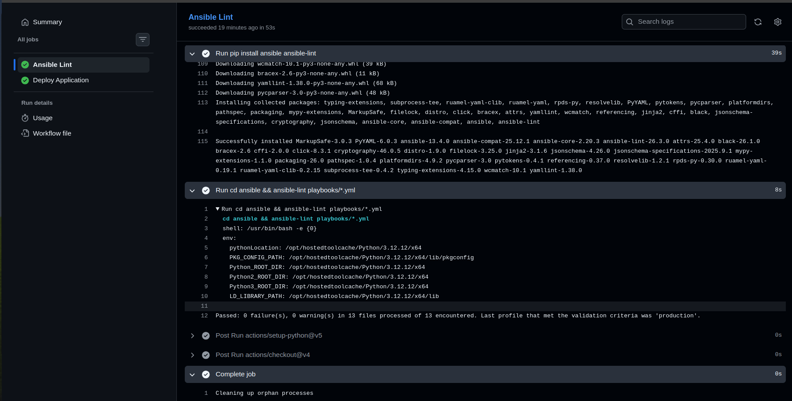
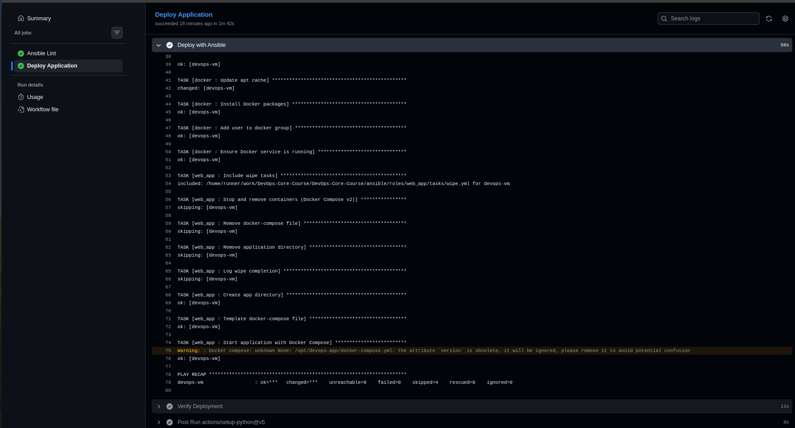
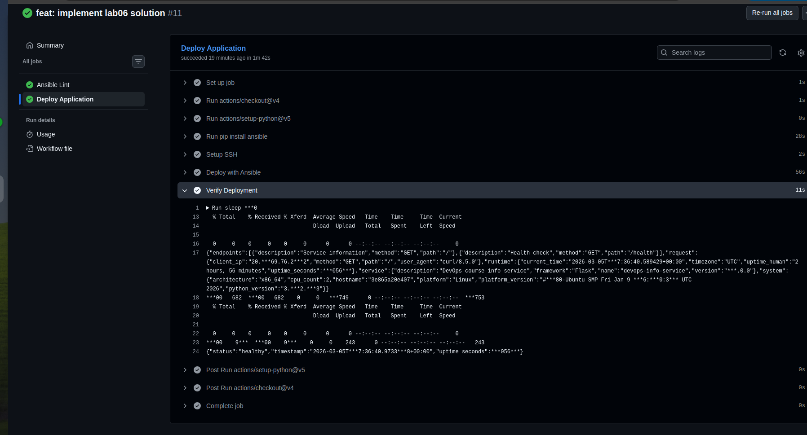
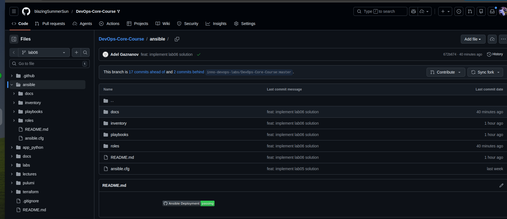
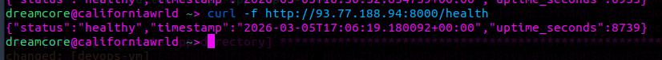

# Overview
## What was done
- Automated web application deployment using Ansible. 
- Configured Docker and Docker Compose for application containerization. 
- Implemented wipe logic to securely remove old application versions. 
- Integrated CI/CD via GitHub Actions with automatic deployment to a remote VM. 
- Used Vault for secure storage of secrets, environment variables, and idempotent playbooks.

## Technologies used
- Ansible (roles, tasks, blocks, tags, vault)
- Docker & Docker Compose (v2)
- GitHub Actions (CI/CD)
- Python (Flask-приложение)
- Yandex Cloud (VM)

# Blocks & Tags
Using blocks in roles:
- docker/tasks/main.yml 
  - block for installing Docker with a rescue block in case of an apt-cache update error. 
- web_app/tasks/main.yml 
  - block for creating a directory, templating docker-compose.yml, and deploying the application. 
  - rescue block for handling deployment errors.
- web_app/tasks/wipe.yml 
  - block for stopping containers and deleting files and directories with the "when" condition: web_app_wipe | bool.

Tagging strategy:
- docker, docker_install — Docker installation
- app_deploy, compose — application deployment
- web_app_wipe — cleaning up the old application

The playbook supports selective execution using tags.
Running the playbook with --tags docker executes only tasks related to Docker installation and configuration.


```commandline
dreamcore@californiawrld:~/PycharmProjects/DevOps-Core-Course/ansible$ ansible-playbook playbooks/provision.yml --tags docker --ask-vault-pass
Vault password: 

PLAY [Provision web servers] *****************************************************************************************************************************************************************************

TASK [Gathering Facts] ***********************************************************************************************************************************************************************************
[WARNING]: Platform linux on host devops-vm is using the discovered Python interpreter at /usr/bin/python3.10, but future installation of another Python interpreter could change the meaning of that
path. See https://docs.ansible.com/ansible-core/2.17/reference_appendices/interpreter_discovery.html for more information.
ok: [devops-vm]

TASK [docker : Add Docker GPG key] ***********************************************************************************************************************************************************************
ok: [devops-vm]

TASK [docker : Add Docker repository] ********************************************************************************************************************************************************************
ok: [devops-vm]

TASK [docker : Update apt cache] *************************************************************************************************************************************************************************
changed: [devops-vm]

TASK [docker : Install Docker packages] ******************************************************************************************************************************************************************
ok: [devops-vm]

TASK [docker : Add user to docker group] *****************************************************************************************************************************************************************
ok: [devops-vm]

TASK [docker : Ensure Docker service is running] *********************************************************************************************************************************************************
ok: [devops-vm]

PLAY RECAP ***********************************************************************************************************************************************************************************************
devops-vm                  : ok=7    changed=1    unreachable=0    failed=0    skipped=0    rescued=0    ignored=0
```

### Output showing error handling with rescue block triggered
```commandline
dreamcore@californiawrld:~/PycharmProjects/DevOps-Core-Course/ansible$ ansible-playbook playbooks/provision.yml --tags docker_install --ask-vault-pass
Vault password: 

PLAY [Provision web servers] *****************************************************************************************************************************************************************************

TASK [Gathering Facts] ***********************************************************************************************************************************************************************************
[WARNING]: Platform linux on host devops-vm is using the discovered Python interpreter at /usr/bin/python3.10, but future installation of another Python interpreter could change the meaning of that
path. See https://docs.ansible.com/ansible-core/2.17/reference_appendices/interpreter_discovery.html for more information.
ok: [devops-vm]

TASK [docker : Add Docker GPG key] ***********************************************************************************************************************************************************************
fatal: [devops-vm]: FAILED! => {"changed": false, "msg": "Failed to download key at https://download.docker.com/linux/ubuntu/gpg-broken: HTTP Error 404: Not Found"}

TASK [docker : Wait before retry] ************************************************************************************************************************************************************************
Pausing for 10 seconds
(ctrl+C then 'C' = continue early, ctrl+C then 'A' = abort)
ok: [devops-vm]

TASK [docker : Retry apt update] *************************************************************************************************************************************************************************
changed: [devops-vm]

PLAY RECAP ***********************************************************************************************************************************************************************************************
devops-vm                  : ok=3    changed=1    unreachable=0    failed=0    skipped=0    rescued=1    ignored=0 
```

### List of all available tags (--list-tags output)
```commandline
dreamcore@californiawrld:~/PycharmProjects/DevOps-Core-Course/ansible$ ansible-playbook playbooks/provision.yml --list-tags --ask-vault-pass
Vault password: 

playbook: playbooks/provision.yml

  play #1 (webservers): Provision web servers	TAGS: []
      TASK TAGS: [common, docker, docker_config, docker_install, packages, users]

```

## Research questions
Q: What happens if rescue block also fails?
- playbook will fail totally:
  - block → failed 
  - rescue → failed 
  - playbook → failed

Q: Can you have nested blocks?
- Yes.
```commandline
block:
  - block:
      - task1
      - task2
    rescue:
      - task3
```
Q: How do tags inherit to tasks within blocks?
- Tags on block inherit with all tasks inside a block:
```commandline
block:
   tags: packages
```
is equivalent to
```commandline
task1 tags: packages
task2 tags: packages
```

## Task 2
### Output showing Docker Compose deployment success
```commandline
dreamcore@californiawrld:~/PycharmProjects/DevOps-Core-Course/ansible$ ansible-playbook playbooks/deploy.yml --ask-vault-pass
Vault password: 

PLAY [Deploy application] ********************************************************************************************************************************************************************************

TASK [Gathering Facts] ***********************************************************************************************************************************************************************************
[WARNING]: Platform linux on host devops-vm is using the discovered Python interpreter at /usr/bin/python3.10, but future installation of another Python interpreter could change the meaning of that
path. See https://docs.ansible.com/ansible-core/2.17/reference_appendices/interpreter_discovery.html for more information.
ok: [devops-vm]

TASK [docker : Add Docker GPG key] ***********************************************************************************************************************************************************************
ok: [devops-vm]

TASK [docker : Add Docker repository] ********************************************************************************************************************************************************************
ok: [devops-vm]

TASK [docker : Update apt cache] *************************************************************************************************************************************************************************
changed: [devops-vm]

TASK [docker : Install Docker packages] ******************************************************************************************************************************************************************
ok: [devops-vm]

TASK [docker : Add user to docker group] *****************************************************************************************************************************************************************
ok: [devops-vm]

TASK [docker : Ensure Docker service is running] *********************************************************************************************************************************************************
ok: [devops-vm]

TASK [web_app : Create app directory] ********************************************************************************************************************************************************************
ok: [devops-vm]

TASK [web_app : Template docker-compose file] ************************************************************************************************************************************************************
changed: [devops-vm]

TASK [web_app : Start application with Docker Compose] ***************************************************************************************************************************************************
[WARNING]: Docker compose: unknown None: /opt/devops-app/docker-compose.yml: the attribute `version` is obsolete, it will be ignored, please remove it to avoid potential confusion
changed: [devops-vm]

PLAY RECAP ***********************************************************************************************************************************************************************************************
devops-vm                  : ok=10   changed=3    unreachable=0    failed=0    skipped=0    rescued=0    ignored=0 
```
### Idempotency proof (second run shows "ok" not "changed")
```commandline
dreamcore@californiawrld:~/PycharmProjects/DevOps-Core-Course/ansible$ ansible-playbook playbooks/deploy.yml --ask-vault-pass
Vault password: 

PLAY [Deploy application] ********************************************************************************************************************************************************************************

TASK [Gathering Facts] ***********************************************************************************************************************************************************************************
[WARNING]: Platform linux on host devops-vm is using the discovered Python interpreter at /usr/bin/python3.10, but future installation of another Python interpreter could change the meaning of that
path. See https://docs.ansible.com/ansible-core/2.17/reference_appendices/interpreter_discovery.html for more information.
ok: [devops-vm]

TASK [docker : Add Docker GPG key] ***********************************************************************************************************************************************************************
ok: [devops-vm]

TASK [docker : Add Docker repository] ********************************************************************************************************************************************************************
ok: [devops-vm]

TASK [docker : Update apt cache] *************************************************************************************************************************************************************************
changed: [devops-vm]

TASK [docker : Install Docker packages] ******************************************************************************************************************************************************************
ok: [devops-vm]

TASK [docker : Add user to docker group] *****************************************************************************************************************************************************************
ok: [devops-vm]

TASK [docker : Ensure Docker service is running] *********************************************************************************************************************************************************
ok: [devops-vm]

TASK [web_app : Create app directory] ********************************************************************************************************************************************************************
ok: [devops-vm]

TASK [web_app : Template docker-compose file] ************************************************************************************************************************************************************
ok: [devops-vm]

TASK [web_app : Start application with Docker Compose] ***************************************************************************************************************************************************
[WARNING]: Docker compose: unknown None: /opt/devops-app/docker-compose.yml: the attribute `version` is obsolete, it will be ignored, please remove it to avoid potential confusion
ok: [devops-vm]

PLAY RECAP ***********************************************************************************************************************************************************************************************
devops-vm                  : ok=10   changed=1    unreachable=0    failed=0    skipped=0    rescued=0    ignored=0 
```

### Application running and accessible
```commandline
dreamcore@californiawrld:~/PycharmProjects/DevOps-Core-Course/ansible$ ssh ubuntu@93.77.188.94
Welcome to Ubuntu 22.04.5 LTS (GNU/Linux 5.15.0-170-generic x86_64)

 * Documentation:  https://help.ubuntu.com
 * Management:     https://landscape.canonical.com
 * Support:        https://ubuntu.com/pro

 System information as of Thu Mar  5 14:17:08 UTC 2026

  System load:  0.16              Processes:             104
  Usage of /:   26.6% of 9.04GB   Users logged in:       0
  Memory usage: 32%               IPv4 address for eth0: 10.0.1.13
  Swap usage:   0%


Expanded Security Maintenance for Applications is not enabled.

1 update can be applied immediately.
To see these additional updates run: apt list --upgradable

Enable ESM Apps to receive additional future security updates.
See https://ubuntu.com/esm or run: sudo pro status

New release '24.04.4 LTS' available.
Run 'do-release-upgrade' to upgrade to it.


*** System restart required ***
Last login: Thu Mar  5 14:15:21 2026 from 188.130.155.186


ubuntu@fhmiihicgvtf4tih7m9k:~$ curl http://localhost:8000
{"endpoints":[{"description":"Service information","method":"GET","path":"/"},{"description":"Health check","method":"GET","path":"/health"}],"request":{"client_ip":"172.18.0.1","method":"GET","path":"/","user_agent":"curl/7.81.0"},"runtime":{"current_time":"2026-03-05T14:17:11.369874+00:00","timezone":"UTC","uptime_human":"0 hours, 4 minutes","uptime_seconds":265},"service":{"description":"DevOps course info service","framework":"Flask","name":"devops-info-service","version":"1.0.0"},"system":{"architecture":"x86_64","cpu_count":2,"hostname":"408aca60019f","platform":"Linux","platform_version":"#180-Ubuntu SMP Fri Jan 9 16:10:31 UTC 2026","python_version":"3.12.13"}}
ubuntu@fhmiihicgvtf4tih7m9k:~$ curl http://localhost:8000/health
{"status":"healthy","timestamp":"2026-03-05T14:17:53.184481+00:00","uptime_seconds":307}
```

# Docker Compose Migration
```commandline
version: '{{ docker_compose_version }}'

services:
  {{ app_name }}:
    image: {{ docker_image }}:{{ docker_tag }}
    container_name: {{ app_name }}
    ports:
      - "{{ app_port }}:{{ app_internal_port }}"
    environment:
      HOST: "0.0.0.0"
      PORT: "{{ app_internal_port }}"
      DEBUG: "False"
      APP_SECRET_KEY: "{{ app_secret_key }}"
    restart: unless-stopped
```
Role dependencies:
the web_app role depends on docker to ensure Docker is installed before deployment.

| Before                                             | After                                          |
|----------------------------------------------------|------------------------------------------------|
| `community.docker.docker_compose` (v1, deprecated) | `community.docker.docker_compose_v2`           |
| manual `docker run`                                | Idempotent deploy with templates and variables |
| No network/volume management                       | Support of networks and environment variables  |


docker ps server:
```commandline
ubuntu@fhmiihicgvtf4tih7m9k:~$ docker ps
CONTAINER ID   IMAGE                         COMMAND           CREATED         STATUS         PORTS                                                   NAMES
408aca60019f   sincere99/devops-app:latest   "python app.py"   6 minutes ago   Up 6 minutes   5000/tcp, 0.0.0.0:8000->8000/tcp, [::]:8000->8000/tcp   devops-app

ubuntu@fhmiihicgvtf4tih7m9k:~$ docker compose -f /opt/devops-app/docker-compose.yml ps
WARN[0000] /opt/devops-app/docker-compose.yml: the attribute `version` is obsolete, it will be ignored, please remove it to avoid potential confusion 
NAME         IMAGE                         COMMAND           SERVICE      CREATED              STATUS              PORTS
devops-app   sincere99/devops-app:latest   "python app.py"   devops-app   About a minute ago   Up About a minute   5000/tcp, 0.0.0.0:8000->8000/tcp, [::]:8000->8000/tcp

```

### Research questions
Q: What's the difference between restart: always and restart: unless-stopped
- restart: always: This policy ensures the container will always restart, regardless of why it stopped. This includes crashes, system reboots, and even if it was manually stopped. After a manual stop, the container will restart automatically if the Docker daemon is restarted.
- restart: unless-stopped: This policy also ensures automatic restarts for crashes and system reboots, but it respects a manual stop by a user. If a user stops the container manually, it will remain stopped, even if the Docker daemon or the host system is restarted, until it is manually started again.

Q: How do Docker Compose networks differ from Docker bridge networks?
- Docker Compose networks are a form of user-defined bridge networks that offer enhanced features like automatic service discovery by name, which the default Docker bridge network lacks.

Q: Can you reference Ansible Vault variables in the template?
- Yes, you can reference Ansible Vault variables in a Jinja2 template just like any other variable, provided you supply the correct vault password when running the playbook.

# Wipe logic
Variable + tag approach:
- Variable: web_app_wipe: false by default. 
- Tag: web_app_wipe — explicitly starts wipe tasks.
## Example of call
```
dreamcore@californiawrld:~/PycharmProjects/DevOps-Core-Course/ansible$ ansible-playbook playbooks/deploy.yml   -e "web_app_wipe=true" --ask-vault-pass
Vault password: 

PLAY [Deploy application] ********************************************************************************************************************************************************************************

TASK [Gathering Facts] ***********************************************************************************************************************************************************************************
[WARNING]: Platform linux on host devops-vm is using the discovered Python interpreter at /usr/bin/python3.10, but future installation of another Python interpreter could change the meaning of that
path. See https://docs.ansible.com/ansible-core/2.17/reference_appendices/interpreter_discovery.html for more information.
ok: [devops-vm]

TASK [docker : Add Docker GPG key] ***********************************************************************************************************************************************************************
ok: [devops-vm]

TASK [docker : Add Docker repository] ********************************************************************************************************************************************************************
ok: [devops-vm]

TASK [docker : Update apt cache] *************************************************************************************************************************************************************************
changed: [devops-vm]

TASK [docker : Install Docker packages] ******************************************************************************************************************************************************************
ok: [devops-vm]

TASK [docker : Add user to docker group] *****************************************************************************************************************************************************************
ok: [devops-vm]

TASK [docker : Ensure Docker service is running] *********************************************************************************************************************************************************
ok: [devops-vm]

TASK [web_app : Include wipe tasks] **********************************************************************************************************************************************************************
included: /home/dreamcore/PycharmProjects/DevOps-Core-Course/ansible/roles/web_app/tasks/wipe.yml for devops-vm

TASK [web_app : Stop and remove containers (Docker Compose v2)] ******************************************************************************************************************************************
[WARNING]: Docker compose: unknown None: /opt/devops-app/docker-compose.yml: the attribute `version` is obsolete, it will be ignored, please remove it to avoid potential confusion
changed: [devops-vm]

TASK [web_app : Remove docker-compose file] **************************************************************************************************************************************************************
changed: [devops-vm]

TASK [web_app : Remove application directory] ************************************************************************************************************************************************************
changed: [devops-vm]

TASK [web_app : Log wipe completion] *********************************************************************************************************************************************************************
ok: [devops-vm] => {
    "msg": "Application devops-app wiped successfully"
}

TASK [web_app : Create app directory] ********************************************************************************************************************************************************************
changed: [devops-vm]

TASK [web_app : Template docker-compose file] ************************************************************************************************************************************************************
changed: [devops-vm]

TASK [web_app : Start application with Docker Compose] ***************************************************************************************************************************************************
changed: [devops-vm]

PLAY RECAP ***********************************************************************************************************************************************************************************************
devops-vm                  : ok=15   changed=7    unreachable=0    failed=0    skipped=0    rescued=0    ignored=0
```

### Output of Scenario 1 showing normal deployment (wipe skipped)
```commandline
dreamcore@californiawrld:~/PycharmProjects/DevOps-Core-Course/ansible$ ansible-playbook playbooks/deploy.yml --ask-vault-pass
Vault password: 

PLAY [Deploy application] ********************************************************************************************************************************************************************************

TASK [Gathering Facts] ***********************************************************************************************************************************************************************************
[WARNING]: Platform linux on host devops-vm is using the discovered Python interpreter at /usr/bin/python3.10, but future installation of another Python interpreter could change the meaning of that
path. See https://docs.ansible.com/ansible-core/2.17/reference_appendices/interpreter_discovery.html for more information.
ok: [devops-vm]

TASK [docker : Add Docker GPG key] ***********************************************************************************************************************************************************************
ok: [devops-vm]

TASK [docker : Add Docker repository] ********************************************************************************************************************************************************************
ok: [devops-vm]

TASK [docker : Update apt cache] *************************************************************************************************************************************************************************
changed: [devops-vm]

TASK [docker : Install Docker packages] ******************************************************************************************************************************************************************
ok: [devops-vm]

TASK [docker : Add user to docker group] *****************************************************************************************************************************************************************
ok: [devops-vm]

TASK [docker : Ensure Docker service is running] *********************************************************************************************************************************************************
ok: [devops-vm]

TASK [web_app : Include wipe tasks] **********************************************************************************************************************************************************************
included: /home/dreamcore/PycharmProjects/DevOps-Core-Course/ansible/roles/web_app/tasks/wipe.yml for devops-vm

TASK [web_app : Stop and remove containers (Docker Compose v2)] ******************************************************************************************************************************************
skipping: [devops-vm]

TASK [web_app : Remove docker-compose file] **************************************************************************************************************************************************************
skipping: [devops-vm]

TASK [web_app : Remove application directory] ************************************************************************************************************************************************************
skipping: [devops-vm]

TASK [web_app : Log wipe completion] *********************************************************************************************************************************************************************
skipping: [devops-vm]

TASK [web_app : Create app directory] ********************************************************************************************************************************************************************
changed: [devops-vm]

TASK [web_app : Template docker-compose file] ************************************************************************************************************************************************************
changed: [devops-vm]

TASK [web_app : Start application with Docker Compose] ***************************************************************************************************************************************************
[WARNING]: Docker compose: unknown None: /opt/devops-app/docker-compose.yml: the attribute `version` is obsolete, it will be ignored, please remove it to avoid potential confusion
changed: [devops-vm]

PLAY RECAP ***********************************************************************************************************************************************************************************************
devops-vm                  : ok=11   changed=4    unreachable=0    failed=0    skipped=4    rescued=0    ignored=0
```

### Output of Scenario 2 showing wipe-only operation
```
dreamcore@californiawrld:~/PycharmProjects/DevOps-Core-Course/ansible$ ansible-playbook playbooks/deploy.yml \
  -e "web_app_wipe=true" \
  --tags web_app_wipe --ask-vault-pass
Vault password: 

PLAY [Deploy application] ********************************************************************************************************************************************************************************

TASK [Gathering Facts] ***********************************************************************************************************************************************************************************
[WARNING]: Platform linux on host devops-vm is using the discovered Python interpreter at /usr/bin/python3.10, but future installation of another Python interpreter could change the meaning of that
path. See https://docs.ansible.com/ansible-core/2.17/reference_appendices/interpreter_discovery.html for more information.
ok: [devops-vm]

TASK [web_app : Include wipe tasks] **********************************************************************************************************************************************************************
included: /home/dreamcore/PycharmProjects/DevOps-Core-Course/ansible/roles/web_app/tasks/wipe.yml for devops-vm

TASK [web_app : Stop and remove containers (Docker Compose v2)] ******************************************************************************************************************************************
[WARNING]: Docker compose: unknown None: /opt/devops-app/docker-compose.yml: the attribute `version` is obsolete, it will be ignored, please remove it to avoid potential confusion
changed: [devops-vm]

TASK [web_app : Remove docker-compose file] **************************************************************************************************************************************************************
changed: [devops-vm]

TASK [web_app : Remove application directory] ************************************************************************************************************************************************************
changed: [devops-vm]

TASK [web_app : Log wipe completion] *********************************************************************************************************************************************************************
ok: [devops-vm] => {
    "msg": "Application devops-app wiped successfully"
}

PLAY RECAP ***********************************************************************************************************************************************************************************************
devops-vm                  : ok=6    changed=3    unreachable=0    failed=0    skipped=0    rescued=0    ignored=0 

dreamcore@californiawrld:~/PycharmProjects/DevOps-Core-Course/ansible$ ssh ubuntu@93.77.188.94
Welcome to Ubuntu 22.04.5 LTS (GNU/Linux 5.15.0-170-generic x86_64)

 * Documentation:  https://help.ubuntu.com
 * Management:     https://landscape.canonical.com
 * Support:        https://ubuntu.com/pro

 System information as of Thu Mar  5 14:38:11 UTC 2026

  System load:  0.68              Processes:             101
  Usage of /:   26.6% of 9.04GB   Users logged in:       0
  Memory usage: 28%               IPv4 address for eth0: 10.0.1.13
  Swap usage:   0%


Expanded Security Maintenance for Applications is not enabled.

1 update can be applied immediately.
To see these additional updates run: apt list --upgradable

Enable ESM Apps to receive additional future security updates.
See https://ubuntu.com/esm or run: sudo pro status

New release '24.04.4 LTS' available.
Run 'do-release-upgrade' to upgrade to it.


*** System restart required ***
Last login: Thu Mar  5 14:37:51 2026 from 188.130.155.186
ubuntu@fhmiihicgvtf4tih7m9k:~$ docker ps
CONTAINER ID   IMAGE     COMMAND   CREATED   STATUS    PORTS     NAMES
ubuntu@fhmiihicgvtf4tih7m9k:~$ ls /opt
containerd
```

### Output of Scenario 3 showing clean reinstall (wipe → deploy)
```
dreamcore@californiawrld:~/PycharmProjects/DevOps-Core-Course/ansible$ ansible-playbook playbooks/deploy.yml   -e "web_app_wipe=true" --ask-vault-pass
Vault password: 

PLAY [Deploy application] ********************************************************************************************************************************************************************************

TASK [Gathering Facts] ***********************************************************************************************************************************************************************************
[WARNING]: Platform linux on host devops-vm is using the discovered Python interpreter at /usr/bin/python3.10, but future installation of another Python interpreter could change the meaning of that
path. See https://docs.ansible.com/ansible-core/2.17/reference_appendices/interpreter_discovery.html for more information.
ok: [devops-vm]

TASK [docker : Add Docker GPG key] ***********************************************************************************************************************************************************************
ok: [devops-vm]

TASK [docker : Add Docker repository] ********************************************************************************************************************************************************************
ok: [devops-vm]

TASK [docker : Update apt cache] *************************************************************************************************************************************************************************
changed: [devops-vm]

TASK [docker : Install Docker packages] ******************************************************************************************************************************************************************
ok: [devops-vm]

TASK [docker : Add user to docker group] *****************************************************************************************************************************************************************
ok: [devops-vm]

TASK [docker : Ensure Docker service is running] *********************************************************************************************************************************************************
ok: [devops-vm]

TASK [web_app : Include wipe tasks] **********************************************************************************************************************************************************************
included: /home/dreamcore/PycharmProjects/DevOps-Core-Course/ansible/roles/web_app/tasks/wipe.yml for devops-vm

TASK [web_app : Stop and remove containers (Docker Compose v2)] ******************************************************************************************************************************************
[WARNING]: Docker compose: unknown None: /opt/devops-app/docker-compose.yml: the attribute `version` is obsolete, it will be ignored, please remove it to avoid potential confusion
changed: [devops-vm]

TASK [web_app : Remove docker-compose file] **************************************************************************************************************************************************************
changed: [devops-vm]

TASK [web_app : Remove application directory] ************************************************************************************************************************************************************
changed: [devops-vm]

TASK [web_app : Log wipe completion] *********************************************************************************************************************************************************************
ok: [devops-vm] => {
    "msg": "Application devops-app wiped successfully"
}

TASK [web_app : Create app directory] ********************************************************************************************************************************************************************
changed: [devops-vm]

TASK [web_app : Template docker-compose file] ************************************************************************************************************************************************************
changed: [devops-vm]

TASK [web_app : Start application with Docker Compose] ***************************************************************************************************************************************************
changed: [devops-vm]

PLAY RECAP ***********************************************************************************************************************************************************************************************
devops-vm                  : ok=15   changed=7    unreachable=0    failed=0    skipped=0    rescued=0    ignored=0 

ubuntu@fhmiihicgvtf4tih7m9k:~$ docker ps
CONTAINER ID   IMAGE                         COMMAND           CREATED         STATUS         PORTS                                                   NAMES
3e865a20e407   sincere99/devops-app:latest   "python app.py"   3 minutes ago   Up 3 minutes   5000/tcp, 0.0.0.0:8000->8000/tcp, [::]:8000->8000/tcp   devops-app
ubuntu@fhmiihicgvtf4tih7m9k:~$ ls /opt
containerd  devops-app
```
### Output of Scenario 4a showing wipe blocked by when condition

```
dreamcore@californiawrld:~/PycharmProjects/DevOps-Core-Course/ansible$ ansible-playbook playbooks/deploy.yml --tags web_app_wipe --ask-vault-pass
Vault password: 

PLAY [Deploy application] ********************************************************************************************************************************************************************************

TASK [Gathering Facts] ***********************************************************************************************************************************************************************************
[WARNING]: Platform linux on host devops-vm is using the discovered Python interpreter at /usr/bin/python3.10, but future installation of another Python interpreter could change the meaning of that
path. See https://docs.ansible.com/ansible-core/2.17/reference_appendices/interpreter_discovery.html for more information.
ok: [devops-vm]

TASK [web_app : Include wipe tasks] **********************************************************************************************************************************************************************
included: /home/dreamcore/PycharmProjects/DevOps-Core-Course/ansible/roles/web_app/tasks/wipe.yml for devops-vm

TASK [web_app : Stop and remove containers (Docker Compose v2)] ******************************************************************************************************************************************
skipping: [devops-vm]

TASK [web_app : Remove docker-compose file] **************************************************************************************************************************************************************
skipping: [devops-vm]

TASK [web_app : Remove application directory] ************************************************************************************************************************************************************
skipping: [devops-vm]

TASK [web_app : Log wipe completion] *********************************************************************************************************************************************************************
skipping: [devops-vm]

PLAY RECAP ***********************************************************************************************************************************************************************************************
devops-vm                  : ok=2    changed=0    unreachable=0    failed=0    skipped=4    rescued=0    ignored=0 
```

### Test results:
- Scenario 1: Wipe fails with standard deployment
- Scenario 2: Wipe-only deletes the application and directory 
- Scenario 3: Clean reinstall → wipe → deploy 
- Scenario 4a: Tag specified, but variable false → wipe skipped

### Screenshot of application running after clean reinstall


### Research Questions
Q: Why use both variable AND tag? (Double safety mechanism)

A: Using both the variable (web_app_wipe) and the tag (web_app_wipe) provides double protection: even if someone accidentally specifies the tag, wipe tasks will not be executed without explicit permission via the variable. This prevents accidental deletion of the application on the production system.

Q: What's the difference between never tag and this approach?

A: The never tag completely blocks task execution regardless of any flags, and our variable + tag combination allows for a controlled and secure wipe run only with explicit intent (-e "web_app_wipe=true" --tags web_app_wipe). This is more flexible and secure than ignoring the task entirely.

Q: Why must wipe logic come BEFORE deployment in main.yml? (Clean reinstall scenario)

A: Wipe is performed first to remove the old version of the application and its files. After this, the deployer can safely create a fresh installation, avoiding conflicts with existing containers, directories, or configurations.

Q: When would you want clean reinstallation vs. rolling update?

A: 
- Clean reinstallation: during testing, when fixing configuration or image errors, or when a complete reset is needed.
- Rolling update: in production, to minimize downtime, only the image or configuration is updated, preserving old containers until new ones are ready.

Q: How would you extend this to wipe Docker images and volumes too?

A:
We can add tasks to the wipe.yml block with modules:
- community.docker.docker_image_v2 with state: absent to delete images; 
- community.docker.docker_volume with state: absent to delete volumes.

For security, it's best to use additional flags (force: true) and check for the presence of images/volumes before deleting.

Q: What are the security implications of storing SSH keys in GitHub Secrets?

A: Storing SSH private keys in GitHub Secrets is a common practice for automating deployments, but it carries significant security implications. While it is more secure than hardcoding keys directly into source code, it places highly sensitive, persistent credentials within a third-party platform's infrastructure, requiring strict risk management

Q: How would you implement a staging → production deployment pipeline?

A: Implementing a staging-to-production pipeline involves creating an automated CI/CD workflow (using tools like GitHub Actions, GitLab CI, or Jenkins) that builds, tests, and deploys code to a replica staging environment upon merging to a staging branch, followed by manual approval to trigger a safe (blue-green or canary) deployment to production

Q: What would you add to make rollbacks possible?

A: To make rollbacks possible, we must implement a combination of version control, automated deployment pipelines, and database management strategies. The goal is to ensure that if a new deployment causes issues, the system can revert to a previously known stable state rapidly

Q: How does self-hosted runner improve security compared to GitHub-hosted?

A: Self-hosted runners improve security by keeping CI/CD workloads within your private network, eliminating exposure to the public internet, and providing full control over the infrastructure, OS, and software. This allows for better security auditing, data residency compliance, and restricted access to internal resources, such as databases or APIs behind firewalls.

## Screenshot of successful workflow run


## Output logs showing ansible-lint passing
```
Run cd ansible && ansible-lint playbooks/*.yml
  cd ansible && ansible-lint playbooks/*.yml
  shell: /usr/bin/bash -e {0}
  env:
    pythonLocation: /opt/hostedtoolcache/Python/3.12.12/x64
    PKG_CONFIG_PATH: /opt/hostedtoolcache/Python/3.12.12/x64/lib/pkgconfig
    Python_ROOT_DIR: /opt/hostedtoolcache/Python/3.12.12/x64
    Python2_ROOT_DIR: /opt/hostedtoolcache/Python/3.12.12/x64
    Python3_ROOT_DIR: /opt/hostedtoolcache/Python/3.12.12/x64
    LD_LIBRARY_PATH: /opt/hostedtoolcache/Python/3.12.12/x64/lib

Passed: 0 failure(s), 0 warning(s) in 13 files processed of 13 encountered. Last profile that met the validation criteria was 'production'.
```


## Output logs showing ansible-playbook execution
```
PLAY [Deploy application] ******************************************************

TASK [Gathering Facts] *********************************************************
Warning: : Host 'devops-vm' is using the discovered Python interpreter at '/usr/bin/python3.***0', but future installation of another Python interpreter could cause a different interpreter to be discovered. See https://docs.ansible.com/ansible-core/2.20/reference_appendices/interpreter_discovery.html for more information.
ok: [devops-vm]

TASK [docker : Add Docker GPG key] *********************************************
ok: [devops-vm]

TASK [docker : Add Docker repository] ******************************************
Warning: : Deprecation warnings can be disabled by setting `deprecation_warnings=False` in ansible.cfg.
[DEPRECATION WARNING]: INJECT_FACTS_AS_VARS default to `True` is deprecated, top-level facts will not be auto injected after the change. This feature will be removed from ansible-core version 2.24.
Origin: /home/runner/work/DevOps-Core-Course/DevOps-Core-Course/ansible/roles/docker/tasks/main.yml:***6:***5

***4     - name: Add Docker repository
***5       ansible.builtin.apt_repository:
***6         repo: "deb https://download.docker.com/linux/ubuntu {{ ansible_distribution_release }} stable"
                 ^ column ***5

Use `ansible_facts["fact_name"]` (no `ansible_` prefix) instead.

ok: [devops-vm]

TASK [docker : Update apt cache] ***********************************************
changed: [devops-vm]

TASK [docker : Install Docker packages] ****************************************
ok: [devops-vm]

TASK [docker : Add user to docker group] ***************************************
ok: [devops-vm]

TASK [docker : Ensure Docker service is running] *******************************
ok: [devops-vm]

TASK [web_app : Include wipe tasks] ********************************************
included: /home/runner/work/DevOps-Core-Course/DevOps-Core-Course/ansible/roles/web_app/tasks/wipe.yml for devops-vm

TASK [web_app : Stop and remove containers (Docker Compose v2)] ****************
skipping: [devops-vm]

TASK [web_app : Remove docker-compose file] ************************************
skipping: [devops-vm]

TASK [web_app : Remove application directory] **********************************
skipping: [devops-vm]

TASK [web_app : Log wipe completion] *******************************************
skipping: [devops-vm]

TASK [web_app : Create app directory] ******************************************
ok: [devops-vm]

TASK [web_app : Template docker-compose file] **********************************
ok: [devops-vm]

TASK [web_app : Start application with Docker Compose] *************************
Warning: : Docker compose: unknown None: /opt/devops-app/docker-compose.yml: the attribute `version` is obsolete, it will be ignored, please remove it to avoid potential confusion
ok: [devops-vm]

PLAY RECAP *********************************************************************
devops-vm                  : ok=***   changed=***    unreachable=0    failed=0    skipped=4    rescued=0    ignored=0   
```


## Verification step output showing app responding
```
% Total    % Received % Xferd  Average Speed   Time    Time     Time  Current
                                 Dload  Upload   Total   Spent    Left  Speed

  0     0    0     0    0     0      0      0 --:--:-- --:--:-- --:--:--     0
{"endpoints":[{"description":"Service information","method":"GET","path":"/"},{"description":"Health check","method":"GET","path":"/health"}],"request":{"client_ip":"20.***69.76.2***2","method":"GET","path":"/","user_agent":"curl/8.5.0"},"runtime":{"current_time":"2026-03-05T***7:36:40.589429+00:00","timezone":"UTC","uptime_human":"2 hours, 56 minutes","uptime_seconds":***056***},"service":{"description":"DevOps course info service","framework":"Flask","name":"devops-info-service","version":"***.0.0"},"system":{"architecture":"x86_64","cpu_count":2,"hostname":"3e865a20e407","platform":"Linux","platform_version":"#***80-Ubuntu SMP Fri Jan 9 ***6:***0:3*** UTC 2026","python_version":"3.***2.***3"}}
***00   682  ***00   682    0     0   ***749      0 --:--:-- --:--:-- --:--:--  ***753
  % Total    % Received % Xferd  Average Speed   Time    Time     Time  Current
                                 Dload  Upload   Total   Spent    Left  Speed

  0     0    0     0    0     0      0      0 --:--:-- --:--:-- --:--:--     0
***00    9***  ***00    9***    0     0    243      0 --:--:-- --:--:-- --:--:--   243
{"status":"healthy","timestamp":"2026-03-05T***7:36:40.9733***8+00:00","uptime_seconds":***056***}
```


## Status badge in README showing passing


# CI/CD Integration
Workflow architecture:
- GitHub Actions with two jobs:
- Lint — Ansible syntax checker (ansible-lint)
- Deploy — deploy to a VM via SSH, using Vault

Example deploy job (GitHub-hosted runner):
```
name: Ansible Deployment

on:
  push:
    branches: [ main, master, lab06 ]
    paths:
      - 'ansible/**'
      - '.github/workflows/ansible-deploy.yml'
  pull_request:
    branches: [ main, master ]
    paths:
      - 'ansible/**'

jobs:
  lint:
    name: Ansible Lint
    runs-on: ubuntu-latest
    steps:
      - uses: actions/checkout@v4
      - uses: actions/setup-python@v5
        with:
          python-version: '3.12'
      - run: pip install ansible ansible-lint
      - run: cd ansible && ansible-lint playbooks/*.yml

  deploy:
    name: Deploy Application
    needs: lint
    runs-on: ubuntu-latest
    steps:
      - uses: actions/checkout@v4
      - uses: actions/setup-python@v5
        with:
          python-version: '3.12'
      - run: pip install ansible
      - name: Setup SSH
        run: |
          mkdir -p ~/.ssh
          echo "${{ secrets.SSH_PRIVATE_KEY }}" > ~/.ssh/id_rsa
          chmod 600 ~/.ssh/id_rsa
          ssh-keyscan -H ${{ secrets.VM_HOST }} >> ~/.ssh/known_hosts
      - name: Deploy with Ansible
        env:
          ANSIBLE_VAULT_PASSWORD: ${{ secrets.ANSIBLE_VAULT_PASSWORD }}
        run: |
          cd ansible
          echo "$ANSIBLE_VAULT_PASSWORD" > /tmp/vault_pass
          ansible-playbook playbooks/deploy.yml \
            -i inventory/hosts.ini \
            --vault-password-file /tmp/vault_pass
          rm /tmp/vault_pass
      - name: Verify Deployment
        run: |
          sleep 10
          curl -f http://${{ secrets.VM_HOST }}:8000 || exit 1
          curl -f http://${{ secrets.VM_HOST }}:8000/health || exit 1
```
## Example of successful deployment


# Testing Results
- Idempotency: Running ansible-playbook deploy.yml twice → ok the second time, no changes. 
- Wipe logic: Wipe-only and clean reinstall scripts checked. 
- Docker Compose: Application is available on port 8000, environment variables applied. 
- CI/CD: Workflow successfully builds, deploys, and checks application availability.

All screenshots provided above.

# Challenges & Solutions
| Problem                            | Solution                                                         |
|------------------------------------|------------------------------------------------------------------|
| Deprecated `docker_compose` module | Move to `community.docker.docker_compose_v2`                     |
| Problems with vault + SSH          | Usage of GitHub Secrets                                          |
| Linting errors                       | Fixed FQCN, keys block/rescue, files rights, usage of apt module |

## Research answers
Answers were provided above, through during each task

## Code documentation
All modified Ansible files contain clear comments explaining the purpose of roles, tasks, and complex logic. Templates include documentation of all variables used in docker-compose configuration.

The wipe logic is documented with explanations of the double safety mechanism that requires both a tag (web_app_wipe) and a variable (web_app_wipe=true). This prevents accidental deletion during normal deployments.

The CI/CD workflow file contains comments describing each stage of the pipeline, including linting, deployment, and verification steps.