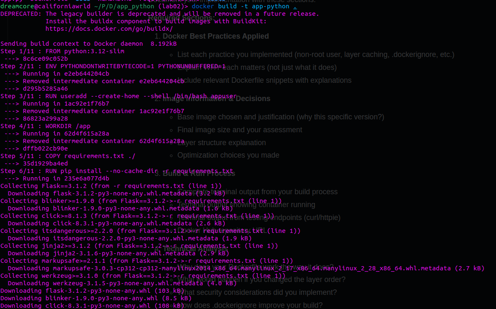
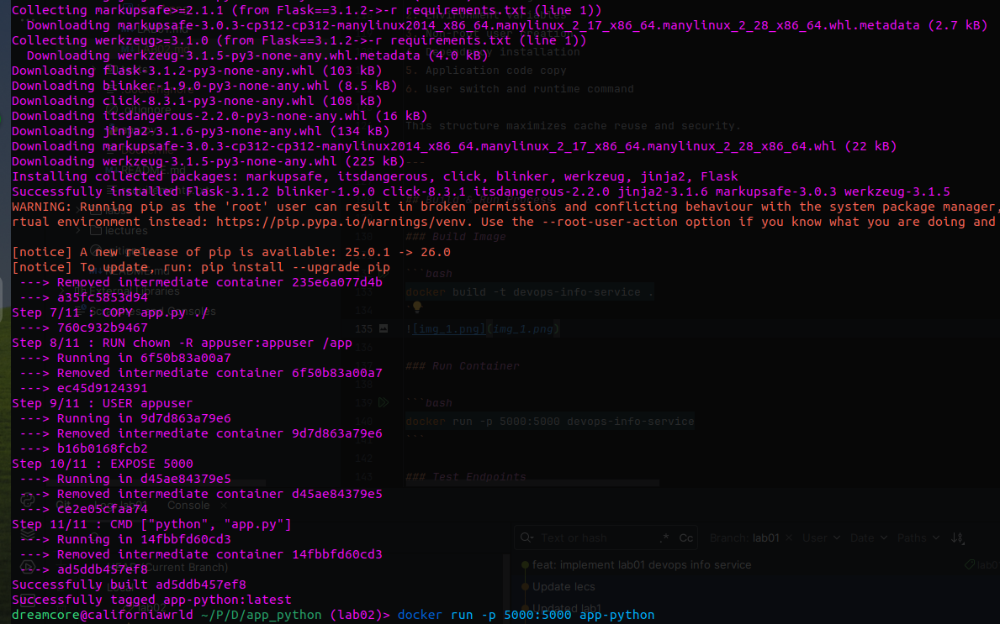
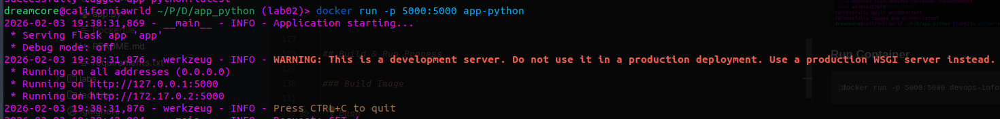
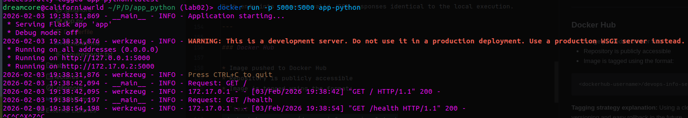
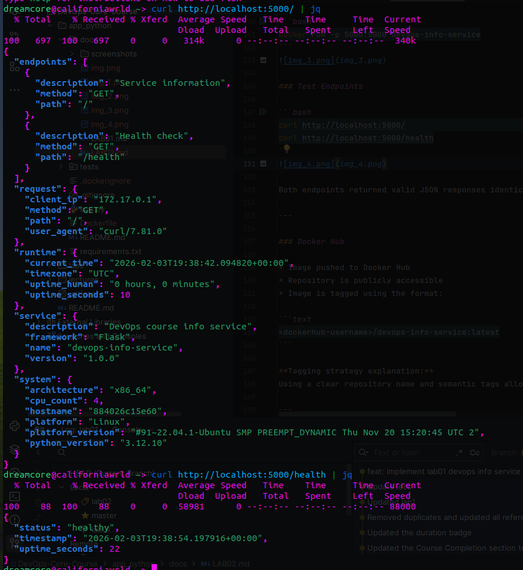
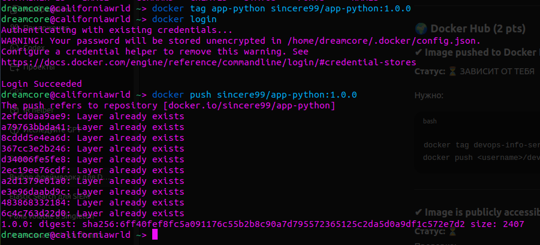
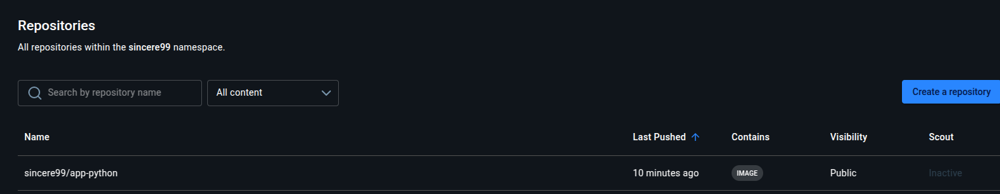

# LAB02 — Dockerizing Python Application

---

## Docker Best Practices Applied

### 1. Non-root User

**What was done:**
A dedicated non-root user (`appuser`) is created and used to run the application.

**Why it matters:**
Running containers as root increases the impact of a potential security breach. Using a non-root user reduces the attack surface and aligns with container security best practices.

**Dockerfile snippet:**

```dockerfile
RUN useradd --create-home --shell /bin/bash appuser
USER appuser
```

---

### 2. Specific Base Image Version

**What was done:**
The image uses a fixed Python version:

```dockerfile
FROM python:3.12-slim
```

**Why it matters:**

* Guarantees reproducible builds
* Avoids unexpected breaking changes
* `slim` images reduce size and attack surface compared to full images

---

### 3. Layer Caching Optimization

**What was done:**
Dependencies are installed before copying application code.

**Why it matters:**
Docker caches layers. If only application code changes, dependencies are not reinstalled, which significantly speeds up rebuilds.

**Dockerfile snippet:**

```dockerfile
COPY requirements.txt .
RUN pip install --no-cache-dir -r requirements.txt
COPY app.py ./
```

---

### 4. Environment-based Configuration

**What was done:**
The application configuration (host, port, debug mode) is controlled via environment variables.

**Why it matters:**
This follows the 12-factor app methodology and allows the same image to run in different environments without modification.

---

### 5. Logging to stdout/stderr

**What was done:**
Python logging is configured to output logs to standard output.

**Why it matters:**
Docker collects stdout/stderr logs automatically, enabling easy inspection with `docker logs` and integration with centralized logging systems.

---

### 6. .dockerignore Usage

**What was done:**
A `.dockerignore` file excludes unnecessary files from the build context (e.g. `__pycache__`, `.git`, virtual environments).

**Why it matters:**

* Faster build times
* Smaller build context
* Prevents accidental inclusion of sensitive or irrelevant files

---

## Image Information & Decisions

### Base Image Selection

**Chosen image:** `python:3.12-slim`

**Justification:**

* Official and well-maintained
* Smaller than full images
* Better compatibility than Alpine for Python packages

---

### Final Image Size

The final image size (2407) is significantly smaller than a full Python image due to the use of the slim variant and removal of pip cache.

**Assessment:**
The image size is appropriate for a simple API service and suitable for CI/CD pipelines.

---

### Layer Structure Explanation

1. Base Python image
2. Environment variables
3. Non-root user creation
4. Dependency installation
5. Application code copy
6. User switch and runtime command

This structure maximizes cache reuse and security.

---

## Build & Run Process

### Build Image

```bash
docker build -t app-python .
```



### Run Container

```bash
docker run -p 5000:5000 app-python
```


### Test Endpoints

```bash
curl http://localhost:5000/
curl http://localhost:5000/health
```


Both endpoints returned valid JSON responses identical to the local execution.

---

### Docker Hub

* Image pushed to Docker Hub
* Repository is publicly accessible
* Image is tagged using the format:

```text
sincere99/app-python:1.0.0
```


Docker Hub repositorty URL:
```text
https://hub.docker.com/repositories/sincere99
```


**Tagging strategy explanation:**
Using a clear repository name and semantic tags (1.0.0 for now) allows versioning and easy rollback in the future.

---

## Technical Analysis

### Why This Dockerfile Works Correctly

* Flask listens on `0.0.0.0`, allowing external access
* The exposed port matches the application port
* Dependencies are installed in an isolated, reproducible manner

---

### Effect of Changing Layer Order

If application code were copied before dependency installation, any code change would invalidate the cache and force a full dependency reinstall, slowing down builds.

---

### Security Considerations

* Non-root execution
* Minimal base image
* No secrets baked into the image
* Debug mode disabled by default

---

### Impact of .dockerignore

Excluding unnecessary files reduces build time, image size, and the risk of leaking development artifacts into production images.

---

## Challenges & Solutions

### Challenge 1: Image Rebuilds Were Slow

**Problem:**
Dependencies were reinstalled on every build.

**Solution:**
Reordered Dockerfile layers to leverage Docker cache effectively.

---

## What I Learned

* How Docker layer caching works in practice
* Why running containers as non-root is critical
* How to structure Dockerfiles for security and performance
* How to document containerization decisions clearly and professionally
