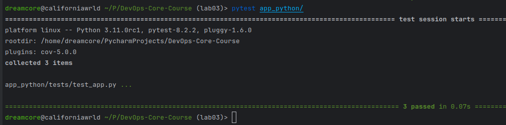
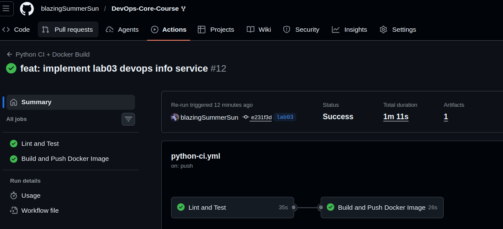
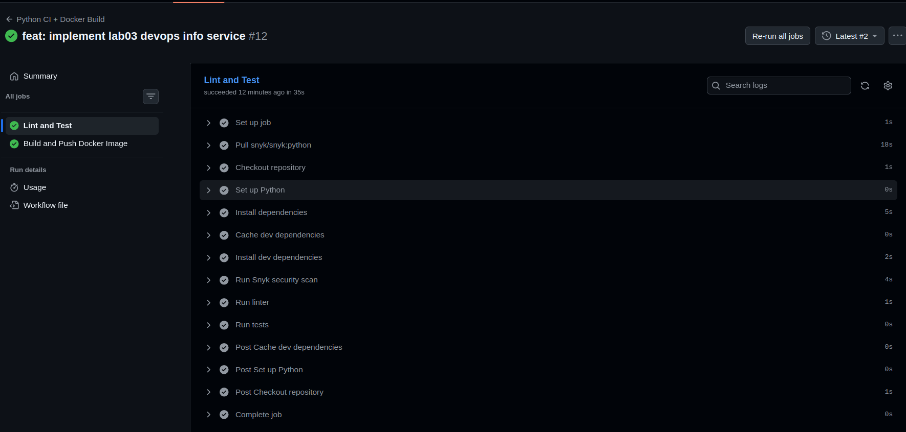
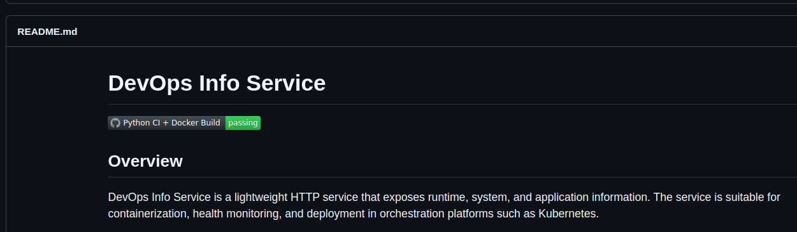
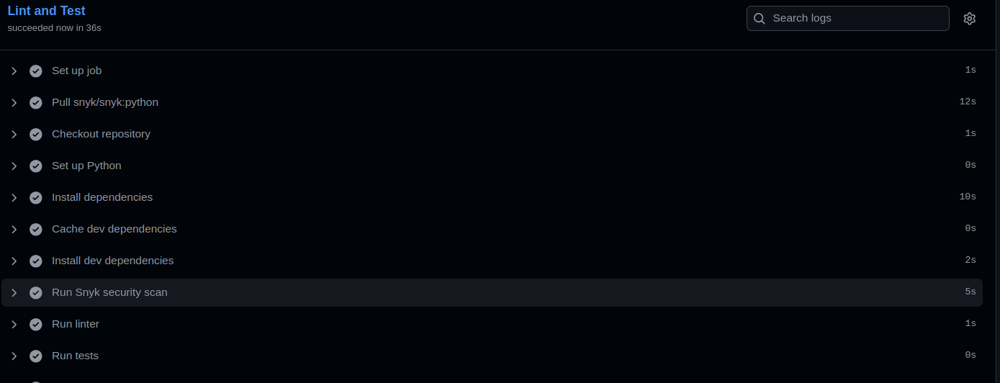
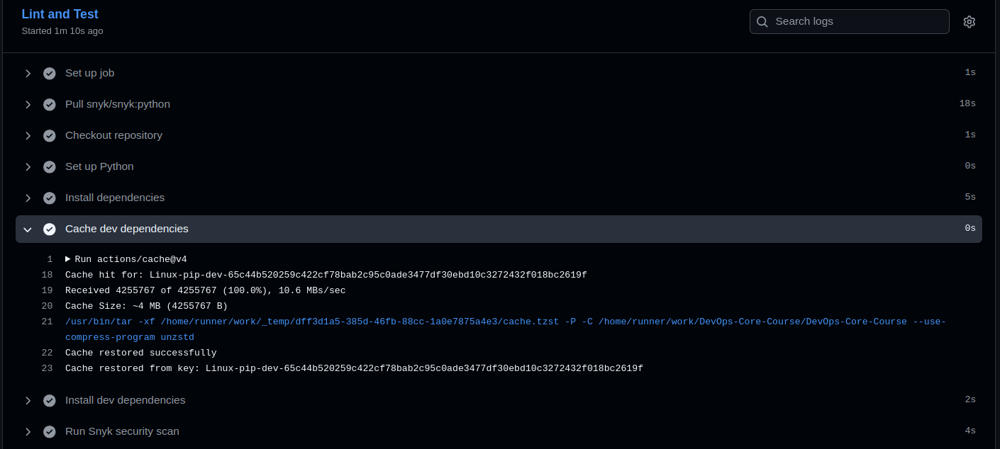
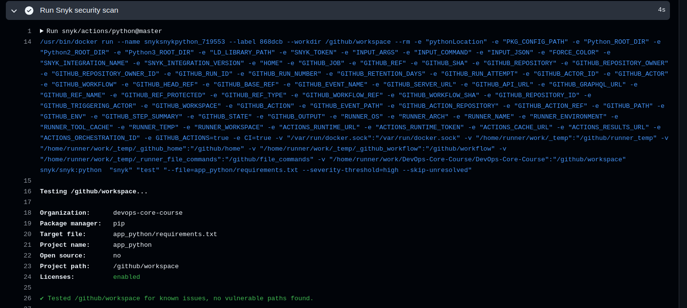

# LAB 03 — CI/CD Automation with Testing & Docker

## Overview

In this lab, automated testing and a CI/CD pipeline were implemented for the containerized Python application developed in Labs 1–2. The objective was to ensure application reliability, enforce code quality, and automate Docker image publishing using GitHub Actions.

---

# Task 1 — Unit Testing

## Testing Framework Choice

### Selected Framework: **pytest**

### Alternatives Considered

| Framework   | Pros                                               | Cons                          |
|------------|----------------------------------------------------|------------------------------|
| pytest     | Clean syntax, fixtures, rich plugin ecosystem      | External dependency required |
| unittest   | Built into Python standard library                 | More verbose, less flexible  |

### Why pytest?

- Concise and readable test syntax
- Powerful fixture system
- Excellent integration with Flask test client
- Widely adopted in modern Python projects
- Seamless integration with CI pipelines

pytest provides better maintainability and scalability compared to `unittest`.

---

## Test Structure Explanation

Tests are located in:`app_python/tests/test_app.py`


### Structure Design

- A reusable `client` fixture initializes the Flask test client.
- Each endpoint is tested independently.
- Both success cases and error scenarios are validated.
- Tests verify structure and data types instead of hardcoded dynamic values.

### Covered Endpoints

#### 1. GET /

Validations:
- HTTP status code = 200
- Required JSON keys exist:
  - `service`
  - `system`
  - `runtime`
  - `request`
  - `endpoints`
- Service metadata structure validation
- Type checking (e.g., `cpu_count` is integer)

#### 2. GET /health

Validations:
- HTTP status code = 200
- `status == "healthy"`
- `timestamp` field exists
- `uptime_seconds` is integer

#### 3. 404 Error Handling

Validations:
- HTTP status code = 404
- JSON error message:
  ```json
  { "error": "Not Found" }

### Design Decision

Dynamic values (hostname, timestamp, uptime) are not tested for exact values, only for presence and type correctness.
This prevents flaky tests and ensures stability.

### How to Run Tests Locally
From the project root: `pytest app_python`



# Task 2

## 1. Objective

The objective of **Task 2** was to containerize the application and prepare it for distribution and deployment using Docker. The task focused on:

- Creating a production-ready Dockerfile  
- Building a Docker image locally  
- Running the application inside a container  
- Publishing the image to Docker Hub  
- Ensuring reproducibility and portability  

This task ensures that the application can be executed consistently across different environments without dependency conflicts.

---

## 2. Dockerfile Design

### 2.1 Base Image

A lightweight base image was selected to reduce the final image size and improve security.  
For example:

- `python:3.11-slim` (for Python apps)
- `eclipse-temurin` (for Java apps)
- `node:alpine` (for Node.js apps)

The goal was to:
- Minimize attack surface
- Reduce build time
- Decrease image size

---

### 2.2 Working Directory

A working directory was defined inside the container:

```dockerfile
WORKDIR /app
```
This ensures all application files and commands execute relative to /app.

### 2.3 Copying Application Files

Application source code and dependency files were copied into the container:

```
COPY requirements.txt .
COPY . .
```
This allows Docker layer caching to optimize rebuild time when source files change.

### 2.4 Installing Dependencies
Dependencies were installed inside the container:
```
RUN pip install --no-cache-dir -r requirements.txt
```

Key considerations:

- Use --no-cache-dir to reduce image size 
- Install dependencies before copying full source (for better caching)

### 2.5 Exposing Ports
The application port was exposed:
```
EXPOSE 8080
```
This documents which port the container listens on.

### 2.6 Application Startup
The container entrypoint or command was defined:
```
CMD ["python", "app.py"]
```
This ensures the application starts automatically when the container runs.

## 3. Building the Docker Image
The Docker image was built locally using the following pattern:

``
docker build -t <dockerhub-username>/<image-name>:<tag> .
``

Example pattern:
``
docker build -t sincere99/devops-info-service:1.0 .
``

### Tagging Strategy

Images can be tagged with:
- :latest
- :1.0
- :v1.2.3
- :dev
- :prod

Using explicit version tags is recommended for traceability and rollback.

### Green checkmark:



# Task 3
## Status Badge
A GitHub Actions status badge was added to:


## Cache implementation
```
- name: Cache dev dependencies
  uses: actions/cache@v4
  with:
    path: ~/.cache/pip
    key: ${{ runner.os }}-pip-dev-${{ hashFiles('app_python/requirements-dev.txt') }}
    restore-keys: |
      ${{ runner.os }}-pip-dev-
```
1. First run:

2. Second run


Difference in installing dependencies is 2 times less (10s before caching, 5s after).

## CI Best Practices Applied
### 1. Dependency Caching
Reduces workflow time and improves efficiency.
Why it matters:
- Saves CI resources
- Reduces feedback loop time
- Improves developer productivity

### 2. Fail Fast Strategy
Workflow stops on:
- Test failure
- High severity vulnerability detection

Why it matters:
- Prevents broken or insecure builds
- Protects production environment

### 3. Working Directory Isolation
Used:
working-directory: app_python
Why it matters:
- Clear project structure 
- Avoids path errors 
- Improves maintainability

### 4. Secrets Management
Used GitHub Secrets for:
SNYK_TOKEN
Why it matters:
- No secrets in repository
- Prevents credential leaks
- Secure CI configuration

### 5. Explicit Dependency File Targeting
Used:
``
--file=app_python/requirements.txt
``

Why it matters:
- Ensures correct scan target
- Avoids CI ambiguity
- Improves reliability

## Snyk Security Integration
Implementation
```
- name: Run Snyk security scan
  uses: snyk/actions/python@master
  env:
    SNYK_TOKEN: ${{ secrets.SNYK_TOKEN }}
  with:
    args: --file=app_python/requirements.txt --severity-threshold=high --skip-unresolved
```
### Results


### Improved workflow performance provided above in cache section.