# Lab 4

## Provider used: Yandex Cloud
Reason: The free tier allows you to quickly create a VM for a training lab 
without paying anything. It provides a convenient Terraform provider and a public IP address for SSH 
access.

## Terraform version used: 1.14.5
## Project structure explanation:
- main.tf — the main file describing resources: VPC, subnets, Security Group, and VM.
- variables.tf — project variables (e.g., zone, vm_size, my_ip).
- outputs.tf — output of values ​​after terraform apply, e.g., the VM's public IP.
- terraform.tfstate — automatically generated state file (not committed to Git).
- provider.tf — provider settings (Yandex.Cloud, token, zone).

## Key configuration decisions:

- I used a local state for simplicity (it's not stored in the cloud).
- I configured a Security Group with ingress only for my IP for SSH (/32) and open ports for HTTP/5000.
- The VM was created with an Ubuntu 22.04 LTS image and a size of 2 vCPUs / 1 GB RAM for the test task.
- NAT is enabled on the VM's network interface to obtain a public IP.

## Challenges encountered:
- When using a dynamic IP, SSH sometimes failed, so we had to test and record the current external IP.

## Resources Created
- Network / VPC: devops-network — a virtual private network (VPC) in the selected zone.
- Subnet: devops-subnet — a subnet within the VPC with CIDR 10.0.1.0/24.
- Security Group / Firewall: devops-sg — a security group with the following rules:
- Ingress: SSH (TCP 22) → only for your IP (151.243.28.100/32)
- HTTP (TCP 80) → open to all (0.0.0.0/0)
- Application port (TCP 5000) → open to all (0.0.0.0/0)
- Egress: Any protocol → open to all (0.0.0.0/0)

## Resources created:
| Resource              | Configuration                                                                           |
| --------------------- | --------------------------------------------------------------------------------------- |
| VM (compute instance) | Platform: standard-v2, Cores: 2 (core_fraction=20%), Memory: 1 GB, Boot disk: 10 GB HDD |
| Zone / Region         | var.zone = ru-central1-a                                                                |
| Network (VPC)         | Name: devops-network                                                                    |
| Subnet                | Name: devops-subnet, CIDR: 10.0.1.0/24                                                  |
| Security group        | Name: devops-sg, Rules: SSH 22 (my IP), HTTP 80 (0.0.0.0/0), App 5000 (0.0.0.0/0)       |
| NAT                   | Enabled (public IP assigned)                                                            |
| Labels                | environment=dev, project=devops-course                                                  |

## Public IP address of created VM: 93.77.182.209

## SSH connection command: 
``
ssh -i ~/.ssh/devops_vm_key ubuntu@93.77.182.209
``

## Terminal output from terraform plan and terraform apply
Start of the terraform plan output:
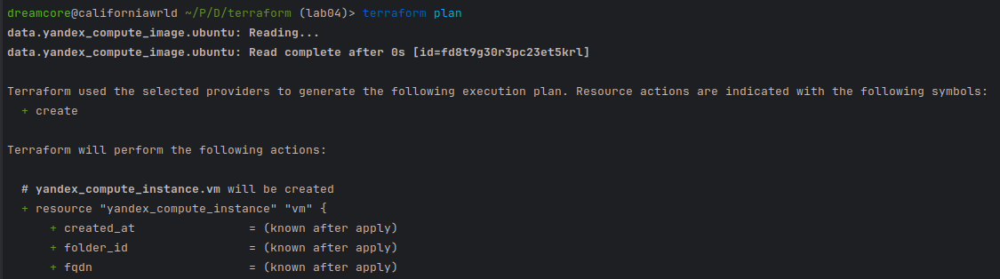
End of the output (skipped description of .tf files):
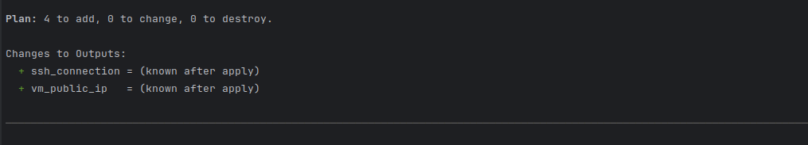

terraform apply output:
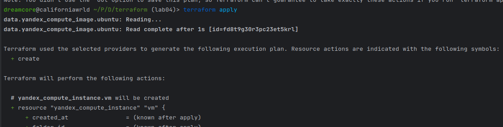

end of the output:
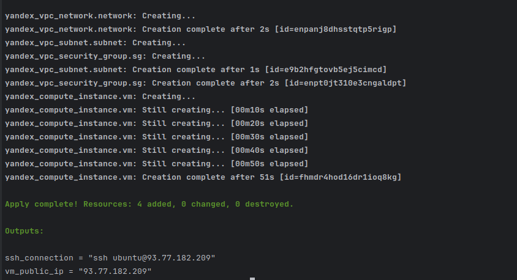

## Proof of SSH access to VM
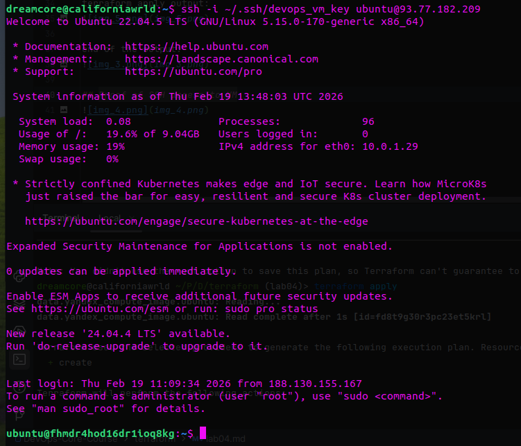

# Task 2
## Executed terraform destroy command:
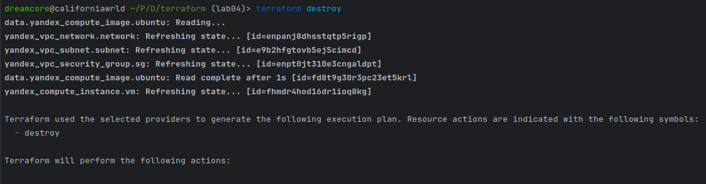
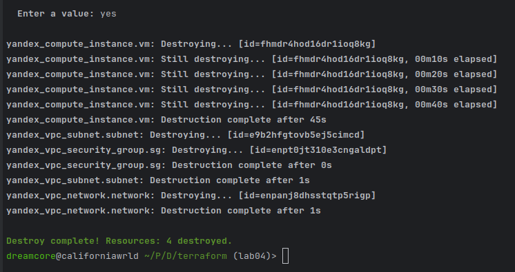

## Chosen version and pulumi version
Python was chosen due to its ease of integration with familiar libraries and the ease of writing infrastructure logic.

Pulumi version: 3.222.0
Language: Python 3.10.12

## Pulumi preview and pulumi up
``
pulumi preview
``
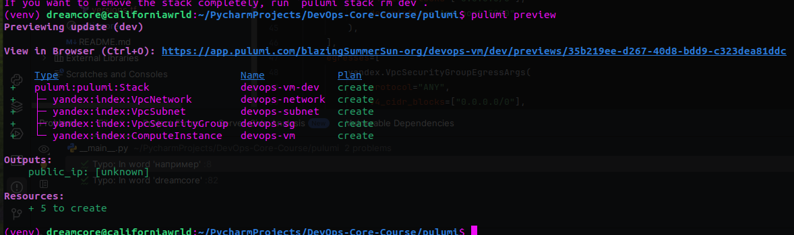

``pulumi up``
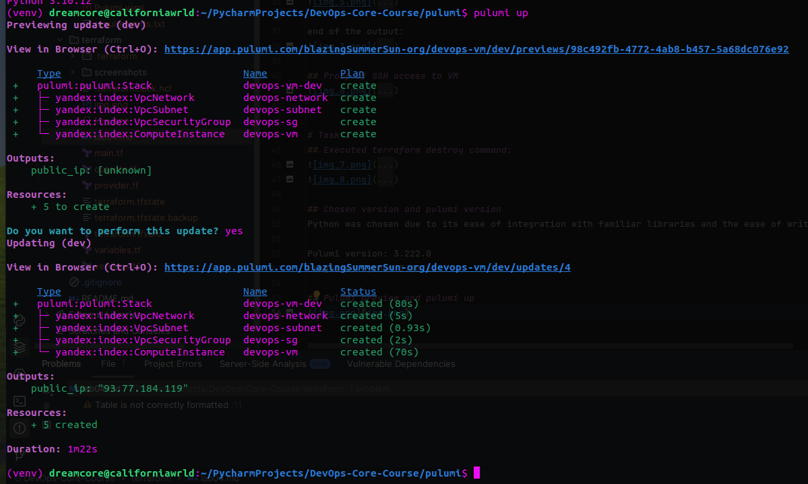

## Public ip: 93.77.184.119

## How code differs from terraform

- Terraform uses declarative HCL, while Pulumi uses a full-fledged Python language.
- Pulumi supports loops, functions, variables, and conditionals, simplifying dynamic resource creation.
- In Pulumi, resource objects are created using classes and arguments, while in Terraform, they are created using resource blocks.

## Advantages you discovered
- Full control over infrastructure logic thanks to Python.
- Easily integrate external libraries and work with configuration as code.
- Direct logging and debugging in code.
- Standard Python tools (e.g., os, json, logging) can be used.

## Challenges encountered
- Configuring a Security Group for Yandex.Cloud required precise specification of ingresses and egresses in the correct format.
- Pulumi SDK versions sometimes change arguments and class structures (VpcSecurityGroup vs. VpcSecurityGroupRule).
- It was necessary to add the /32 suffix to the local IP for SSH, otherwise the Yandex.Cloud API would return an error.

## Connected to ssh
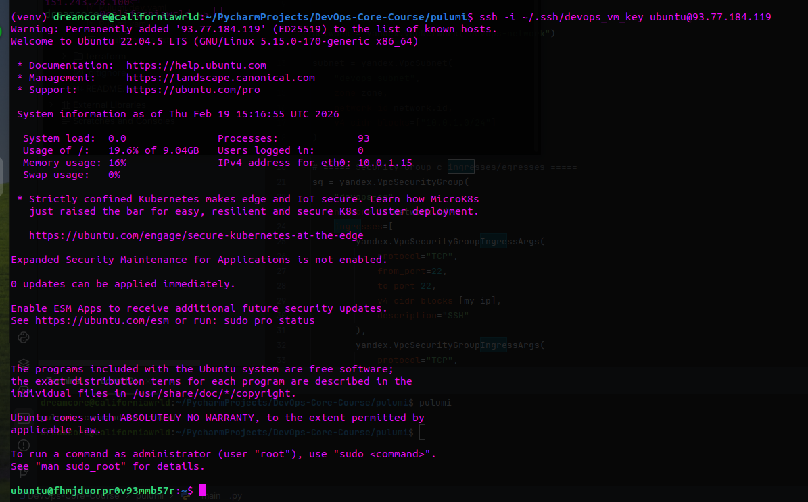

## Terraform vs Pulumi Comparison
### Ease of Learning
- Terraform: It's easier to master basic resources because HCL is declarative and has less syntax.
- Pulumi: It requires Python knowledge, but offers more flexibility for dynamic and complex configurations.

### Code Readability
- Terraform: HCL is compact and easy to read if the infrastructure is static.
- Pulumi: Python is more verbose, sometimes noisier, but the logic is clearer for complex scenarios.

### Debugging
- Terraform: Errors are sometimes not obvious, especially with resource dependencies.
- Pulumi: It's easier to debug; you can use Python print and standard logging.

### Documentation
- Terraform: Official documentation and examples are available for almost all providers.
- Pulumi: The documentation is a bit more complex for beginners, but the Python/TypeScript code examples provide real-world scenarios and integration.

### Use Case
- Terraform: Best for static infrastructure when you need to quickly and easily deploy a cloud.
- Pulumi: Ideal for dynamic infrastructure, code-based automation, and integration with Python or TypeScript projects.

## Lab 5 Preparation & Cleanup
- I will keep my VM for lab 5
- Terraform
- Destroyed pulumi:
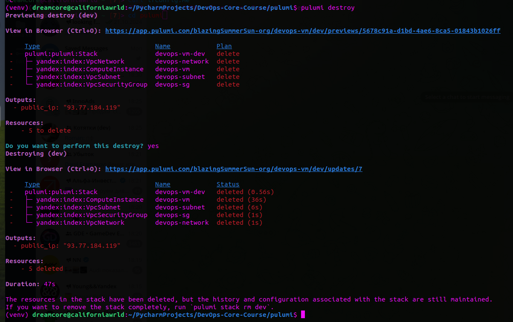