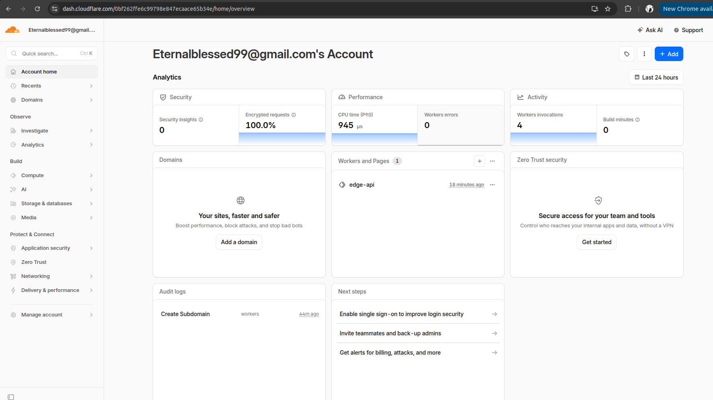
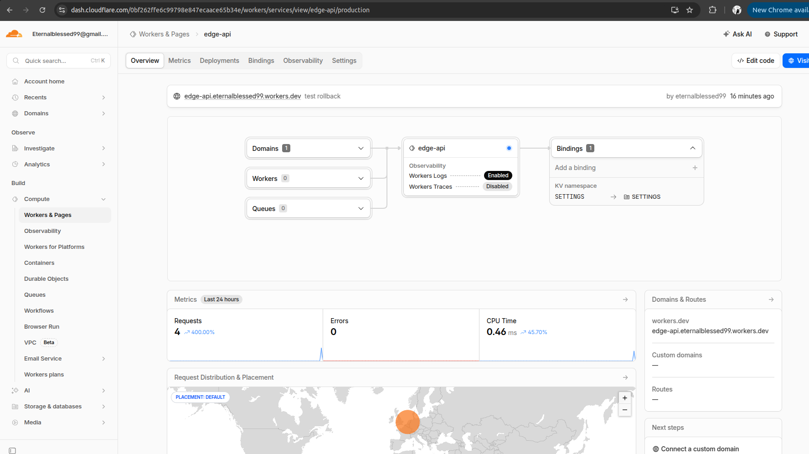
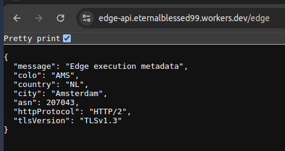
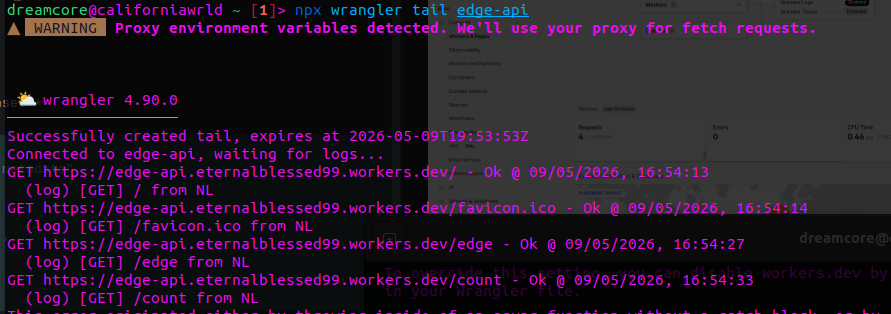

# Lab 17 — Cloudflare Workers Edge Deployment Report

## 1. Deployment Summary
- **Worker URL:** `https://edge-api.eternalblessed99.workers.dev`
- **Main routes:** `/`, `/health`, `/edge`, `/counter`
- **Configuration used:**
  - Plaintext variables defined in `wrangler.jsonc` (`APP_NAME`, `COURSE_NAME`).
  - Secrets securely added via Wrangler CLI (`API_TOKEN`, `ADMIN_EMAIL`).
  - Workers KV Namespace bound as `SETTINGS` for persistent state.

## 2. Evidence
**Dashboard Evidence:**



**Example `/edge` JSON response:**
```json
{
  "message": "Edge execution metadata",
  "colo": "FRA",
  "country": "DE",
  "city": "Frankfurt am Main",
  "asn": 3320,
  "httpProtocol": "HTTP/3",
  "tlsVersion": "TLSv1.3"
}
```


**Example log entry (from `npx wrangler tail`):**
```bash
dreamcore@californiawrld ~ [1]> npx wrangler tail edge-api
▲ [WARNING] Proxy environment variables detected. We'll use your proxy for fetch requests.


 ⛅️ wrangler 4.90.0
───────────────────
Successfully created tail, expires at 2026-05-09T19:53:53Z
Connected to edge-api, waiting for logs...
GET https://edge-api.eternalblessed99.workers.dev/ - Ok @ 09/05/2026, 16:54:13
  (log) [GET] / from NL
GET https://edge-api.eternalblessed99.workers.dev/favicon.ico - Ok @ 09/05/2026, 16:54:14
  (log) [GET] /favicon.ico from NL
GET https://edge-api.eternalblessed99.workers.dev/edge - Ok @ 09/05/2026, 16:54:27
  (log) [GET] /edge from NL
GET https://edge-api.eternalblessed99.workers.dev/count - Ok @ 09/05/2026, 16:54:33
  (log) [GET] /count from NL

```


## 3. Kubernetes vs Cloudflare Workers Comparison

| Aspect | Kubernetes | Cloudflare Workers |
|--------|------------|--------------------|
| Setup complexity | High (requires cluster provisioning, manifests, networking) | Very low (run `npm create` and deploy) |
| Deployment speed | Minutes (build image, push to registry, wait for pods) | Seconds (instant edge distribution) |
| Global distribution | Manual/Hard (needs multi-cluster setup and global routing) | Automatic (runs on CF edge globally by default) |
| Cost (for small apps) | High (pay for idle nodes/control plane) | Free/Extremely low (pay per request) |
| State/persistence | StatefulSets, PVCs, complex distributed databases | Managed APIs like KV, D1, Durable Objects |
| Control/flexibility | Complete control over runtime, OS, and networking | Constrained to V8 Isolates (no native Node.js binaries) |
| Best use case | Complex microservices, stateful apps, background workers | API gateways, simple APIs, edge routing, caching logic |

## 4. When to Use Each
**Scenarios favoring Kubernetes:**
- The application relies on specific OS libraries, native binaries, or custom Docker images.
- Long-running background processes, daemons, or complex cron jobs are required.
- You need deep custom networking, service meshes, or private VPC isolation.

**Scenarios favoring Cloudflare Workers:**
- Building fast, globally distributed stateless APIs, edge proxies, or webhooks.
- Ultra-low latency response times are critical for end-users across the world.
- You want zero-maintenance infrastructure with automatic scaling to zero when idle.

## 5. Reflection
- **What felt easier than Kubernetes:** Deployment and SSL provisioning. Running `npx wrangler deploy` is incredibly fast compared to writing Dockerfiles, building container images, and writing complex Kubernetes YAML manifests.
- **What felt more constrained:** The inability to use standard Node.js modules that rely on native C++ bindings or file system access. The V8 isolate environment is much stricter than a standard Docker container.
- **What changed because Workers is not a Docker host:** I had to completely adapt my approach to state persistence. Instead of mounting volumes or connecting to a traditional database container, I utilized Cloudflare's proprietary KV store via direct environment bindings.
