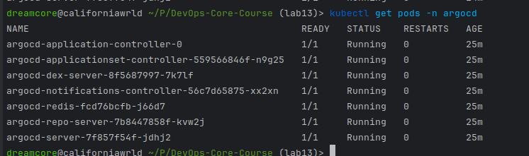
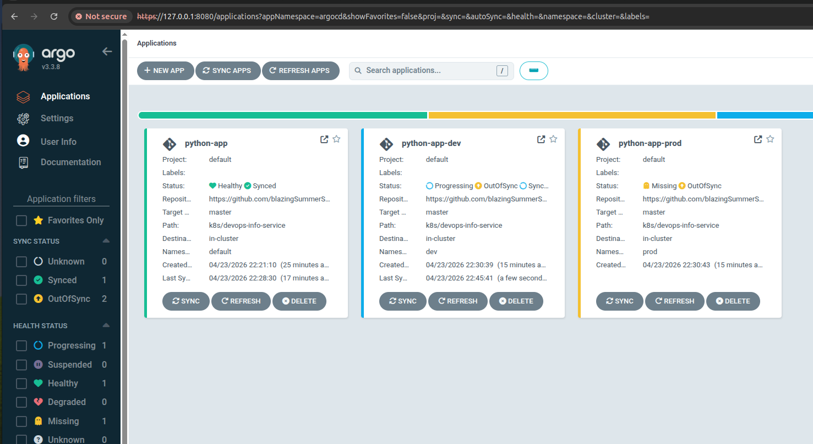
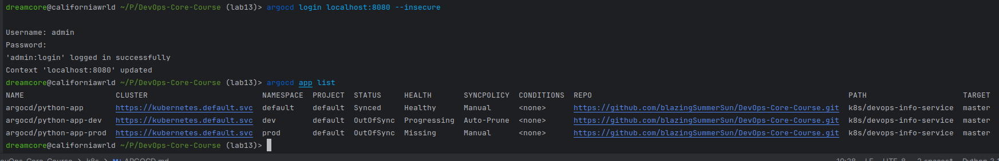
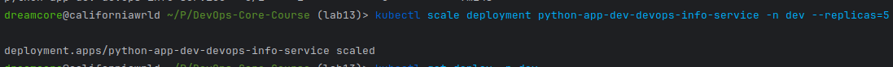
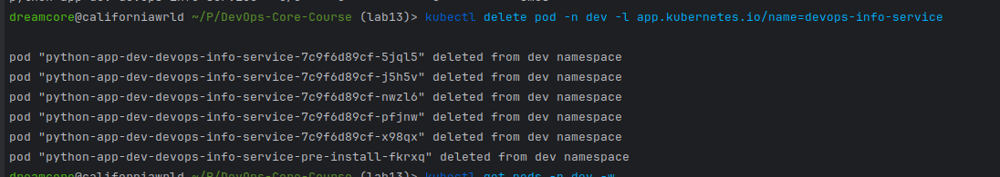
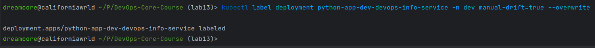
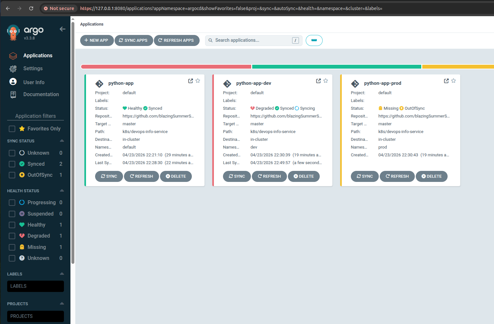
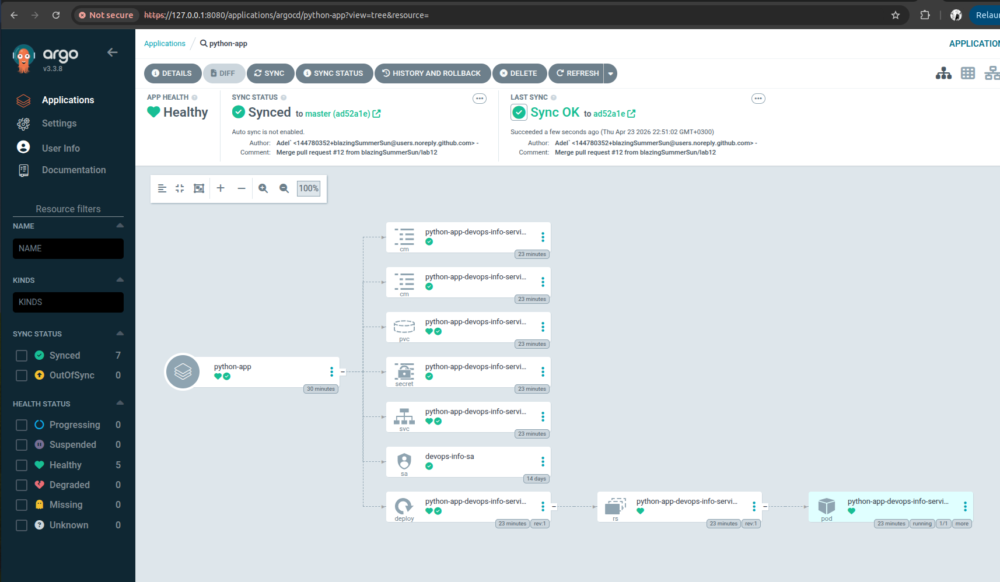
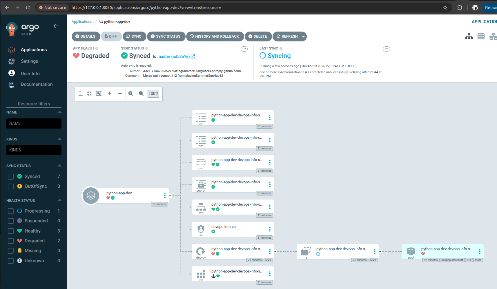

# ArgoCD Lab 13 Report

## 1. ArgoCD Setup
- Installed via Helm in `argocd` namespace.
- Verified pods:
  - 
- UI access:
  - `kubectl port-forward svc/argocd-server -n argocd 8080:443`
  - URL: `https://localhost:8080`
  - 
- CLI:
  - `argocd login localhost:8080 --insecure`
  - 

## 2. Application Configuration
- Repository: `https://github.com/blazingSummerSun/DevOps-Core-Course.git`
- Branch: `master`
- Helm path: `k8s/devops-info-service`
- ArgoCD manifests:
  - `k8s/argocd/application.yaml`
  - `k8s/argocd/application-dev.yaml`
  - `k8s/argocd/application-prod.yaml`

## 3. Multi-Environment
- Namespaces: `dev`, `prod`
- Dev:
  - `values-dev.yaml`
  - auto-sync enabled (`prune: true`, `selfHeal: true`)
- Prod:
  - `values-prod.yaml`
  - manual sync only
- Rationale:
  - Dev for fast iterations, Prod for control releases.

## 4. Self-Healing Evidence

### 4.1 Manual Scale Drift (Dev)
- Time:
- Command:
  - `kubectl scale deployment python-app-dev-devops-info-service -n dev --replicas=5`
  - 
- Observed:
  - ArgoCD detected OutOfSync and reverted replicas to Git value.

### 4.2 Pod Deletion Test
- Command:
  - `kubectl delete pod -n dev -l app.kubernetes.io/name=devops-info-service`
  - 
- Observed:
  - Pod recreated by Kubernetes ReplicaSet controller.

### 4.3 Configuration Drift Test
- Command:
  - `kubectl label deployment python-app-dev-devops-info-service -n dev manual-drift=true --overwrite`
  - 
- Observed:
  - ArgoCD diff showed drift, self-heal removed manual label.

## 5. Screenshots
- ArgoCD app list with both apps
- `python-app-dev` details (Synced/Healthy)
- `python-app-prod` details
- Drift/diff screenshot

