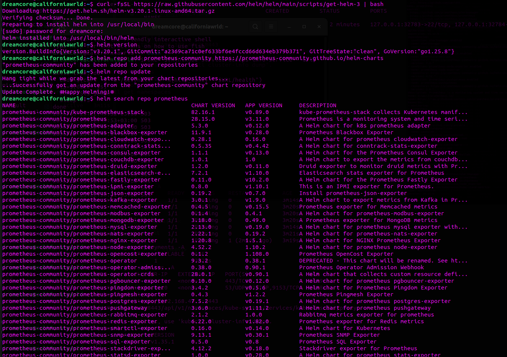
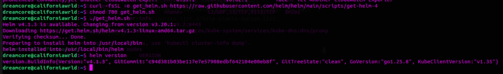
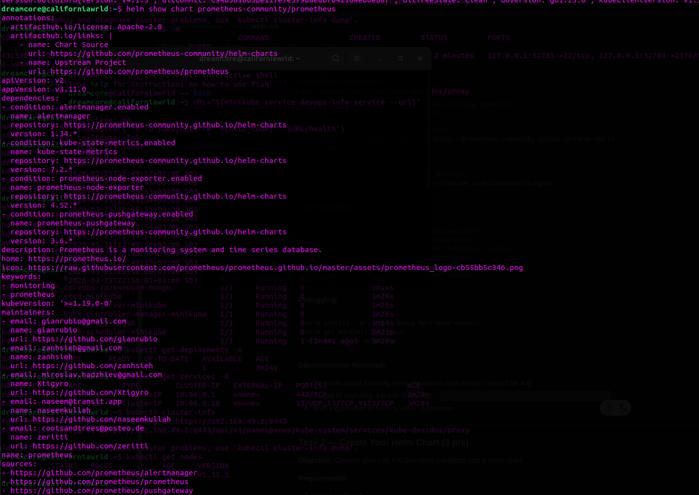
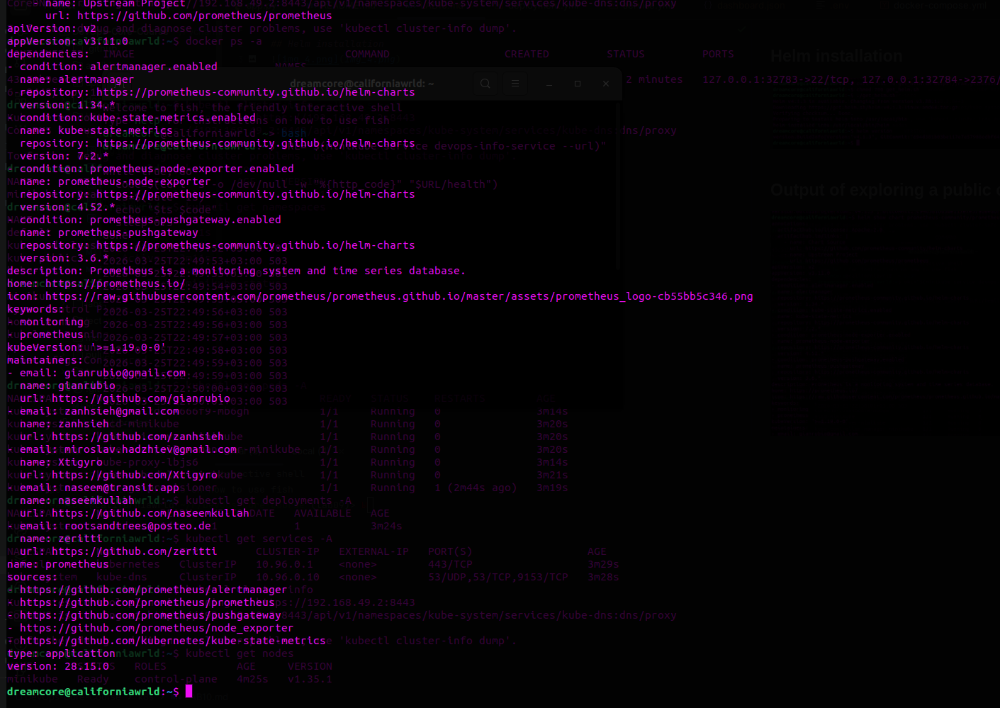

## 1) Chart Overview

### Chart structure
- `Chart.yaml` — chart metadata (name/version/appVersion).
- `values.yaml` — default configuration.
- `templates/deployment.yaml` — Deployment template (replicas/image/resources/probes configurable via values).
- `templates/service.yaml` — Service template (type/ports configurable via values).
- `templates/_helpers.tpl` — naming + labels helpers (DRY and consistency).
- `templates/hooks/pre-install-job.yaml` — pre-install hook Job.
- `templates/hooks/post-install-job.yaml` — post-install hook Job.

### Values strategy
- `values.yaml` holds sane defaults for a “base” environment.
- `values-dev.yaml` and `values-prod.yaml` override only what differs between environments (replicas/resources/service/image tag/probes timings).

---

## 2) Configuration Guide

### Key values

- `replicaCount` — number of replicas.
- `image.repository`, `image.tag`, `image.pullPolicy` — container image settings.
- `resources.requests/limits` — CPU/memory requests and limits.
- `service.type`, `service.port`, `service.targetPort` — Service exposure and ports.
- `livenessProbe.*`, `readinessProbe.*` — health checks configuration (never disabled by default).
- `hooks.enabled` — enable/disable Helm hooks.

### Install examples

#### Default install
```bash
helm install myapp k8s/devops-info-service
```

#### Development environment
```bash
helm install myapp-dev k8s/devops-info-service -f k8s/devops-info-service/values-dev.yaml
```

#### Production environment
```bash
helm install myapp-prod k8s/devops-info-service -f k8s/devops-info-service/values-prod.yaml
```

#### Override single value example
```bash
helm install myapp k8s/devops-info-service --set replicaCount=2
```

---

## 3) Multi-environment (dev vs prod)

### Dev overrides (`values-dev.yaml`)
- `replicaCount: 1`
- relaxed resources
- `service.type: NodePort`
- image tag: `latest`
- faster probes

### Prod overrides (`values-prod.yaml`)
- `replicaCount: 5` (or higher)
- stronger resources
- `service.type: LoadBalancer`
- pinned image tag (e.g. `v2`)
- more conservative probes

### Evidence (dev install -> prod upgrade)

#### Dev install command output
```bash
helm install myapp k8s/devops-info-service -f k8s/devops-info-service/values-dev.yaml
```

```bash
dreamcore@californiawrld ~/P/DevOps-Core-Course (lab10)> helm install myapp k8s/devops-info-service -f k8s/devops-info-service/values-dev.yaml

NAME: myapp
LAST DEPLOYED: Thu Apr  2 20:54:25 2026
NAMESPACE: default
STATUS: deployed
REVISION: 1
DESCRIPTION: Install complete

```

#### Dev values after install
```bash
helm get values myapp
```

```bash
dreamcore@californiawrld ~/P/DevOps-Core-Course (lab10)> helm get values myapp

USER-SUPPLIED VALUES:
image:
  tag: latest
livenessProbe:
  initialDelaySeconds: 5
  periodSeconds: 10
readinessProbe:
  initialDelaySeconds: 3
  periodSeconds: 5
replicaCount: 1
resources:
  limits:
    cpu: 100m
    memory: 128Mi
  requests:
    cpu: 50m
    memory: 64Mi
service:
  type: NodePort
```

#### Dev resources
```bash
kubectl get deploy,svc
```

```bash
dreamcore@californiawrld ~/P/DevOps-Core-Course (lab10)> kubectl get deploy,svc

NAME                                            READY   UP-TO-DATE   AVAILABLE   AGE
deployment.apps/devops-info-service             5/5     5            5           7d22h
deployment.apps/myapp-devops-info-service       1/1     1            1           10s
deployment.apps/myrelease-devops-info-service   5/5     5            5           2m57s

NAME                                    TYPE        CLUSTER-IP      EXTERNAL-IP   PORT(S)        AGE
service/devops-info-service             NodePort    10.98.115.189   <none>        80:31280/TCP   7d22h
service/kubernetes                      ClusterIP   10.96.0.1       <none>        443/TCP        7d22h
service/myapp-devops-info-service       NodePort    10.100.99.141   <none>        80:32248/TCP   10s
service/myrelease-devops-info-service   NodePort    10.111.50.64    <none>        80:31493/TCP   2m57s
```

#### Upgrade to prod
```bash
helm upgrade myapp k8s/devops-info-service -f k8s/devops-info-service/values-prod.yaml
```

```bash
dreamcore@californiawrld ~/P/DevOps-Core-Course (lab10)> helm upgrade myapp k8s/devops-info-service -f k8s/devops-info-service/values-prod.yaml

Release "myapp" has been upgraded. Happy Helming!
NAME: myapp
LAST DEPLOYED: Thu Apr  2 20:54:44 2026
NAMESPACE: default
STATUS: deployed
REVISION: 2
DESCRIPTION: Upgrade complete
```

#### Prod values after upgrade
```bash
helm get values myapp
```

```bash
dreamcore@californiawrld ~/P/DevOps-Core-Course (lab10)> helm get values myapp

USER-SUPPLIED VALUES:
image:
  tag: v2
livenessProbe:
  initialDelaySeconds: 30
  periodSeconds: 5
readinessProbe:
  initialDelaySeconds: 10
  periodSeconds: 3
replicaCount: 5
resources:
  limits:
    cpu: 500m
    memory: 512Mi
  requests:
    cpu: 200m
    memory: 256Mi
service:
  type: LoadBalancer
```

#### Prod services
```bash
kubectl get svc
```

```bash
dreamcore@californiawrld ~/P/DevOps-Core-Course (lab10)> kubectl get svc
NAME                            TYPE           CLUSTER-IP      EXTERNAL-IP   PORT(S)        AGE
devops-info-service             NodePort       10.98.115.189   <none>        80:31280/TCP   7d22h
kubernetes                      ClusterIP      10.96.0.1       <none>        443/TCP        7d22h
myapp-devops-info-service       LoadBalancer   10.100.99.141   <pending>     80:32248/TCP   74s
myrelease-devops-info-service   NodePort       10.111.50.64    <none>        80:31493/TCP   4m1s
```

---

## 4) Hook Implementation

### Implemented hooks
- **pre-install** Job:
  - Purpose: run a pre-install task (validation/migration placeholder).
  - Weight: `-5` (runs earlier)
  - Delete policy: `hook-succeeded`

- **post-install** Job:
  - Purpose: run a post-install task (smoke test/notification placeholder).
  - Weight: `5` (runs after install)
  - Delete policy: `hook-succeeded`

### Evidence (hooks)

#### Hooks rendered in dry-run
```bash
helm install --dry-run=client --debug hooktest k8s/devops-info-service | grep -n "helm.sh/hook" -n
```

```bash
dreamcore@californiawrld ~/P/DevOps-Core-Course (lab10)> helm install --dry-run=client --debug hooktest k8s/devops-info-service | grep -n "helm.sh/hook" -n

level=DEBUG msg="Original chart version" version=""
level=DEBUG msg="Chart path" path=/home/dreamcore/PycharmProjects/DevOps-Core-Course/k8s/devops-info-service
level=DEBUG msg="number of dependencies in the chart" chart=devops-info-service dependencies=0
70:    "helm.sh/hook": post-install
71:    "helm.sh/hook-weight": "5"
72:    "helm.sh/hook-delete-policy": hook-succeeded
109:    "helm.sh/hook": pre-install
110:    "helm.sh/hook-weight": "-5"
111:    "helm.sh/hook-delete-policy": hook-succeeded
```

#### Install that triggers hooks
```bash
helm install hooktest k8s/devops-info-service
```

```bash
dreamcore@californiawrld ~/P/DevOps-Core-Course (lab10)> helm install hooktest k8s/devops-info-service
NAME: hooktest
LAST DEPLOYED: Thu Apr  2 21:21:22 2026
NAMESPACE: default
STATUS: deployed
REVISION: 1
DESCRIPTION: Install complete
TEST SUITE: None
```

#### Hook jobs (may disappear due to hook-delete-policy)
```bash
kubectl get jobs
```

<PASTE OUTPUT HERE>

In my case, jobs are visible here:

```bash
kubectl get events --sort-by=.metadata.creationTimestamp | tail -n 40
```

```
dreamcore@californiawrld ~/P/DevOps-Core-Course (lab10)> kubectl get events --sort-by=.metadata.creationTimestamp | tail -n 40

39s         Normal    Killing             pod/hooktest-devops-info-service-5fb857b874-7792n     Stopping container devops-info-service
39s         Normal    Killing             pod/hooktest-devops-info-service-5fb857b874-4bz59     Stopping container devops-info-service
37s         Normal    SuccessfulCreate    job/hooktest-devops-info-service-pre-install          Created pod: hooktest-devops-info-service-pre-install-x5hfq
37s         Normal    Scheduled           pod/hooktest-devops-info-service-pre-install-x5hfq    Successfully assigned default/hooktest-devops-info-service-pre-install-x5hfq to minikube
36s         Normal    Started             pod/hooktest-devops-info-service-pre-install-x5hfq    Container started
36s         Normal    Created             pod/hooktest-devops-info-service-pre-install-x5hfq    Container created
36s         Normal    Pulled              pod/hooktest-devops-info-service-pre-install-x5hfq    Container image "busybox:1.36" already present on machine and can be accessed by the pod
29s         Normal    SuccessfulCreate    replicaset/hooktest-devops-info-service-5fb857b874    Created pod: hooktest-devops-info-service-5fb857b874-9dxfs
29s         Normal    Scheduled           pod/hooktest-devops-info-service-post-install-fl4bt   Successfully assigned default/hooktest-devops-info-service-post-install-fl4bt to minikube
29s         Normal    SuccessfulCreate    job/hooktest-devops-info-service-post-install         Created pod: hooktest-devops-info-service-post-install-fl4bt
29s         Normal    SuccessfulCreate    replicaset/hooktest-devops-info-service-5fb857b874    Created pod: hooktest-devops-info-service-5fb857b874-sqpxm
29s         Normal    SuccessfulCreate    replicaset/hooktest-devops-info-service-5fb857b874    Created pod: hooktest-devops-info-service-5fb857b874-t6mzf
29s         Normal    SuccessfulCreate    replicaset/hooktest-devops-info-service-5fb857b874    Created pod: hooktest-devops-info-service-5fb857b874-sjjnk
29s         Normal    SuccessfulCreate    replicaset/hooktest-devops-info-service-5fb857b874    Created pod: hooktest-devops-info-service-5fb857b874-x5bx7
29s         Normal    Scheduled           pod/hooktest-devops-info-service-5fb857b874-9dxfs     Successfully assigned default/hooktest-devops-info-service-5fb857b874-9dxfs to minikube
29s         Normal    Scheduled           pod/hooktest-devops-info-service-5fb857b874-x5bx7     Successfully assigned default/hooktest-devops-info-service-5fb857b874-x5bx7 to minikube
29s         Normal    ScalingReplicaSet   deployment/hooktest-devops-info-service               Scaled up replica set hooktest-devops-info-service-5fb857b874 from 0 to 5
29s         Normal    Completed           job/hooktest-devops-info-service-pre-install          Job completed
29s         Normal    Scheduled           pod/hooktest-devops-info-service-5fb857b874-sjjnk     Successfully assigned default/hooktest-devops-info-service-5fb857b874-sjjnk to minikube
29s         Normal    Scheduled           pod/hooktest-devops-info-service-5fb857b874-sqpxm     Successfully assigned default/hooktest-devops-info-service-5fb857b874-sqpxm to minikube
29s         Normal    Scheduled           pod/hooktest-devops-info-service-5fb857b874-t6mzf     Successfully assigned default/hooktest-devops-info-service-5fb857b874-t6mzf to minikube
28s         Normal    Created             pod/hooktest-devops-info-service-5fb857b874-x5bx7     Container created
28s         Normal    Created             pod/hooktest-devops-info-service-5fb857b874-9dxfs     Container created
28s         Normal    Started             pod/hooktest-devops-info-service-5fb857b874-sjjnk     Container started
28s         Normal    Pulled              pod/hooktest-devops-info-service-5fb857b874-x5bx7     Container image "sincere99/devops-app:v2" already present on machine and can be accessed by the pod
28s         Normal    Pulled              pod/hooktest-devops-info-service-5fb857b874-sqpxm     Container image "sincere99/devops-app:v2" already present on machine and can be accessed by the pod
28s         Normal    Pulled              pod/hooktest-devops-info-service-5fb857b874-t6mzf     Container image "sincere99/devops-app:v2" already present on machine and can be accessed by the pod
28s         Normal    Started             pod/hooktest-devops-info-service-5fb857b874-9dxfs     Container started
28s         Normal    Started             pod/hooktest-devops-info-service-5fb857b874-x5bx7     Container started
28s         Normal    Created             pod/hooktest-devops-info-service-5fb857b874-sjjnk     Container created
28s         Normal    Started             pod/hooktest-devops-info-service-5fb857b874-sqpxm     Container started
28s         Normal    Created             pod/hooktest-devops-info-service-5fb857b874-sqpxm     Container created
28s         Normal    Pulled              pod/hooktest-devops-info-service-5fb857b874-9dxfs     Container image "sincere99/devops-app:v2" already present on machine and can be accessed by the pod
28s         Normal    Pulled              pod/hooktest-devops-info-service-post-install-fl4bt   Container image "busybox:1.36" already present on machine and can be accessed by the pod
28s         Normal    Created             pod/hooktest-devops-info-service-post-install-fl4bt   Container created
28s         Normal    Started             pod/hooktest-devops-info-service-post-install-fl4bt   Container started
28s         Normal    Pulled              pod/hooktest-devops-info-service-5fb857b874-sjjnk     Container image "sincere99/devops-app:v2" already present on machine and can be accessed by the pod
28s         Normal    Created             pod/hooktest-devops-info-service-5fb857b874-t6mzf     Container created
28s         Normal    Started             pod/hooktest-devops-info-service-5fb857b874-t6mzf     Container started
20s         Normal    Completed           job/hooktest-devops-info-service-post-install         Job completed
```

---

## 5) Operations

### List releases
```bash
helm list
```

```bash
dreamcore@californiawrld ~/P/DevOps-Core-Course (lab10)> helm list

NAME            NAMESPACE       REVISION        UPDATED                                 STATUS          CHART                           APP VERSION
hooktest        default         1               2026-04-02 21:21:22.540590836 +0300 MSK deployed        devops-info-service-0.1.0       v2         
myapp           default         2               2026-04-02 20:54:44.185465882 +0300 MSK deployed        devops-info-service-0.1.0       v2         
```

### Upgrade
```bash
helm upgrade myapp k8s/devops-info-service -f k8s/devops-info-service/values-prod.yaml
```

```bash
dreamcore@californiawrld ~/P/DevOps-Core-Course (lab10)> helm upgrade myapp k8s/devops-info-service -f k8s/devops-info-service/values-prod.yaml

Release "myapp" has been upgraded. Happy Helming!
NAME: myapp
LAST DEPLOYED: Thu Apr  2 21:23:29 2026
NAMESPACE: default
STATUS: deployed
REVISION: 3
DESCRIPTION: Upgrade complete
TEST SUITE: None
```

### Rollback
```bash
helm history myapp
helm rollback myapp 1
```

```bash
dreamcore@californiawrld ~/P/DevOps-Core-Course (lab10)> helm history myapp

REVISION        UPDATED                         STATUS          CHART                           APP VERSION     DESCRIPTION     
1               Thu Apr  2 20:54:25 2026        superseded      devops-info-service-0.1.0       v2              Install complete
2               Thu Apr  2 20:54:44 2026        superseded      devops-info-service-0.1.0       v2              Upgrade complete
3               Thu Apr  2 21:23:29 2026        deployed        devops-info-service-0.1.0       v2              Upgrade complete
dreamcore@californiawrld ~/P/DevOps-Core-Course (lab10)> helm rollback myapp 1

Rollback was a success! Happy Helming!
```

### Uninstall
```bash
helm uninstall myapp
```

```bash
dreamcore@californiawrld ~/P/DevOps-Core-Course (lab10)> helm uninstall myapp

release "myapp" uninstalled
```

---

## 6) Testing & Validation

### Lint
```bash
helm lint k8s/devops-info-service
```

```bash
dreamcore@californiawrld ~/P/DevOps-Core-Course (lab10)> helm lint k8s/devops-info-service

==> Linting k8s/devops-info-service
[INFO] Chart.yaml: icon is recommended

1 chart(s) linted, 0 chart(s) failed
```

### Template render
```bash
helm template myapp k8s/devops-info-service | head -n 120
```

```bash
dreamcore@californiawrld ~/P/DevOps-Core-Course (lab10)> helm template myapp k8s/devops-info-service | head -n 120

---
# Source: devops-info-service/templates/service.yaml
apiVersion: v1
kind: Service
metadata:
  name: myapp-devops-info-service
  labels:
    app.kubernetes.io/name: devops-info-service
    app.kubernetes.io/instance: myapp
    app.kubernetes.io/part-of: devops-core-course
    app.kubernetes.io/version: "v2"
    app.kubernetes.io/managed-by: Helm
    helm.sh/chart: "devops-info-service-0.1.0"
spec:
  type: NodePort
  selector:
    app.kubernetes.io/name: devops-info-service
    app.kubernetes.io/instance: myapp
  ports:
    - name: http
      protocol: TCP
      port: 80
      targetPort: 5000
---
# Source: devops-info-service/templates/deployment.yaml
apiVersion: apps/v1
kind: Deployment
metadata:
  name: myapp-devops-info-service
  labels:
    app.kubernetes.io/name: devops-info-service
    app.kubernetes.io/instance: myapp
    app.kubernetes.io/part-of: devops-core-course
    app.kubernetes.io/version: "v2"
    app.kubernetes.io/managed-by: Helm
    helm.sh/chart: "devops-info-service-0.1.0"
spec:
  replicas: 5
  revisionHistoryLimit: 5
  strategy:
    type: RollingUpdate
    rollingUpdate:
      maxSurge: 1
      maxUnavailable: 0
  selector:
    matchLabels:
      app.kubernetes.io/name: devops-info-service
      app.kubernetes.io/instance: myapp
  template:
    metadata:
      labels:
        app.kubernetes.io/name: devops-info-service
        app.kubernetes.io/instance: myapp
        app.kubernetes.io/part-of: devops-core-course
    spec:
      containers:
        - name: devops-info-service
          image: "sincere99/devops-app:v2"
          imagePullPolicy: IfNotPresent

          ports:
            - name: http
              containerPort: 5000
              protocol: TCP

          resources:
            limits:
              cpu: 200m
              memory: 256Mi
            requests:
              cpu: 100m
              memory: 128Mi
          livenessProbe:
            httpGet:
              path: /health
              port: 5000
            initialDelaySeconds: 10
            periodSeconds: 5
            timeoutSeconds: 2
            failureThreshold: 3
          readinessProbe:
            httpGet:
              path: /health
              port: 5000
            initialDelaySeconds: 5
            periodSeconds: 3
            timeoutSeconds: 2
            failureThreshold: 3
---
# Source: devops-info-service/templates/hooks/post-install-job.yaml
apiVersion: batch/v1
kind: Job
metadata:
  name: "myapp-devops-info-service-post-install"
  labels:
    app.kubernetes.io/name: devops-info-service
    app.kubernetes.io/instance: myapp
    app.kubernetes.io/part-of: devops-core-course
    app.kubernetes.io/version: "v2"
    app.kubernetes.io/managed-by: Helm
    helm.sh/chart: "devops-info-service-0.1.0"
  annotations:
    "helm.sh/hook": post-install
    "helm.sh/hook-weight": "5"
    "helm.sh/hook-delete-policy": hook-succeeded
spec:
  template:
    metadata:
      labels:
        app.kubernetes.io/name: devops-info-service
        app.kubernetes.io/instance: myapp
        app.kubernetes.io/part-of: devops-core-course
        app.kubernetes.io/version: "v2"
        app.kubernetes.io/managed-by: Helm
        helm.sh/chart: "devops-info-service-0.1.0"
    spec:
      restartPolicy: Never
      containers:
        - name: post-install
          image: "busybox:1.36"
```

### Dry-run install
```bash
helm install --dry-run=client --debug myapp k8s/devops-info-service | head -n 180
```

```bash
dreamcore@californiawrld ~/P/DevOps-Core-Course (lab10)> helm install --dry-run=client --debug myapp k8s/devops-info-service | head -n 180

level=DEBUG msg="Original chart version" version=""
level=DEBUG msg="Chart path" path=/home/dreamcore/PycharmProjects/DevOps-Core-Course/k8s/devops-info-service
level=DEBUG msg="number of dependencies in the chart" chart=devops-info-service dependencies=0
NAME: myapp
LAST DEPLOYED: Thu Apr  2 21:24:49 2026
NAMESPACE: default
STATUS: pending-install
REVISION: 1
DESCRIPTION: Dry run complete
TEST SUITE: None
USER-SUPPLIED VALUES:
{}

COMPUTED VALUES:
containerPort: 5000
fullnameOverride: ""
hooks:
  enabled: true
  image: busybox:1.36
  postInstall:
    sleepSeconds: 5
  preInstall:
    sleepSeconds: 5
image:
  pullPolicy: IfNotPresent
  repository: sincere99/devops-app
  tag: v2
livenessProbe:
  enabled: true
  failureThreshold: 3
  initialDelaySeconds: 10
  path: /health
  periodSeconds: 5
  port: 5000
  timeoutSeconds: 2
nameOverride: ""
readinessProbe:
  enabled: true
  failureThreshold: 3
  initialDelaySeconds: 5
  path: /health
  periodSeconds: 3
  port: 5000
  timeoutSeconds: 2
replicaCount: 5
resources:
  limits:
    cpu: 200m
    memory: 256Mi
  requests:
    cpu: 100m
    memory: 128Mi
service:
  port: 80
  targetPort: 5000
  type: NodePort

HOOKS:
---
# Source: devops-info-service/templates/hooks/post-install-job.yaml
apiVersion: batch/v1
kind: Job
metadata:
  name: "myapp-devops-info-service-post-install"
  labels:
    app.kubernetes.io/name: devops-info-service
    app.kubernetes.io/instance: myapp
    app.kubernetes.io/part-of: devops-core-course
    app.kubernetes.io/version: "v2"
    app.kubernetes.io/managed-by: Helm
    helm.sh/chart: "devops-info-service-0.1.0"
  annotations:
    "helm.sh/hook": post-install
    "helm.sh/hook-weight": "5"
    "helm.sh/hook-delete-policy": hook-succeeded
spec:
  template:
    metadata:
      labels:
        app.kubernetes.io/name: devops-info-service
        app.kubernetes.io/instance: myapp
        app.kubernetes.io/part-of: devops-core-course
        app.kubernetes.io/version: "v2"
        app.kubernetes.io/managed-by: Helm
        helm.sh/chart: "devops-info-service-0.1.0"
    spec:
      restartPolicy: Never
      containers:
        - name: post-install
          image: "busybox:1.36"
          command:
            - sh
            - -c
            - >
              echo "[post-install] starting";
              sleep 5;
              echo "[post-install] done";
---
# Source: devops-info-service/templates/hooks/pre-install-job.yaml
apiVersion: batch/v1
kind: Job
metadata:
  name: "myapp-devops-info-service-pre-install"
  labels:
    app.kubernetes.io/name: devops-info-service
    app.kubernetes.io/instance: myapp
    app.kubernetes.io/part-of: devops-core-course
    app.kubernetes.io/version: "v2"
    app.kubernetes.io/managed-by: Helm
    helm.sh/chart: "devops-info-service-0.1.0"
  annotations:
    "helm.sh/hook": pre-install
    "helm.sh/hook-weight": "-5"
    "helm.sh/hook-delete-policy": hook-succeeded
spec:
  template:
    metadata:
      labels:
        app.kubernetes.io/name: devops-info-service
        app.kubernetes.io/instance: myapp
        app.kubernetes.io/part-of: devops-core-course
        app.kubernetes.io/version: "v2"
        app.kubernetes.io/managed-by: Helm
        helm.sh/chart: "devops-info-service-0.1.0"
    spec:
      restartPolicy: Never
      containers:
        - name: pre-install
          image: "busybox:1.36"
          command:
            - sh
            - -c
            - >
              echo "[pre-install] starting";
              sleep 5;
              echo "[pre-install] done";
MANIFEST:
---
# Source: devops-info-service/templates/service.yaml
apiVersion: v1
kind: Service
metadata:
  name: myapp-devops-info-service
  labels:
    app.kubernetes.io/name: devops-info-service
    app.kubernetes.io/instance: myapp
    app.kubernetes.io/part-of: devops-core-course
    app.kubernetes.io/version: "v2"
    app.kubernetes.io/managed-by: Helm
    helm.sh/chart: "devops-info-service-0.1.0"
spec:
  type: NodePort
  selector:
    app.kubernetes.io/name: devops-info-service
    app.kubernetes.io/instance: myapp
  ports:
    - name: http
      protocol: TCP
      port: 80
      targetPort: 5000
---
# Source: devops-info-service/templates/deployment.yaml
apiVersion: apps/v1
kind: Deployment
metadata:
  name: myapp-devops-info-service
  labels:
    app.kubernetes.io/name: devops-info-service
    app.kubernetes.io/instance: myapp
    app.kubernetes.io/part-of: devops-core-course
    app.kubernetes.io/version: "v2"
    app.kubernetes.io/managed-by: Helm
    helm.sh/chart: "devops-info-service-0.1.0"
spec:
  replicas: 5
  revisionHistoryLimit: 5
  strategy:
    type: RollingUpdate
    rollingUpdate:
      maxSurge: 1
      maxUnavailable: 0
  selector:
    matchLabels:
```

### Cluster resources
```bash
kubectl get all
```

```bash
dreamcore@californiawrld ~/P/DevOps-Core-Course (lab10)> kubectl get all

NAME                                                READY   STATUS    RESTARTS   AGE
pod/hooktest-devops-info-service-5fb857b874-9dxfs   1/1     Running   0          3m37s
pod/hooktest-devops-info-service-5fb857b874-sjjnk   1/1     Running   0          3m37s
pod/hooktest-devops-info-service-5fb857b874-sqpxm   1/1     Running   0          3m37s
pod/hooktest-devops-info-service-5fb857b874-t6mzf   1/1     Running   0          3m37s
pod/hooktest-devops-info-service-5fb857b874-x5bx7   1/1     Running   0          3m37s

NAME                                   TYPE        CLUSTER-IP      EXTERNAL-IP   PORT(S)        AGE
service/hooktest-devops-info-service   NodePort    10.111.42.190   <none>        80:32400/TCP   3m37s
service/kubernetes                     ClusterIP   10.96.0.1       <none>        443/TCP        7d23h

NAME                                           READY   UP-TO-DATE   AVAILABLE   AGE
deployment.apps/hooktest-devops-info-service   5/5     5            5           3m37s

NAME                                                      DESIRED   CURRENT   READY   AGE
replicaset.apps/hooktest-devops-info-service-5fb857b874   5         5         5       3m37s
```

---


## Helm installation


### Updating to the 4th version


## Output of exploring a public chard



## Helm's value proposition
Helm is a package manager for Kubernetes: it packages a set of Kubernetes manifests into a chart, which can be installed as a release with parameters (values). This eliminates the problems of copy-pasting and manually editing YAML by:

- Templating: one set of templates for dev/prod (only the values change). 
- Versioning & rollback: releases are versioned, allowing to roll back to a previous revision. 
- Dependencies: an application can depend on other charts (database, ingress, monitoring). 
- Repeatable installs: identical installations in different clusters/namespaces with a single command.