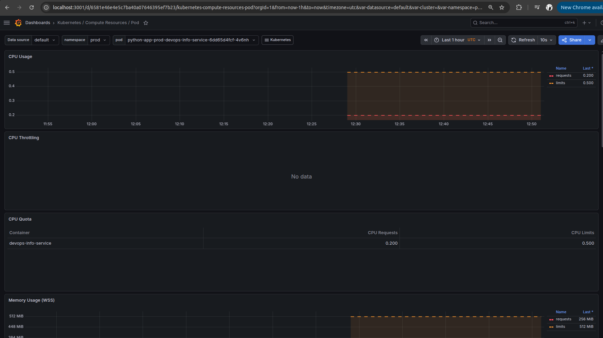
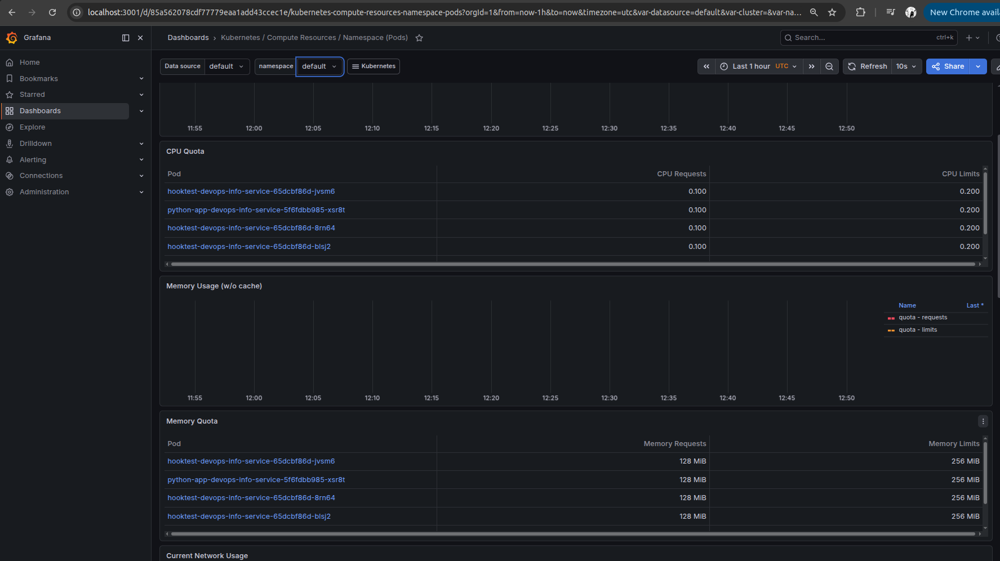
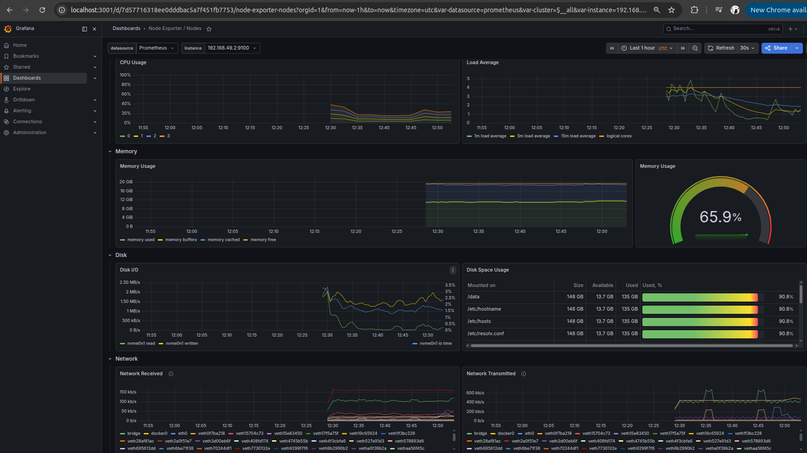
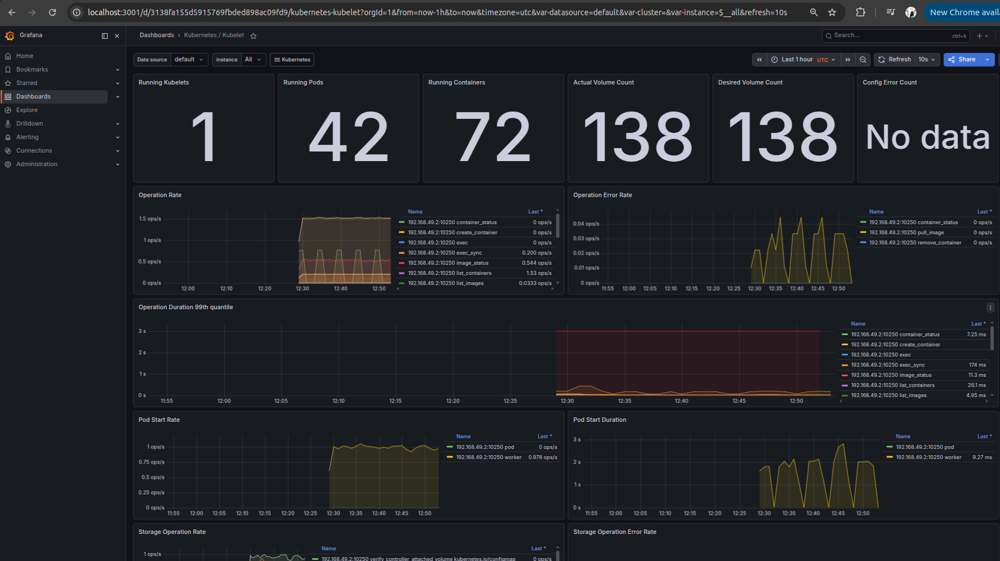
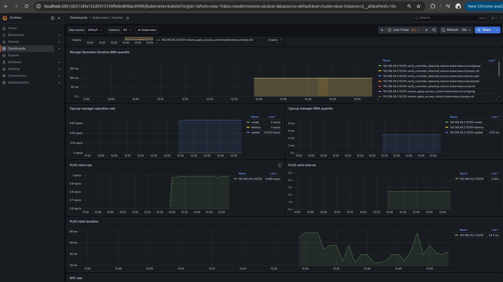
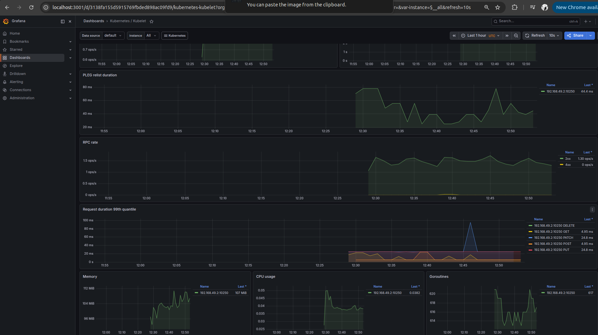
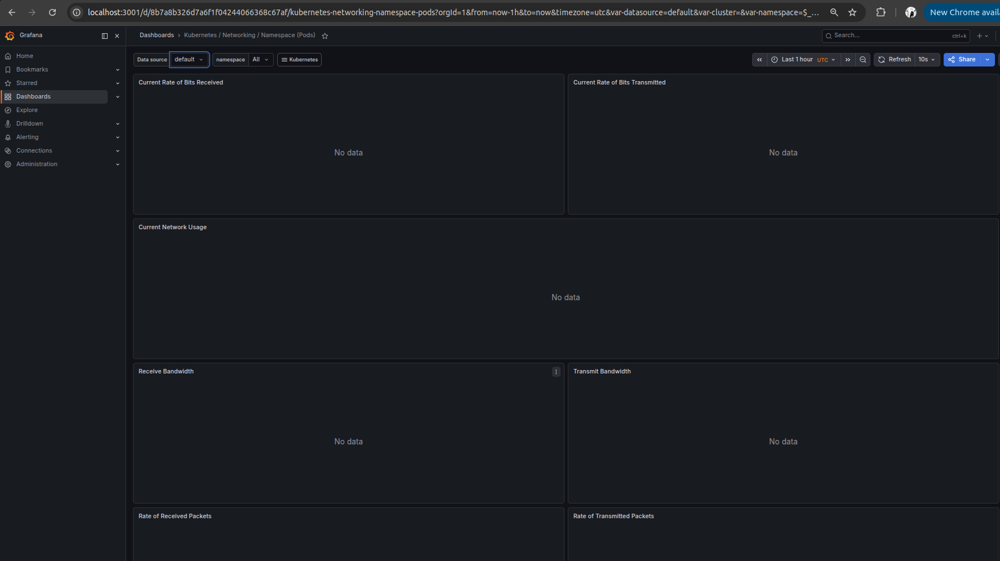
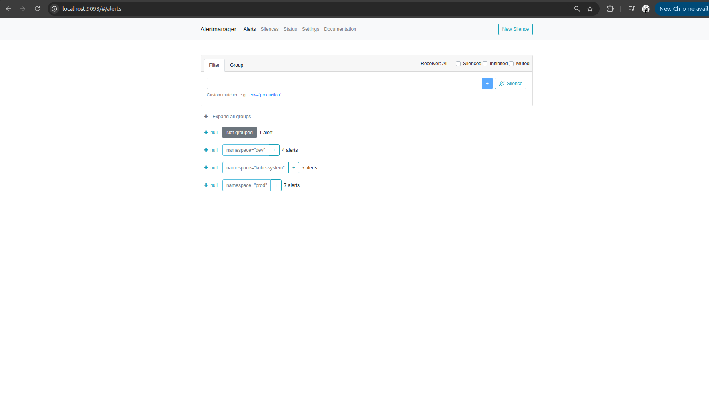

# Kubernetes Monitoring & Init Containers

## 1. Stack Components
* **Prometheus Operator:** Manages the lifecycle of Prometheus monitoring components inside the cluster by using Custom Resource Definitions (CRDs). It automates the configuration and deployment of Prometheus, Alertmanager, and Grafana.
* **Prometheus:** The core monitoring and alerting toolkit. It periodically scrapes (collects) metrics from configured endpoints and stores them as time-series data.
* **Alertmanager:** Handles alerts generated by client applications such as the Prometheus server. It takes care of deduplicating, grouping, and routing them to the correct receiver integrations (e.g., email, Slack).
* **Grafana:** A visualization and analytics platform. It connects to Prometheus as a data source and provides rich, interactive dashboards to monitor cluster health and application metrics.
* **kube-state-metrics:** A service that listens to the Kubernetes API server and generates metrics about the state of the objects (like Deployments, Pods, Nodes, and StatefulSets).
* **node-exporter:** A hardware and OS metrics exporter. It runs as a DaemonSet on every node in the cluster to collect low-level metrics like CPU, memory, disk I/O, and network usage.

## 2. Installation Evidence
```text
dreamcore@californiawrld ~/P/DevOps-Core-Course (lab16) [SIGINT]> helm install monitoring prometheus-community/kube-prometheus-stack --namespace monitoring --create-namespace
NAME: monitoring
LAST DEPLOYED: Sat May  9 15:26:16 2026
NAMESPACE: monitoring
STATUS: deployed
REVISION: 1
DESCRIPTION: Install complete
TEST SUITE: None
NOTES:
kube-prometheus-stack has been installed. Check its status by running:
  kubectl --namespace monitoring get pods -l "release=monitoring"

Get Grafana 'admin' user password by running:

  kubectl --namespace monitoring get secrets monitoring-grafana -o jsonpath="{.data.admin-password}" | base64 -d ; echo

Access Grafana local instance:

  export POD_NAME=$(kubectl --namespace monitoring get pod -l "app.kubernetes.io/name=grafana,app.kubernetes.io/instance=monitoring" -oname)
  kubectl --namespace monitoring port-forward $POD_NAME 3000

Get your grafana admin user password by running:

  kubectl get secret --namespace monitoring -l app.kubernetes.io/component=admin-secret -o jsonpath="{.items[0].data.admin-password}" | base64 --decode ; echo


Visit https://github.com/prometheus-operator/kube-prometheus for instructions on how to create & configure Alertmanager and Prometheus instances using the Operator.
dreamcore@californiawrld ~/P/DevOps-Core-Course (lab16)> kubectl get pods -n monitoring

NAME                                                     READY   STATUS              RESTARTS   AGE
alertmanager-monitoring-kube-prometheus-alertmanager-0   0/2     Init:0/1            0          11s
monitoring-grafana-5f6897ccd-qfckp                       0/3     ContainerCreating   0          35s
monitoring-kube-prometheus-operator-795c5775d-7wbl4      1/1     Running             0          35s
monitoring-kube-state-metrics-67d5f7bf68-4cpnm           1/1     Running             0          35s
monitoring-prometheus-node-exporter-gzz72                1/1     Running             0          36s
prometheus-monitoring-kube-prometheus-prometheus-0       0/2     Init:0/1            0          10s

dreamcore@californiawrld ~/P/DevOps-Core-Course (lab16)> kubectl get svc -n monitoring
NAME                                      TYPE        CLUSTER-IP       EXTERNAL-IP   PORT(S)                      AGE
alertmanager-operated                     ClusterIP   None             <none>        9093/TCP,9094/TCP,9094/UDP   48m
monitoring-grafana                        ClusterIP   10.102.224.178   <none>        80/TCP                       48m
monitoring-kube-prometheus-alertmanager   ClusterIP   10.98.63.157     <none>        9093/TCP,8080/TCP            48m
monitoring-kube-prometheus-operator       ClusterIP   10.99.40.57      <none>        443/TCP                      48m
monitoring-kube-prometheus-prometheus     ClusterIP   10.98.53.111     <none>        9090/TCP,8080/TCP            48m
monitoring-kube-state-metrics             ClusterIP   10.106.241.107   <none>        8080/TCP                     48m
monitoring-prometheus-node-exporter       ClusterIP   10.100.184.63    <none>        9100/TCP                     48m
prometheus-operated                       ClusterIP   None             <none>        9090/TCP                     48m


dreamcore@californiawrld ~/P/DevOps-Core-Course (lab16)> kubectl get po -n monitoring
NAME                                                     READY   STATUS    RESTARTS   AGE
alertmanager-monitoring-kube-prometheus-alertmanager-0   2/2     Running   0          48m
monitoring-grafana-5f6897ccd-qfckp                       3/3     Running   0          48m
monitoring-kube-prometheus-operator-795c5775d-7wbl4      1/1     Running   0          48m
monitoring-kube-state-metrics-67d5f7bf68-4cpnm           1/1     Running   0          48m
monitoring-prometheus-node-exporter-gzz72                1/1     Running   0          48m
prometheus-monitoring-kube-prometheus-prometheus-0       2/2     Running   0          48m


```

## 3. Dashboard Answers

1. **Pod Resources (CPU/memory usage of your StatefulSet):**


2. **Namespace Analysis (Pods using most/least CPU in default namespace):**


3. **Node Metrics (Memory usage % and MB, CPU cores):**


4. **Kubelet (How many pods/containers managed):**






5. **Network (Traffic for pods in default namespace):**


6. **Alerts (Active alerts from Alertmanager UI):**


## 4. Init Containers

**Implementation:**
The `init-pods.yaml` manifest uses two init containers. The first init container (`init-download`) uses a `busybox` image to download an `index.html` file via `wget` into a shared `emptyDir` volume. The second init container (`wait-for-service`) runs a loop checking for the Kubernetes default DNS record via `nslookup` to ensure core services are accessible before starting. Once both successfully complete, the main `nginx` container mounts the shared volume and serves the downloaded file.

**Proof of success:**
```text
dreamcore@californiawrld ~/P/DevOps-Core-Course (lab16)> kubectl apply -f k8s/init-pods.yaml

pod/init-demo-pod created
dreamcore@californiawrld ~/P/DevOps-Core-Course (lab16)> kubectl get pods -w
NAME                                              READY   STATUS    RESTARTS       AGE
hooktest-devops-info-service-65dcbf86d-6qj42      1/1     Running   7 (2d8h ago)   29d
hooktest-devops-info-service-65dcbf86d-8rn64      1/1     Running   7 (2d8h ago)   29d
hooktest-devops-info-service-65dcbf86d-blsj2      1/1     Running   7 (2d8h ago)   29d
hooktest-devops-info-service-65dcbf86d-jvsm6      1/1     Running   7 (2d8h ago)   29d
hooktest-devops-info-service-65dcbf86d-q4drc      1/1     Running   7 (2d8h ago)   29d
init-demo-pod                                     1/1     Running   0              10s
my-app-devops-info-service-0                      1/1     Running   0              2d7h
my-app-devops-info-service-1                      1/1     Running   0              2d7h
my-app-devops-info-service-584d6d4b6f-67x2q       1/1     Running   0              2d7h
my-app-devops-info-service-584d6d4b6f-xcdkl       1/1     Running   1 (2d8h ago)   8d
python-app-devops-info-service-5f6fdbb985-xsr8t   1/1     Running   3 (2d8h ago)   15d
^C⏎                                                                                                                                                                                                                      
dreamcore@californiawrld ~/P/DevOps-Core-Course (lab16) [1]> kubectl logs init-demo-pod -c init-download

Connecting to example.com (8.6.112.0:443)
wget: note: TLS certificate validation not implemented
saving to '/work-dir/index.html'
index.html           100% |********************************|   528  0:00:00 ETA
'/work-dir/index.html' saved
dreamcore@californiawrld ~/P/DevOps-Core-Course (lab16)> kubectl exec init-demo-pod -- cat /usr/share/nginx/html/index.html

Defaulted container "main-app" out of: main-app, init-download (init), wait-for-service (init)
<!doctype html><html lang="en"><head><title>Example Domain</title><meta name="viewport" content="width=device-width, initial-scale=1"><style>body{background:#eee;width:60vw;margin:15vh auto;font-family:system-ui,sans-serif}h1{font-size:1.5em}div{opacity:0.8}a:link,a:visited{color:#348}</style></head><body><div><h1>Example Domain</h1><p>This domain is for use in documentation examples without needing permission. Avoid use in operations.</p><p><a href="https://iana.org/domains/example">Learn more</a></p></div></body></html>

```
