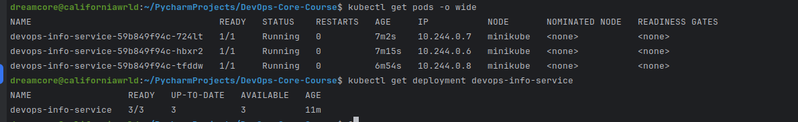
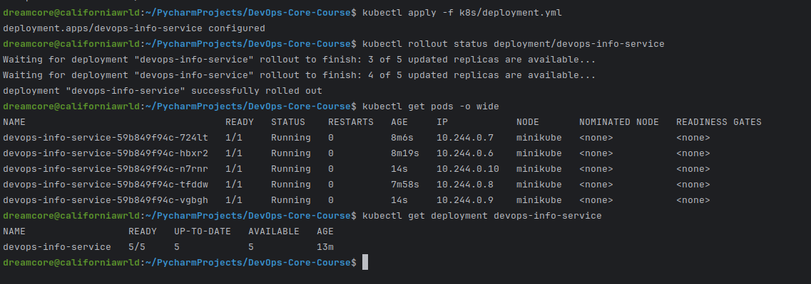
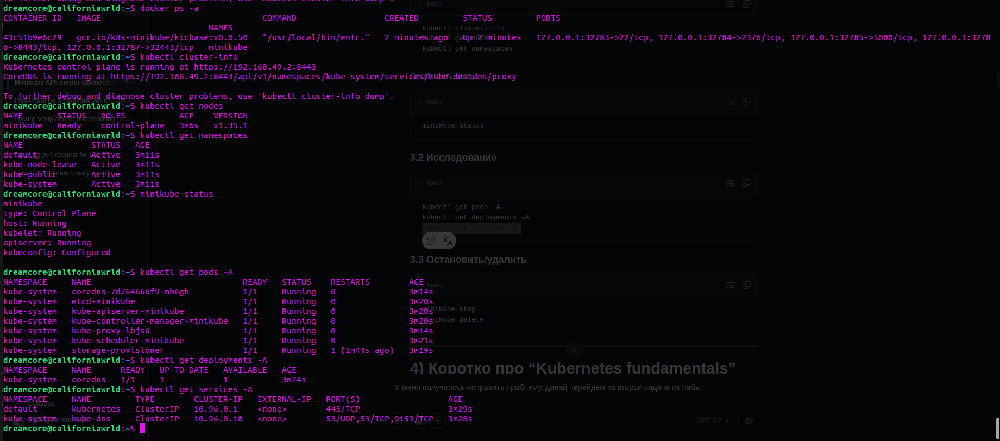
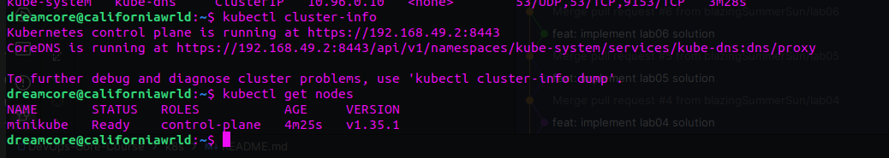

# Lab 9 — Kubernetes Fundamentals

---

## 1) Architecture Overview

### Components
- **Kubernetes cluster**: local **minikube** (single-node)
- **Workload**: `Deployment` `devops-info-service`
- **Networking**: `Service` `devops-info-service` (type **NodePort**)

### Runtime architecture
- **Pods**: `replicas: 3` (scaled to `5` during the scaling task)
- **Service**:
  - Type: `NodePort`
  - Service port: `80`
  - Target port: `5000` (application container port)
  - NodePort assigned by Kubernetes (example): `31280`

### Request / networking flow
1. Client calls `http://<minikube-ip>:<nodeport>/health` (or `/`)
2. Request hits the **NodePort Service**
3. Service load-balances traffic to ready Pods selected by labels:
   - `app.kubernetes.io/name=devops-info-service`
4. Pod forwards request to container port `5000`

### Resource allocation strategy
- I defined **resource requests** and **limits** to:
  - help Kubernetes schedule Pods reliably
  - prevent one container from consuming all node resources
- Current values:
  - requests: `cpu: 100m`, `memory: 128Mi`
  - limits: `cpu: 200m`, `memory: 256Mi`

---

## 2) Manifest Files

### `k8s/deployment.yml`
Creates and manages the application Pods:
- **Replicas**: 3 (minimum required by the lab)
- **RollingUpdate strategy**:
  - `maxSurge: 1`
  - `maxUnavailable: 0` (aiming for zero downtime)
- **Container port**: `5000`
- **Health checks**:
  - `livenessProbe` on `/health`
  - `readinessProbe` on `/health`
- **Resources**: requests & limits configured
- **Non-root**: the container runs as a non-root user (configured in the image)

Key choices rationale:
- `replicas: 3` provides basic high availability even on a single-node local cluster.
- `maxUnavailable: 0` keeps all existing Pods serving traffic during rollout (when readiness passes).
- requests/limits are small but realistic for a lightweight Flask app.

### `k8s/service.yml`
Exposes the Deployment internally and externally:
- Type: **NodePort** (required for local access without cloud LB)
- Selects Pods using the Deployment label selector
- Exposes port `80` and routes to container `targetPort: 5000`

Key choices rationale:
- `port: 80` is convenient for clients; application stays on `5000`.
- NodePort allows access via `minikube service ... --url`.

---

## 3) Deployment Evidence

### Cluster objects
```bash
dreamcore@californiawrld ~/P/DevOps-Core-Course (lab09)> kubectl get all

NAME                                       READY   STATUS    RESTARTS   AGE
pod/devops-info-service-59b849f94c-4m977   1/1     Running   0          3m59s
pod/devops-info-service-59b849f94c-dr5pp   1/1     Running   0          3m26s
pod/devops-info-service-59b849f94c-j6pv9   1/1     Running   0          3m35s
pod/devops-info-service-59b849f94c-sg9vk   1/1     Running   0          3m43s
pod/devops-info-service-59b849f94c-z667j   1/1     Running   0          3m51s

NAME                          TYPE        CLUSTER-IP      EXTERNAL-IP   PORT(S)        AGE
service/devops-info-service   NodePort    10.98.115.189   <none>        80:31280/TCP   15m
service/kubernetes            ClusterIP   10.96.0.1       <none>        443/TCP        37m

NAME                                  READY   UP-TO-DATE   AVAILABLE   AGE
deployment.apps/devops-info-service   5/5     5            5           22m

NAME                                             DESIRED   CURRENT   READY   AGE
replicaset.apps/devops-info-service-59b849f94c   5         5         5       18m
replicaset.apps/devops-info-service-67f69d8c79   0         0         0       22m
replicaset.apps/devops-info-service-7f44dcc498   0         0         0       5m10s

```

### Detailed pods + services
```bash
dreamcore@californiawrld ~/P/DevOps-Core-Course (lab09)> kubectl get pods -o wide

NAME                                   READY   STATUS    RESTARTS   AGE     IP            NODE       NOMINATED NODE   READINESS GATES
devops-info-service-59b849f94c-4m977   1/1     Running   0          4m43s   10.244.0.16   minikube   <none>           <none>
devops-info-service-59b849f94c-dr5pp   1/1     Running   0          4m10s   10.244.0.20   minikube   <none>           <none>
devops-info-service-59b849f94c-j6pv9   1/1     Running   0          4m19s   10.244.0.19   minikube   <none>           <none>
devops-info-service-59b849f94c-sg9vk   1/1     Running   0          4m27s   10.244.0.18   minikube   <none>           <none>
devops-info-service-59b849f94c-z667j   1/1     Running   0          4m35s   10.244.0.17   minikube   <none>           <none>
dreamcore@californiawrld ~/P/DevOps-Core-Course (lab09)> kubectl get svc -o wide

NAME                  TYPE        CLUSTER-IP      EXTERNAL-IP   PORT(S)        AGE   SELECTOR
devops-info-service   NodePort    10.98.115.189   <none>        80:31280/TCP   16m   app.kubernetes.io/name=devops-info-service
kubernetes            ClusterIP   10.96.0.1       <none>        443/TCP        38m   <none>

```

### Deployment description (replicas + strategy)
```bash
dreamcore@californiawrld ~/P/DevOps-Core-Course (lab09)> kubectl describe deployment devops-info-service

Name:                   devops-info-service
Namespace:              default
CreationTimestamp:      Wed, 25 Mar 2026 22:35:12 +0300
Labels:                 app.kubernetes.io/name=devops-info-service
                        app.kubernetes.io/part-of=devops-core-course
Annotations:            deployment.kubernetes.io/revision: 4
Selector:               app.kubernetes.io/name=devops-info-service
Replicas:               5 desired | 5 updated | 5 total | 5 available | 0 unavailable
StrategyType:           RollingUpdate
MinReadySeconds:        0
RollingUpdateStrategy:  0 max unavailable, 1 max surge
Pod Template:
  Labels:  app.kubernetes.io/name=devops-info-service
           app.kubernetes.io/part-of=devops-core-course
  Containers:
   devops-info-service:
    Image:      sincere99/devops-app:latest
    Port:       5000/TCP (http)
    Host Port:  0/TCP (http)
    Limits:
      cpu:     200m
      memory:  256Mi
    Requests:
      cpu:         100m
      memory:      128Mi
    Liveness:      http-get http://:5000/health delay=10s timeout=2s period=5s #success=1 #failure=3
    Readiness:     http-get http://:5000/health delay=5s timeout=2s period=3s #success=1 #failure=3
    Environment:   <none>
    Mounts:        <none>
  Volumes:         <none>
  Node-Selectors:  <none>
  Tolerations:     <none>
Conditions:
  Type           Status  Reason
  ----           ------  ------
  Available      True    MinimumReplicasAvailable
  Progressing    True    NewReplicaSetAvailable
OldReplicaSets:  devops-info-service-67f69d8c79 (0/0 replicas created), devops-info-service-7f44dcc498 (0/0 replicas created)
NewReplicaSet:   devops-info-service-59b849f94c (5/5 replicas created)
Events:
  Type    Reason             Age                     From                   Message
  ----    ------             ----                    ----                   -------
  Normal  ScalingReplicaSet  23m                     deployment-controller  Scaled up replica set devops-info-service-67f69d8c79 from 0 to 3
  Normal  ScalingReplicaSet  19m                     deployment-controller  Scaled up replica set devops-info-service-59b849f94c from 0 to 1
  Normal  ScalingReplicaSet  19m                     deployment-controller  Scaled down replica set devops-info-service-67f69d8c79 from 3 to 2
  Normal  ScalingReplicaSet  19m                     deployment-controller  Scaled up replica set devops-info-service-59b849f94c from 1 to 2
  Normal  ScalingReplicaSet  18m                     deployment-controller  Scaled down replica set devops-info-service-67f69d8c79 from 2 to 1
  Normal  ScalingReplicaSet  18m                     deployment-controller  Scaled up replica set devops-info-service-59b849f94c from 2 to 3
  Normal  ScalingReplicaSet  18m                     deployment-controller  Scaled down replica set devops-info-service-67f69d8c79 from 1 to 0
  Normal  ScalingReplicaSet  11m                     deployment-controller  Scaled up replica set devops-info-service-59b849f94c from 3 to 5
  Normal  ScalingReplicaSet  6m23s                   deployment-controller  Scaled up replica set devops-info-service-7f44dcc498 from 0 to 1
  Normal  ScalingReplicaSet  4m34s (x19 over 6m16s)  deployment-controller  (combined from similar events): Scaled down replica set devops-info-service-7f44dcc498 from 1 to 0

```

### Service endpoints
```bash
dreamcore@californiawrld ~/P/DevOps-Core-Course (lab09)> kubectl get endpoints devops-info-service

Warning: v1 Endpoints is deprecated in v1.33+; use discovery.k8s.io/v1 EndpointSlice
NAME                  ENDPOINTS                                                        AGE
devops-info-service   10.244.0.16:5000,10.244.0.17:5000,10.244.0.18:5000 + 2 more...   17m
dreamcore@californiawrld ~/P/DevOps-Core-Course (lab09)> kubectl get endpointslices -l kubernetes.io/service-name=devops-info-service -o wide

NAME                        ADDRESSTYPE   PORTS   ENDPOINTS                                         AGE
devops-info-service-8lkwr   IPv4          5000    10.244.0.16,10.244.0.17,10.244.0.18 + 2 more...   17m
```

### App is reachable (curl proof)
```bash
dreamcore@californiawrld:~/PycharmProjects/DevOps-Core-Course$ minikube service devops-info-service --url
http://192.168.49.2:31280
dreamcore@californiawrld:~/PycharmProjects/DevOps-Core-Course$ curl "$(minikube service devops-info-service --url)/"
{"endpoints":[{"description":"Service information","method":"GET","path":"/"},{"description":"Health check","method":"GET","path":"/health"}],"request":{"client_ip":"10.244.0.1","method":"GET","path":"/","user_agent":"curl/7.81.0"},"runtime":{"current_time":"2026-03-25T20:00:29.942391+00:00","timezone":"UTC","uptime_human":"0 hours, 6 minutes","uptime_seconds":365},"service":{"description":"DevOps course info service","framework":"Flask","name":"devops-info-service","version":"1.0.0"},"system":{"architecture":"x86_64","cpu_count":4,"hostname":"devops-info-service-59b849f94c-j6pv9","platform":"Linux","platform_version":"#106~22.04.1-Ubuntu SMP PREEMPT_DYNAMIC Fri Mar  6 08:44:59 UTC ","python_version":"3.12.13"}}
dreamcore@californiawrld:~/PycharmProjects/DevOps-Core-Course$ curl "$(minikube service devops-info-service --url)/health"
{"status":"healthy","timestamp":"2026-03-25T20:00:35.123213+00:00","uptime_seconds":378}

```

---

## 4) Operations Performed

### Deploy manifests
```bash
dreamcore@californiawrld:~/PycharmProjects/DevOps-Core-Course$ kubectl apply -f k8s/deployment.yml
deployment.apps/devops-info-service configured
dreamcore@californiawrld:~/PycharmProjects/DevOps-Core-Course$ kubectl apply -f k8s/service.yml
service/devops-info-service unchanged
dreamcore@californiawrld:~/PycharmProjects/DevOps-Core-Course$ kubectl rollout status deployment/devops-info-service
Waiting for deployment "devops-info-service" rollout to finish: 2 out of 5 new replicas have been updated...
Waiting for deployment "devops-info-service" rollout to finish: 2 out of 5 new replicas have been updated...
Waiting for deployment "devops-info-service" rollout to finish: 2 out of 5 new replicas have been updated...
Waiting for deployment "devops-info-service" rollout to finish: 3 out of 5 new replicas have been updated...
Waiting for deployment "devops-info-service" rollout to finish: 3 out of 5 new replicas have been updated...
Waiting for deployment "devops-info-service" rollout to finish: 3 out of 5 new replicas have been updated...
Waiting for deployment "devops-info-service" rollout to finish: 4 out of 5 new replicas have been updated...
Waiting for deployment "devops-info-service" rollout to finish: 4 out of 5 new replicas have been updated...
Waiting for deployment "devops-info-service" rollout to finish: 4 out of 5 new replicas have been updated...
Waiting for deployment "devops-info-service" rollout to finish: 1 old replicas are pending termination...
Waiting for deployment "devops-info-service" rollout to finish: 1 old replicas are pending termination...
Waiting for deployment "devops-info-service" rollout to finish: 1 old replicas are pending termination...
deployment "devops-info-service" successfully rolled out
dreamcore@californiawrld:~/PycharmProjects/DevOps-Core-Course$ kubectl get pods -o wide
NAME                                   READY   STATUS        RESTARTS   AGE   IP            NODE       NOMINATED NODE   READINESS GATES
devops-info-service-59b849f94c-4m977   1/1     Terminating   0          16m   10.244.0.16   minikube   <none>           <none>
devops-info-service-59b849f94c-j6pv9   1/1     Terminating   0          15m   10.244.0.19   minikube   <none>           <none>
devops-info-service-59b849f94c-sg9vk   1/1     Terminating   0          15m   10.244.0.18   minikube   <none>           <none>
devops-info-service-59b849f94c-z667j   1/1     Terminating   0          16m   10.244.0.17   minikube   <none>           <none>
devops-info-service-7f44dcc498-6qwhs   1/1     Running       0          28s   10.244.0.23   minikube   <none>           <none>
devops-info-service-7f44dcc498-6wv7t   1/1     Running       0          36s   10.244.0.22   minikube   <none>           <none>
devops-info-service-7f44dcc498-bsjpp   1/1     Running       0          12s   10.244.0.25   minikube   <none>           <none>
devops-info-service-7f44dcc498-kvffz   1/1     Running       0          20s   10.244.0.24   minikube   <none>           <none>
devops-info-service-7f44dcc498-vpqr7   1/1     Running       0          44s   10.244.0.21   minikube   <none>           <none>
dreamcore@californiawrld:~/PycharmProjects/DevOps-Core-Course$ kubectl get svc
NAME                  TYPE        CLUSTER-IP      EXTERNAL-IP   PORT(S)        AGE
devops-info-service   NodePort    10.98.115.189   <none>        80:31280/TCP   27m
kubernetes            ClusterIP   10.96.0.1       <none>        443/TCP        49m

```

### Scaling demonstration (to 5 replicas)
Method used: declarative update (preferred) (Screenshots provided below)

3 replicas:


Increasing to 5 replicas:


```bash
kubectl apply -f k8s/deployment.yml
kubectl rollout status deployment/devops-info-service
kubectl get pods
kubectl get deployment devops-info-service
```

(Alternative quick test)
```bash
kubectl scale deployment/devops-info-service --replicas=5
kubectl rollout status deployment/devops-info-service
```

### Rolling update demonstration
I performed a rolling update by changing the image tag and re-applying the manifest:
```bash
dreamcore@californiawrld ~/P/DevOps-Core-Course (lab09)> kubectl apply -f k8s/deployment.yml

deployment.apps/devops-info-service configured
dreamcore@californiawrld ~/P/DevOps-Core-Course (lab09)> kubectl rollout status deployment/devops-info-service

Waiting for deployment "devops-info-service" rollout to finish: 1 out of 5 new replicas have been updated...
Waiting for deployment "devops-info-service" rollout to finish: 1 out of 5 new replicas have been updated...
Waiting for deployment "devops-info-service" rollout to finish: 1 out of 5 new replicas have been updated...
Waiting for deployment "devops-info-service" rollout to finish: 2 out of 5 new replicas have been updated...
Waiting for deployment "devops-info-service" rollout to finish: 2 out of 5 new replicas have been updated...
Waiting for deployment "devops-info-service" rollout to finish: 2 out of 5 new replicas have been updated...
Waiting for deployment "devops-info-service" rollout to finish: 3 out of 5 new replicas have been updated...
Waiting for deployment "devops-info-service" rollout to finish: 3 out of 5 new replicas have been updated...
Waiting for deployment "devops-info-service" rollout to finish: 3 out of 5 new replicas have been updated...
Waiting for deployment "devops-info-service" rollout to finish: 4 out of 5 new replicas have been updated...
Waiting for deployment "devops-info-service" rollout to finish: 4 out of 5 new replicas have been updated...
Waiting for deployment "devops-info-service" rollout to finish: 4 out of 5 new replicas have been updated...
Waiting for deployment "devops-info-service" rollout to finish: 1 old replicas are pending termination...
Waiting for deployment "devops-info-service" rollout to finish: 1 old replicas are pending termination...
Waiting for deployment "devops-info-service" rollout to finish: 1 old replicas are pending termination...
deployment "devops-info-service" successfully rolled out

dreamcore@californiawrld ~/P/DevOps-Core-Course (lab09)> kubectl rollout history deployment/devops-info-service

deployment.apps/devops-info-service 
REVISION  CHANGE-CAUSE
1         <none>
2         <none>
3         <none>

```

### Rollback demonstration
```bash
dreamcore@californiawrld ~/P/DevOps-Core-Course (lab09)> kubectl rollout history deployment/devops-info-service

deployment.apps/devops-info-service 
REVISION  CHANGE-CAUSE
1         <none>
2         <none>
3         <none>

dreamcore@californiawrld ~/P/DevOps-Core-Course (lab09)> kubectl rollout undo deployment/devops-info-service

deployment.apps/devops-info-service rolled back

dreamcore@californiawrld ~/P/DevOps-Core-Course (lab09)> kubectl rollout status deployment/devops-info-service

Waiting for deployment "devops-info-service" rollout to finish: 1 out of 5 new replicas have been updated...
Waiting for deployment "devops-info-service" rollout to finish: 1 out of 5 new replicas have been updated...
Waiting for deployment "devops-info-service" rollout to finish: 1 out of 5 new replicas have been updated...
Waiting for deployment "devops-info-service" rollout to finish: 2 out of 5 new replicas have been updated...
Waiting for deployment "devops-info-service" rollout to finish: 2 out of 5 new replicas have been updated...
Waiting for deployment "devops-info-service" rollout to finish: 2 out of 5 new replicas have been updated...
Waiting for deployment "devops-info-service" rollout to finish: 3 out of 5 new replicas have been updated...
Waiting for deployment "devops-info-service" rollout to finish: 3 out of 5 new replicas have been updated...
Waiting for deployment "devops-info-service" rollout to finish: 3 out of 5 new replicas have been updated...
Waiting for deployment "devops-info-service" rollout to finish: 4 out of 5 new replicas have been updated...
Waiting for deployment "devops-info-service" rollout to finish: 4 out of 5 new replicas have been updated...
Waiting for deployment "devops-info-service" rollout to finish: 4 out of 5 new replicas have been updated...
Waiting for deployment "devops-info-service" rollout to finish: 1 old replicas are pending termination...
Waiting for deployment "devops-info-service" rollout to finish: 1 old replicas are pending termination...
deployment "devops-info-service" successfully rolled out

```

### Service access verification
Access method used: `minikube service`
```bash
dreamcore@californiawrld:~/PycharmProjects/DevOps-Core-Course$ minikube service devops-info-service --url
http://192.168.49.2:31280
dreamcore@californiawrld:~/PycharmProjects/DevOps-Core-Course$ curl "$(minikube service devops-info-service --url)/health"
{"status":"healthy","timestamp":"2026-03-25T20:06:31.219998+00:00","uptime_seconds":750}

```
---

## 5) Production Considerations

### Health checks
- **Readiness probe (`/health`)**: ensures the Pod receives traffic only when it is ready to serve requests.
- **Liveness probe (`/health`)**: restarts the container if it becomes unhealthy.

Why:
- Kubernetes can remove failing Pods from Service endpoints (readiness).
- Kubernetes can self-heal by restarting unhealthy containers (liveness).

### Resource limits rationale
- Requests ensure predictable scheduling.
- Limits protect cluster stability and reduce risk of noisy-neighbor issues.

### Improvements for a real production environment
- Use **separate readiness endpoint** (e.g. `/ready`) and deeper checks (DB, dependencies).
- Add **startupProbe** for slow-start applications.
- Add `PodDisruptionBudget` to preserve availability during voluntary disruptions.
- Use `HorizontalPodAutoscaler` (HPA) based on CPU/RPS.
- Add `Ingress` (or Gateway API) + TLS termination instead of NodePort.
- Use private registry + `imagePullSecrets`, pin image tags (no `latest`), sign images.
- Use namespaces, NetworkPolicies, and secrets management (e.g., External Secrets/Vault).

### Monitoring & observability strategy
- Expose metrics (`/metrics`) and scrape with Prometheus.
- Centralized logging (Loki/ELK).
- Dashboards and alerts in Grafana / Alertmanager.
- Trace requests with OpenTelemetry where applicable.

---

## 6) Challenges & Solutions

### Issues encountered
- `ErrImagePull` due to an incorrect image reference in the Deployment manifest.
- Service access and endpoint verification required understanding labels/selectors.
- During rolling updates I observed temporary 503 responses, I investigated endpoints and readiness.

### Debugging approach
Commands I used:
```bash
kubectl get pods -o wide
kubectl describe pod <pod-name>
kubectl logs <pod-name>

kubectl describe deployment devops-info-service
kubectl describe svc devops-info-service
kubectl get endpoints devops-info-service
kubectl get events --sort-by=.metadata.creationTimestamp
```

### What I learned
- How Deployments manage ReplicaSets and rolling updates.
- How Services select Pods via labels and provide stable networking.
- Why readiness/liveness probes and resource constraints are important even for local clusters.
- How to debug common Kubernetes issues using `describe`, `logs`, `events`, and rollout commands.

---


## Evidence that kubectl works


## Output of kubectl cluster-info and kubectl get nodes


## Why I chose minikube
- It's convenient for learning Kubernetes: easy minikube launch, numerous built-in features and add-ons (Ingress, metrics server, dashboard, etc.).
- It's well-suited for local development and testing: I can quickly set up and tear down a cluster without spending money on a cloud.
- It works with the Docker driver, so I can run a cluster without a virtual machine, directly on top of the Docker surface.