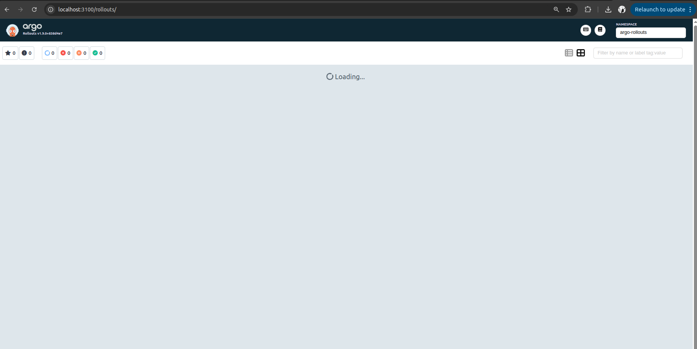

# Argo Rollouts Implementation

## 1. Argo Rollouts Setup
The Argo Rollouts controller and dashboard have been successfully installed in the `argo-rollouts` namespace. The `kubectl-argo-rollouts` CLI plugin was also installed to manage rollout resources via the terminal. The dashboard is accessible locally on port `3100` using port-forwarding (`kubectl port-forward svc/argo-rollouts-dashboard -n argo-rollouts 3100:3100`).

**Rollout vs Deployment differences:**
A `Rollout` Custom Resource Definition (CRD) is largely identical to a standard Kubernetes `Deployment` (it uses the same Pod template spec), but it introduces a `strategy` field. While a Deployment only supports `RollingUpdate` or `Recreate`, a Rollout supports advanced progressive delivery strategies: `canary` and `blueGreen`. It also includes built-in support for traffic shifting, automated analysis, and manual pauses/promotions.

```bash
dreamcore@californiawrld ~/P/DevOps-Core-Course (lab14)> kubectl port-forward svc/argo-rollouts-dashboard -n argo-rollouts 3100:3100
snap-confine has elevated permissions and is not confined but should be. Refusing to continue to avoid permission escalation attacks
Please make sure that the snapd.apparmor service is enabled and started.
dreamcore@californiawrld ~/P/DevOps-Core-Course (lab14) [1]> kubectl create namespace argo-rollouts

snap-confine has elevated permissions and is not confined but should be. Refusing to continue to avoid permission escalation attacks
Please make sure that the snapd.apparmor service is enabled and started.
dreamcore@californiawrld ~/P/DevOps-Core-Course (lab14) [1]> sudo systemctl enable --now apparmor

[sudo] password for dreamcore: 
Synchronizing state of apparmor.service with SysV service script with /lib/systemd/systemd-sysv-install.
Executing: /lib/systemd/systemd-sysv-install enable apparmor
dreamcore@californiawrld ~/P/DevOps-Core-Course (lab14)> sudo systemctl restart apparmor

dreamcore@californiawrld ~/P/DevOps-Core-Course (lab14)> sudo systemctl enable --now snapd.apparmor

dreamcore@californiawrld ~/P/DevOps-Core-Course (lab14)> sudo systemctl restart snapd.apparmor

dreamcore@californiawrld ~/P/DevOps-Core-Course (lab14)> sudo systemctl restart snapd

dreamcore@californiawrld ~/P/DevOps-Core-Course (lab14)> kubectl create namespace argo-rollouts

Error from server (AlreadyExists): namespaces "argo-rollouts" already exists
dreamcore@californiawrld ~/P/DevOps-Core-Course (lab14) [1]> kubectl apply -n argo-rollouts -f https://github.com/argoproj/argo-rollouts/releases/latest/download/install.yaml

customresourcedefinition.apiextensions.k8s.io/analysisruns.argoproj.io unchanged
customresourcedefinition.apiextensions.k8s.io/analysistemplates.argoproj.io unchanged
customresourcedefinition.apiextensions.k8s.io/clusteranalysistemplates.argoproj.io unchanged
customresourcedefinition.apiextensions.k8s.io/experiments.argoproj.io unchanged
customresourcedefinition.apiextensions.k8s.io/rollouts.argoproj.io unchanged
serviceaccount/argo-rollouts unchanged
clusterrole.rbac.authorization.k8s.io/argo-rollouts unchanged
clusterrole.rbac.authorization.k8s.io/argo-rollouts-aggregate-to-admin unchanged
clusterrole.rbac.authorization.k8s.io/argo-rollouts-aggregate-to-edit unchanged
clusterrole.rbac.authorization.k8s.io/argo-rollouts-aggregate-to-view unchanged
clusterrolebinding.rbac.authorization.k8s.io/argo-rollouts unchanged
configmap/argo-rollouts-config unchanged
secret/argo-rollouts-notification-secret unchanged
service/argo-rollouts-metrics unchanged
deployment.apps/argo-rollouts configured
dreamcore@californiawrld ~/P/DevOps-Core-Course (lab14)> curl -LO https://github.com/argoproj/argo-rollouts/releases/latest/download/kubectl-argo-rollouts-linux-amd64

  % Total    % Received % Xferd  Average Speed   Time    Time     Time  Current
                                 Dload  Upload   Total   Spent    Left  Speed
  0     0    0     0    0     0      0      0 --:--:-- --:--:-- --:--:--     0
  0     0    0     0    0     0      0      0 --:--:-- --:--:-- --:--:--     0
100  127M  100  127M    0     0  15.1M      0  0:00:08  0:00:08 --:--:-- 13.7M
dreamcore@californiawrld ~/P/DevOps-Core-Course (lab14)> chmod +x kubectl-argo-rollouts-linux-amd64

dreamcore@californiawrld ~/P/DevOps-Core-Course (lab14)> sudo mv kubectl-argo-rollouts-linux-amd64 /usr/local/bin/kubectl-argo-rollouts

dreamcore@californiawrld ~/P/DevOps-Core-Course (lab14)> kubectl argo rollouts version

kubectl-argo-rollouts: v1.9.0+838d4e7
  BuildDate: 2026-03-20T21:08:11Z
  GitCommit: 838d4e792be666ec11bd0c80331e0c5511b5010e
  GitTreeState: clean
  GoVersion: go1.24.13
  Compiler: gc
  Platform: linux/amd64
dreamcore@californiawrld ~/P/DevOps-Core-Course (lab14)> kubectl apply -n argo-rollouts -f https://github.com/argoproj/argo-rollouts/releases/latest/download/dashboard-install.yaml

serviceaccount/argo-rollouts-dashboard unchanged
clusterrole.rbac.authorization.k8s.io/argo-rollouts-dashboard unchanged
clusterrolebinding.rbac.authorization.k8s.io/argo-rollouts-dashboard unchanged
service/argo-rollouts-dashboard unchanged
deployment.apps/argo-rollouts-dashboard unchanged
dreamcore@californiawrld ~/P/DevOps-Core-Course (lab14)> kubectl port-forward svc/argo-rollouts-dashboard -n argo-rollouts 3100:3100

Forwarding from 127.0.0.1:3100 -> 3100
Forwarding from [::1]:3100 -> 3100
Handling connection for 3100
Handling connection for 3100
Handling connection for 3100
```



## 2. Canary Deployment
The Canary strategy was configured to gradually shift traffic to the new version to minimize the impact of potential bugs.

**Strategy Configuration:**
- **Step 1:** Route 20% of the traffic to the new version and pause indefinitely (requires manual promotion).
- **Steps 2-4:** Automatically increase traffic to 40%, 60%, and 80%, pausing for 30 seconds at each step.
- **Step 5:** 100% traffic shifted, rollout completes.

**Progression and Rollback:**
When a new image tag is applied, the rollout starts and automatically pauses at 20% traffic. Running `kubectl argo rollouts promote <rollout-name>` manually resumes the process, and traffic gradually shifts every 30 seconds. If an issue is detected during the rollout, running the `abort` command instantly scales down the canary replica and shifts 100% of the traffic back to the stable version.

```bash
dreamcore@californiawrld ~/P/D/k8s (lab14) [1]> helm upgrade --install my-app ./devops-info-service/
Release "my-app" does not exist. Installing it now.
NAME: my-app
LAST DEPLOYED: Thu Apr 30 23:47:49 2026
NAMESPACE: default
STATUS: deployed
REVISION: 1
DESCRIPTION: Install complete
TEST SUITE: None
dreamcore@californiawrld ~/P/D/k8s (lab14)> kubectl get rollouts
NAME                         DESIRED   CURRENT   UP-TO-DATE   AVAILABLE   AGE
my-app-devops-info-service   1         1         1            1           30s
dreamcore@californiawrld ~/P/D/k8s (lab14)> kubectl argo rollouts get rollout my-app-devops-info-service -w
Name:            my-app-devops-info-service
Namespace:       default
Status:          ✔ Healthy
Strategy:        Canary
  Step:          9/9
  SetWeight:     100
  ActualWeight:  100
Images:          devops-info-service:lab12 (stable)
Replicas:
  Desired:       1
  Current:       1
  Updated:       1
  Ready:         1
  Available:     1

NAME                                                    KIND        STATUS     AGE  INFO
⟳ my-app-devops-info-service                            Rollout     ✔ Healthy  42s  
└──# revision:1                                                                     
   └──⧉ my-app-devops-info-service-584d6d4b6f           ReplicaSet  ✔ Healthy  42s  stable
      └──□ my-app-devops-info-service-584d6d4b6f-xcdkl  Pod         ✔ Running  42s  ready:1/1
Name:            my-app-devops-info-service
Namespace:       default
Status:          ✔ Healthy
Strategy:        Canary
  Step:          9/9
  SetWeight:     100
  ActualWeight:  100
Images:          devops-info-service:lab12 (stable)
Replicas:
  Desired:       1
  Current:       1
  Updated:       1
  Ready:         1
  Available:     1

NAME                                                    KIND        STATUS     AGE  INFO
⟳ my-app-devops-info-service                            Rollout     ✔ Healthy  43s  
└──# revision:1                                                                     
   └──⧉ my-app-devops-info-service-584d6d4b6f           ReplicaSet  ✔ Healthy  43s  stable
      └──□ my-app-devops-info-service-584d6d4b6f-xcdkl  Pod         ✔ Running  43s  ready:1/1
Name:            my-app-devops-info-service
Namespace:       default
Status:          ✔ Healthy
Strategy:        Canary
  Step:          9/9
  SetWeight:     100
  ActualWeight:  100
Images:          devops-info-service:lab12 (stable)
Replicas:
  Desired:       1
  Current:       1
  Updated:       1
  Ready:         1
  Available:     1

NAME                                                    KIND        STATUS     AGE  INFO
⟳ my-app-devops-info-service                            Rollout     ✔ Healthy  44s  
└──# revision:1                                                                     
   └──⧉ my-app-devops-info-service-584d6d4b6f           ReplicaSet  ✔ Healthy  44s  stable
      └──□ my-app-devops-info-service-584d6d4b6f-xcdkl  Pod         ✔ Running  44s  ready:1/1
Name:            my-app-devops-info-service
Namespace:       default
Status:          ✔ Healthy
Strategy:        Canary
  Step:          9/9
  SetWeight:     100
  ActualWeight:  100
Images:          devops-info-service:lab12 (stable)
Replicas:
  Desired:       1
  Current:       1
  Updated:       1
  Ready:         1
  Available:     1

NAME                                                    KIND        STATUS     AGE  INFO
⟳ my-app-devops-info-service                            Rollout     ✔ Healthy  45s  
└──# revision:1                                                                     
   └──⧉ my-app-devops-info-service-584d6d4b6f           ReplicaSet  ✔ Healthy  45s  stable
      └──□ my-app-devops-info-service-584d6d4b6f-xcdkl  Pod         ✔ Running  45s  ready:1/1
Name:            my-app-devops-info-service
Namespace:       default
Status:          ✔ Healthy
Strategy:        Canary
  Step:          9/9
  SetWeight:     100
  ActualWeight:  100
Images:          devops-info-service:lab12 (stable)
Replicas:
  Desired:       1
  Current:       1
  Updated:       1
  Ready:         1
  Available:     1

NAME                                                    KIND        STATUS     AGE  INFO
⟳ my-app-devops-info-service                            Rollout     ✔ Healthy  46s  
└──# revision:1                                                                     
   └──⧉ my-app-devops-info-service-584d6d4b6f           ReplicaSet  ✔ Healthy  46s  stable
      └──□ my-app-devops-info-service-584d6d4b6f-xcdkl  Pod         ✔ Running  46s  ready:1/1
Name:            my-app-devops-info-service
Namespace:       default
Status:          ✔ Healthy
Strategy:        Canary
  Step:          9/9
  SetWeight:     100
  ActualWeight:  100
Images:          devops-info-service:lab12 (stable)
Replicas:
  Desired:       1
  Current:       1
  Updated:       1
  Ready:         1
  Available:     1

NAME                                                    KIND        STATUS     AGE  INFO
⟳ my-app-devops-info-service                            Rollout     ✔ Healthy  47s  
└──# revision:1                                                                     
   └──⧉ my-app-devops-info-service-584d6d4b6f           ReplicaSet  ✔ Healthy  47s  stable
      └──□ my-app-devops-info-service-584d6d4b6f-xcdkl  Pod         ✔ Running  47s  ready:1/1
Name:            my-app-devops-info-service
Namespace:       default
Status:          ✔ Healthy
Strategy:        Canary
  Step:          9/9
  SetWeight:     100
  ActualWeight:  100
Images:          devops-info-service:lab12 (stable)
Replicas:
  Desired:       1
  Current:       1
  Updated:       1
  Ready:         1
  Available:     1

NAME                                                    KIND        STATUS     AGE  INFO
⟳ my-app-devops-info-service                            Rollout     ✔ Healthy  48s  
└──# revision:1                                                                     
   └──⧉ my-app-devops-info-service-584d6d4b6f           ReplicaSet  ✔ Healthy  48s  stable
      └──□ my-app-devops-info-service-584d6d4b6f-xcdkl  Pod         ✔ Running  48s  ready:1/1
Name:            my-app-devops-info-service
Namespace:       default
Status:          ✔ Healthy
Strategy:        Canary
  Step:          9/9
  SetWeight:     100
  ActualWeight:  100
Images:          devops-info-service:lab12 (stable)
Replicas:
  Desired:       1
  Current:       1
  Updated:       1
  Ready:         1
  Available:     1

NAME                                                    KIND        STATUS     AGE  INFO
⟳ my-app-devops-info-service                            Rollout     ✔ Healthy  49s  
└──# revision:1                                                                     
   └──⧉ my-app-devops-info-service-584d6d4b6f           ReplicaSet  ✔ Healthy  49s  stable
      └──□ my-app-devops-info-service-584d6d4b6f-xcdkl  Pod         ✔ Running  49s  ready:1/1
Name:            my-app-devops-info-service
Namespace:       default
Status:          ✔ Healthy
Strategy:        Canary
  Step:          9/9
  SetWeight:     100
  ActualWeight:  100
Images:          devops-info-service:lab12 (stable)
Replicas:
  Desired:       1
  Current:       1
  Updated:       1
  Ready:         1
  Available:     1

NAME                                                    KIND        STATUS     AGE  INFO
⟳ my-app-devops-info-service                            Rollout     ✔ Healthy  50s  
└──# revision:1                                                                     
   └──⧉ my-app-devops-info-service-584d6d4b6f           ReplicaSet  ✔ Healthy  50s  stable
      └──□ my-app-devops-info-service-584d6d4b6f-xcdkl  Pod         ✔ Running  50s  ready:1/1
Name:            my-app-devops-info-service
Namespace:       default
Status:          ✔ Healthy
Strategy:        Canary
  Step:          9/9
  SetWeight:     100
  ActualWeight:  100
Images:          devops-info-service:lab12 (stable)
Replicas:
  Desired:       1
  Current:       1
  Updated:       1
  Ready:         1
  Available:     1

NAME                                                    KIND        STATUS     AGE  INFO
⟳ my-app-devops-info-service                            Rollout     ✔ Healthy  51s  
└──# revision:1                                                                     
   └──⧉ my-app-devops-info-service-584d6d4b6f           ReplicaSet  ✔ Healthy  51s  stable
      └──□ my-app-devops-info-service-584d6d4b6f-xcdkl  Pod         ✔ Running  51s  ready:1/1
Name:            my-app-devops-info-service
Namespace:       default
Status:          ✔ Healthy
Strategy:        Canary
  Step:          9/9
  SetWeight:     100
  ActualWeight:  100
Images:          devops-info-service:lab12 (stable)
Replicas:
  Desired:       1
  Current:       1
  Updated:       1
  Ready:         1
  Available:     1

NAME                                                    KIND        STATUS     AGE  INFO
⟳ my-app-devops-info-service                            Rollout     ✔ Healthy  52s  
└──# revision:1                                                                     
   └──⧉ my-app-devops-info-service-584d6d4b6f           ReplicaSet  ✔ Healthy  52s  stable
      └──□ my-app-devops-info-service-584d6d4b6f-xcdkl  Pod         ✔ Running  52s  ready:1/1
Name:            my-app-devops-info-service
Namespace:       default
Status:          ✔ Healthy
Strategy:        Canary
  Step:          9/9
  SetWeight:     100
  ActualWeight:  100
Images:          devops-info-service:lab12 (stable)
Replicas:
  Desired:       1
  Current:       1
  Updated:       1
  Ready:         1
  Available:     1

NAME                                                    KIND        STATUS     AGE  INFO
⟳ my-app-devops-info-service                            Rollout     ✔ Healthy  53s  
└──# revision:1                                                                     
   └──⧉ my-app-devops-info-service-584d6d4b6f           ReplicaSet  ✔ Healthy  53s  stable
      └──□ my-app-devops-info-service-584d6d4b6f-xcdkl  Pod         ✔ Running  53s  ready:1/1
Name:            my-app-devops-info-service
Namespace:       default
Status:          ✔ Healthy
Strategy:        Canary
  Step:          9/9
  SetWeight:     100
  ActualWeight:  100
Images:          devops-info-service:lab12 (stable)
Replicas:
  Desired:       1
  Current:       1
  Updated:       1
  Ready:         1
  Available:     1

NAME                                                    KIND        STATUS     AGE  INFO
⟳ my-app-devops-info-service                            Rollout     ✔ Healthy  54s  
└──# revision:1                                                                     
   └──⧉ my-app-devops-info-service-584d6d4b6f           ReplicaSet  ✔ Healthy  54s  stable
      └──□ my-app-devops-info-service-584d6d4b6f-xcdkl  Pod         ✔ Running  54s  ready:1/1
^C⏎                                                                                                                                                                                                                      
dreamcore@californiawrld ~/P/D/k8s (lab14)> helm upgrade --install my-app ./devops-info-service/

Release "my-app" has been upgraded. Happy Helming!
NAME: my-app
LAST DEPLOYED: Thu Apr 30 23:49:08 2026
NAMESPACE: default
STATUS: deployed
REVISION: 2
DESCRIPTION: Upgrade complete
TEST SUITE: None
dreamcore@californiawrld ~/P/D/k8s (lab14)> kubectl argo rollouts promote  my-app-devops-info-service

rollout 'my-app-devops-info-service' promoted
dreamcore@californiawrld ~/P/D/k8s (lab14)> kubectl argo rollouts abort  my-app-devops-info-service

rollout 'my-app-devops-info-service' aborted

```


## 3. Blue-Green Deployment
The Blue-Green strategy was implemented using two separate Kubernetes Services to test the new version safely before exposing it to users.

**Strategy Configuration:**
- `activeService`: Serves live production traffic.
- `previewService`: Exposes the new "green" version for internal testing.
- `autoPromotionEnabled: false`: Ensures the release pauses after the new version is fully scaled up on the preview service, waiting for manual approval.

**Promotion Process:**
When an update is deployed, the controller scales up the new version and links it to the `previewService`. We can test the new version without affecting live users. Once verified, running the `promote` command instantly swaps the `activeService` selectors, cutting over 100% of the production traffic to the new version with zero downtime.


## 4. Strategy Comparison

| Feature | Canary | Blue-Green |
|---------|--------|------------|
| **Traffic Shift** | Gradual (percentage-based) | Instant (all-or-nothing switch) |
| **Resource Usage** | Standard (shares resources between versions) | 2x required (both versions run fully scaled simultaneously) |
| **Risk Mitigation** | High (errors only affect a small % of users) | Moderate (depends heavily on the quality of preview testing) |
| **Rollback Speed** | Fast (scales old version back up/shifts traffic) | Instant (just flips the service selector back) |
| **Best Use Case** | Public web services, microservices, testing in production. | Critical APIs, databases/stateful migrations, rigid QA processes. |

**Recommendation:** 
For our stateless microservice (`devops-info-service`), **Canary** is the recommended strategy. It allows us to safely verify the application under real-world traffic conditions without requiring double the cluster resources, and the automated steps make it highly efficient.

## 5. CLI Commands Reference
Here are the essential commands used during this lab:

- `kubectl argo rollouts version` - Verify the plugin installation.
- `kubectl argo rollouts get rollout <name> -w` - Watch the rollout status and step progression in real-time.
- `kubectl argo rollouts promote <name>` - Move to the next step (Canary) or switch traffic to the new version (Blue-Green).
- `kubectl argo rollouts abort <name>` - Cancel an ongoing rollout and immediately revert traffic to the stable version.
- `kubectl argo rollouts retry rollout <name>` - Reset an aborted rollout to allow applying fixes.