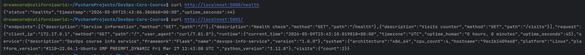

# Lab 18 — Reproducible Builds with Nix

## Task 1 — Build Reproducible Python App (Revisiting Lab 1)

### 1. Nix Installation
Nix was successfully installed using the Determinate Systems installer.

```bash
dreamcore@californiawrld:~/PycharmProjects/DevOps-Core-Course$ nix --version
nix (Determinate Nix 3.20.0) 2.34.6
```

### 2. Nix Derivation for Python App
I created a `default.nix` file to build the application reproducibly. Here is the code:

```nix
{ pkgs ? import (fetchTarball "https://github.com/NixOS/nixpkgs/archive/nixos-24.11.tar.gz") {} }:

pkgs.python3Packages.buildPythonApplication {
  pname = "devops-info-service";
  version = "1.0.0";
  src = ./.;
  format = "other";

  propagatedBuildInputs = with pkgs.python3Packages; [
    flask
    python-json-logger
    prometheus-client
  ];

  nativeBuildInputs = [ pkgs.makeWrapper ];

  installPhase = ''
    mkdir -p $out/bin
    cp app.py $out/bin/devops-info-service
    chmod +x $out/bin/devops-info-service

    wrapProgram $out/bin/devops-info-service \
      --prefix PYTHONPATH : "$PYTHONPATH"
  '';
}
```

### 3. Proving Reproducibility
The build is strictly tied to its inputs. When running `nix-build`, the result is placed in the Nix store. 
My store path is:
```text
/nix/store/w7j9lpfqxqd1kicvqxaw5z44pxwng847-devops-info-service-1.0.0
```
When I run `rm result && nix-build` again, Nix instantly returns the exact same store path because the hash of the inputs hasn't changed. This proves that the build is cached and perfectly reproducible.

### 4. Comparison: `pip` vs Nix
Why does `requirements.txt` provide weaker guarantees than Nix?
* `pip install -r requirements.txt` only pins the direct dependencies. Transitive dependencies (the dependencies of your dependencies) can drift over time unless you use complex lockfiles.
* Pip relies on the system's Python version, which can vary between machines.
* Nix pins the **entire dependency tree**, including the Python interpreter itself and system libraries, ensuring bit-for-bit identical environments on any machine.

### 5. Explanation of Nix Store Path
The Nix store path format is `/nix/store/<hash>-<name>-<version>`. 
For example: `/nix/store/w7j9lpfqxqd1kicvqxaw5z44pxwng847-devops-info-service-1.0.0`.
* `<hash>`: A cryptographic hash of all the inputs (source code, dependencies, build scripts) used to build the package. If any input changes, the hash changes.
* `<name>-<version>`: The package name and version defined in `pname` and `version` in the Nix expression.

### 6. Comparison Table: Lab 1 vs Lab 18
| Aspect | Lab 1 (pip + venv) | Lab 18 (Nix) |
|--------|-------------------|--------------|
| **Python version** | System-dependent | Strictly pinned in derivation |
| **Dependency resolution** | Runtime (`pip install`) | Build-time (pure) |
| **Reproducibility** | Approximate | Bit-for-bit identical |
| **Isolation** | Virtual environment | Sandboxed build |

### 7. Reflection
If I had used Nix from the start in Lab 1, I wouldn't have to worry about Python version mismatches across different environments. In Lab 1, another developer might clone my code, run `pip install`, and get slightly different transitive dependencies that could break the app. Nix would have guaranteed that everyone gets the exact same environment out-of-the-box.

### 8. Running application
```bash
dreamcore@californiawrld:~/PycharmProjects/DevOps-Core-Course/labs/lab18/app_python$ ./result/bin/devops-info-service
{"timestamp": "2026-05-09T15:16:30.838598+00:00", "level": "INFO", "logger": "__main__", "message": "Application starting", "method": "STARTUP", "path": "/", "service": "devops-info-service"}
 * Serving Flask app '..devops-info-service-wrapped-wrapped'
 * Debug mode: off
{"timestamp": "2026-05-09T15:16:30.842925+00:00", "level": "INFO", "logger": "werkzeug", "message": "\u001b[31m\u001b[1mWARNING: This is a development server. Do not use it in a production deployment. Use a production WSGI server instead.\u001b[0m\n * Running on all addresses (0.0.0.0)\n * Running on http://127.0.0.1:8000\n * Running on http://10.247.1.13:8000"}
{"timestamp": "2026-05-09T15:16:30.842980+00:00", "level": "INFO", "logger": "werkzeug", "message": "\u001b[33mPress CTRL+C to quit\u001b[0m"}
```

## Task 2 — Reproducible Docker Images (Revisiting Lab 2)

### 1. Building the Image with Nix
I created a `docker.nix` file using `pkgs.dockerTools.buildLayeredImage`:

```nix
{ pkgs ? import (fetchTarball "https://github.com/NixOS/nixpkgs/archive/nixos-24.11.tar.gz") {} }:

let
  app = import ./default.nix { inherit pkgs; };
in
pkgs.dockerTools.buildLayeredImage {
  name = "devops-info-service-nix";
  tag = "1.0.0";
  contents = [ app ];
  config = {
    Cmd = [ "${app}/bin/devops-info-service" ];
    ExposedPorts = { "8000/tcp" = {}; };
  };
  created = "1970-01-01T00:00:01Z";
}
```

### 2. Hash Comparison & Reproducibility Proof
Unlike traditional Dockerfiles, rebuilding the Nix expression produces a bit-for-bit identical tarball:

```bash
dreamcore@californiawrld:~/PycharmProjects/DevOps-Core-Course/labs/lab18/app_python$ sha256sum result
742256306f3b3346bdb56746583ae07c398848099881624e16873d1c850bd9eb  result

dreamcore@californiawrld:~/PycharmProjects/DevOps-Core-Course/labs/lab18/app_python$ rm result

dreamcore@californiawrld:~/PycharmProjects/DevOps-Core-Course/labs/lab18/app_python$ nix-build docker.nix
/nix/store/1iba40iyd6cc97m2x4s4rlqz7sqmc7p8-devops-info-service-nix.tar.gz

dreamcore@californiawrld:~/PycharmProjects/DevOps-Core-Course/labs/lab18/app_python$ sha256sum result
742256306f3b3346bdb56746583ae07c398848099881624e16873d1c850bd9eb  result

```

### 3. Comparison Table: Lab 2 vs Lab 18
| Metric | Lab 2 Traditional Dockerfile | Lab 18 Nix dockerTools |
|--------|------------------------------|------------------------|
| **Base Image** | Requires a base (e.g., `python:3.13-slim`), which updates unpredictably. | No base image needed. Only explicitly defined derivations are included. |
| **Timestamps** | Varies on every build. | Deterministic (`1970-01-01T00:00:01Z`). |
| **Reproducibility**| Two builds produce different image hashes. | Two builds produce the exact same image hash. |
| **Image Size** | Usually larger (includes OS tools from the base image). | Minimal (only contains the app and its exact dependencies). |

**Why can't traditional Dockerfiles achieve bit-for-bit reproducibility?**
Traditional `docker build` relies on the system time during the build process, and package managers like `apt` or `pip` fetch the "latest" versions of packages if not strictly pinned. Nix fixes this by using a content-addressable store and fixed timestamps.

### 3.5. Image Size Comparison and Analysis
I checked the sizes of both images using `docker images`:

| Image | Size | Analysis |
|-------|------|----------|
| **lab2-app:v1** (Traditional Dockerfile) | ~124MB | Uses `python:3.13-slim` base image, which includes OS-level utilities (like `apt`, `bash`) that the app doesn't actually need to run, making the attack surface larger. |
| **devops-info-service-nix** (Nix dockerTools) | ~181MB | Has no base OS image at all. It contains strictly the application, Python interpreter, and explicitly defined libraries (glibc). While the size might be similar due to the full Python interpreter, the Nix image is completely pure and lacks unused OS package managers or utilities. |

### 3.6. Running Both Containers Simultaneously
I ran both the Lab 2 container and the Nix-built container side-by-side to prove they function identically.
* Lab 2 container mapped to port 5000
* Nix container mapped to port 5001

Both containers running


### 4. Layer Analysis (docker history)
Unlike traditional Dockerfiles where layers have varying timestamps, Nix uses content-addressable layers and fixes the creation date to 1970 (shown as `N/A` or `50+ years ago`). Every dependency is its own explicit layer from the Nix store.

```bash
dreamcore@californiawrld:~/PycharmProjects/DevOps-Core-Course$ docker history devops-info-service-nix:1.0.0
IMAGE          CREATED   CREATED BY   SIZE      COMMENT
c92329562b70   N/A                    411B      store paths: ['/nix/store/hgna5fn43wibx2vvdch1nf8pdzg0lbdb-devops-info-service-nix-customisation-layer']
<missing>      N/A                    14.5kB    store paths: ['/nix/store/5xf393xq8rk15gpb6yk0pp88fjdbwq91-devops-info-service-1.0.0']
<missing>      N/A                    45.9kB    store paths: ['/nix/store/1lx51z5vj2p5y9m8dganvls8f7cvn6cc-python3.12-python-json-logger-2.0.7']
<missing>      N/A                    598kB     store paths: ['/nix/store/a4v5qavdkzip0bnwhmnq2a7m62hpnnpc-python3.12-prometheus-client-0.21.0']
<missing>      N/A                    1.08MB    store paths: ['/nix/store/ijc606v1g5vhqxrjk4qmj787kymp6sal-python3.12-flask-3.0.3']
<missing>      N/A                    2.5MB     store paths: ['/nix/store/jcf93x7sly7l76hyaqwramfyydnbvsf4-python3.12-werkzeug-3.0.6']
<missing>      N/A                    1.85MB    store paths: ['/nix/store/jvrzvrbnxdk6wp1qy9k1iyjhgbzw3jv2-python3.12-jinja2-3.1.5']
<missing>      N/A                    144kB     store paths: ['/nix/store/0vrargkskpn2m47ka7cfkc1bgq35achi-python3.12-itsdangerous-2.2.0']
<missing>      N/A                    1.24MB    store paths: ['/nix/store/k1qzmvyvarz0pgjaz06wx0y5vsgwbhbw-python3.12-click-8.1.7']
<missing>      N/A                    89.3kB    store paths: ['/nix/store/hb6zkd7hqgqsjsc2dswifgcx8ycc43ag-python3.12-blinker-1.8.2']
<missing>      N/A                    83.1kB    store paths: ['/nix/store/s03icbxsi62xvd9bigwbgqlgbr5zhkdp-python3.12-markupsafe-3.0.2']
<missing>      N/A                    113MB     store paths: ['/nix/store/dksjvr69ckglyw1k2ss1qgshhcix73p8-python3-3.12.8']
<missing>      N/A                    837kB     store paths: ['/nix/store/izpczxh0wcm3ra6z0073zf9j0mv2wfl4-xz-5.6.3']
<missing>      N/A                    1.9MB     store paths: ['/nix/store/v87awkhzf3nr7nc5i4gg77xzqv4bqjy3-tzdata-2025b']
<missing>      N/A                    1.58MB    store paths: ['/nix/store/v9smapvfv1z340qs3p7xbw6zb6zplfcf-sqlite-3.46.1']
<missing>      N/A                    473kB     store paths: ['/nix/store/vb3dx18nky7cq63br7x2mi86isli529w-readline-8.2p13']
<missing>      N/A                    7.99MB    store paths: ['/nix/store/qzn96phpnb6c56mlqa1424hfgf5hp67s-openssl-3.3.3']
<missing>      N/A                    220kB     store paths: ['/nix/store/c25k325zh2b9g8s68b7ixbjfh3a916cb-mpdecimal-4.0.0']
<missing>      N/A                    118kB     store paths: ['/nix/store/n4gd4rqkr0p2rkdhklvbx1rnx78m6dkj-mailcap-2.1.54']
<missing>      N/A                    129kB     store paths: ['/nix/store/iissy6zslzyb85rzjgq4waag9dixvv6s-libxcrypt-4.4.36']
<missing>      N/A                    72.3kB    store paths: ['/nix/store/fm7yigp87wq0p58x92iynwscdmspzkrb-libffi-3.4.6']
<missing>      N/A                    443kB     store paths: ['/nix/store/jn8gi3mbjm6b2khxcbm3vf2c1h5wpv17-gdbm-1.24-lib']
<missing>      N/A                    9.08MB    store paths: ['/nix/store/hh698a2nnpqr47lh52n26wi8fiah3hid-gcc-13.3.0-lib']
<missing>      N/A                    286kB     store paths: ['/nix/store/h08i7wrlqmd48lnaimaz28pny9i8vmr8-expat-2.7.1']
<missing>      N/A                    79.5kB    store paths: ['/nix/store/vrqss3954zk1c52mda3xf1rv7wc5ygba-bzip2-1.0.8']
<missing>      N/A                    1.62MB    store paths: ['/nix/store/mjhcjikhxps97mq5z54j4gjjfzgmsir5-bash-5.2p37']
<missing>      N/A                    159kB     store paths: ['/nix/store/mkhhjfg2isjbfx87dz191bzpnwx1bbr9-gcc-13.3.0-libgcc']
<missing>      N/A                    127kB     store paths: ['/nix/store/b6mjyiadysqlh7nps52faznnqmp32604-zlib-1.3.1']
<missing>      N/A                    3.17MB    store paths: ['/nix/store/cn67k729khgnd9i1j7gbyh6lpzz11ci5-ncurses-6.4.20221231']
<missing>      N/A                    30MB      store paths: ['/nix/store/5m9amsvvh2z8sl7jrnc87hzy21glw6k1-glibc-2.40-66']
<missing>      N/A                    159kB     store paths: ['/nix/store/y4d9iir0yqmrcswaqfi368d8m1rkv14s-xgcc-13.3.0-libgcc']
<missing>      N/A                    346kB     store paths: ['/nix/store/c47b963idja6h1d8n91pf28v2jcq96kp-libidn2-2.3.7']
<missing>      N/A                    1.86MB    store paths: ['/nix/store/2745pvn6cv32yn9gp2rlqiqhqgs01pb5-libunistring-1.2']

```

```bash
dreamcore@californiawrld:~/PycharmProjects/DevOps-Core-Course$ docker history lab2-app:v1
IMAGE          CREATED        CREATED BY                                      SIZE      COMMENT
9c72c7ef1150   3 weeks ago    /bin/sh -c #(nop)  CMD ["python" "app.py"]      0B        
7bcd2b93931f   3 weeks ago    /bin/sh -c #(nop)  EXPOSE 5000                  0B        
e5af88576c23   3 weeks ago    /bin/sh -c #(nop)  USER appuser                 0B        
0e75b5de6905   3 weeks ago    /bin/sh -c chown -R appuser:appuser /app        8.08kB    
6d0c6a3efd55   3 weeks ago    /bin/sh -c #(nop) COPY file:c4a85d4de9c9a735…   8.02kB    
908b0b81e44b   3 weeks ago    /bin/sh -c pip install --no-cache-dir -r req…   5.16MB    
98e94bd103c7   3 weeks ago    /bin/sh -c #(nop) COPY file:d37b870d22082339…   64B       
53b5fca3048d   2 months ago   /bin/sh -c #(nop) WORKDIR /app                  0B        
4194f5aff9c8   2 months ago   /bin/sh -c useradd --create-home --shell /bi…   8.92kB    
df563c342e2f   2 months ago   /bin/sh -c #(nop)  ENV PYTHONDONTWRITEBYTECO…   0B        
6f90d4a79e7a   2 months ago   CMD ["python3"]                                 0B        buildkit.dockerfile.v0
<missing>      2 months ago   RUN /bin/sh -c set -eux;  for src in idle3 p…   36B       buildkit.dockerfile.v0
<missing>      2 months ago   RUN /bin/sh -c set -eux;   savedAptMark="$(a…   36.8MB    buildkit.dockerfile.v0
<missing>      2 months ago   ENV PYTHON_SHA256=c08bc65a81971c1dd578318282…   0B        buildkit.dockerfile.v0
<missing>      2 months ago   ENV PYTHON_VERSION=3.12.13                      0B        buildkit.dockerfile.v0
<missing>      2 months ago   ENV GPG_KEY=7169605F62C751356D054A26A821E680…   0B        buildkit.dockerfile.v0
<missing>      2 months ago   RUN /bin/sh -c set -eux;  apt-get update;  a…   3.81MB    buildkit.dockerfile.v0
<missing>      2 months ago   ENV LANG=C.UTF-8                                0B        buildkit.dockerfile.v0
<missing>      2 months ago   ENV PATH=/usr/local/bin:/usr/local/sbin:/usr…   0B        buildkit.dockerfile.v0
<missing>      2 months ago   # debian.sh --arch 'amd64' out/ 'trixie' '@1…   78.6MB    debuerreotype 0.17

```

### 5. Reflection & Practical Scenarios
If I could redo Lab 2 with Nix, I would drop the `Dockerfile` completely and use `dockerTools.buildLayeredImage` for all containerized applications. It eliminates the need for base images (which contain vulnerabilities and bloat) and guarantees that the image I build locally is identical to the one built in CI/CD.

**Where Nix reproducibility matters practically:**
1. **CI/CD Pipelines:** Eliminates "works on my machine but fails in CI" issues.
2. **Security Audits:** You know exactly what binaries and libraries are inside the container down to the last byte. No random packages are fetched at build time.
3. **Rollbacks:** Since every build produces a strict hash, reverting to a previous state is perfectly reliable.