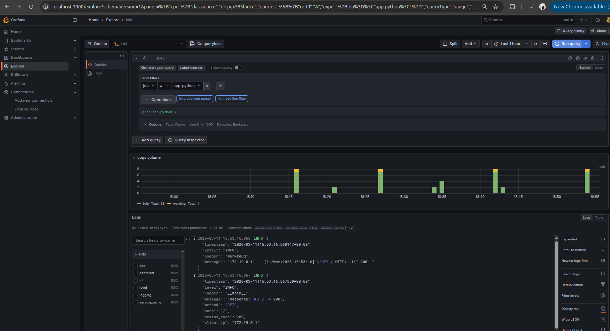
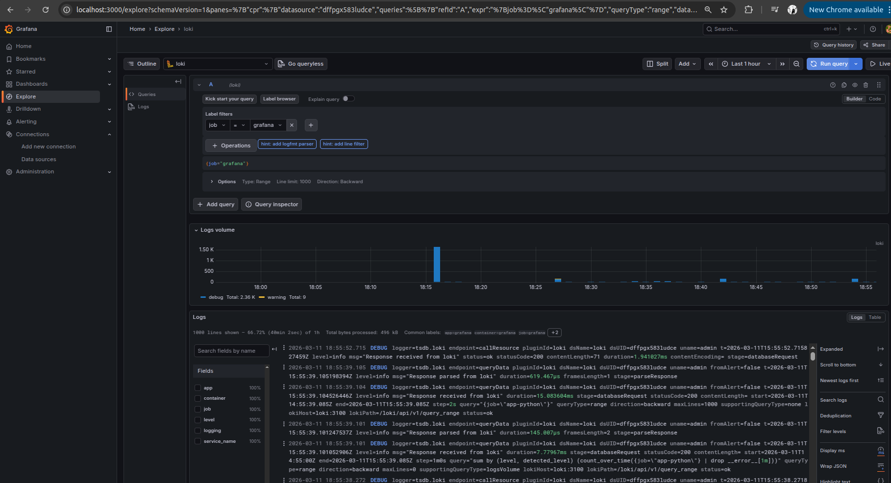
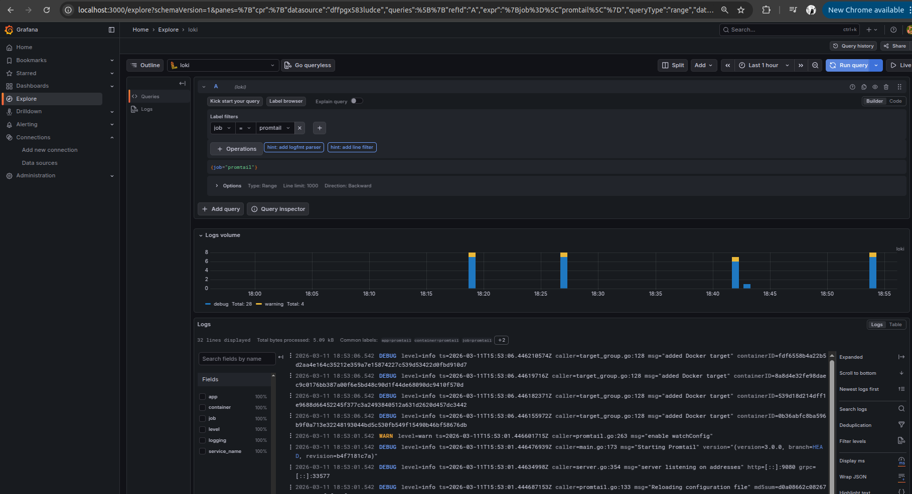
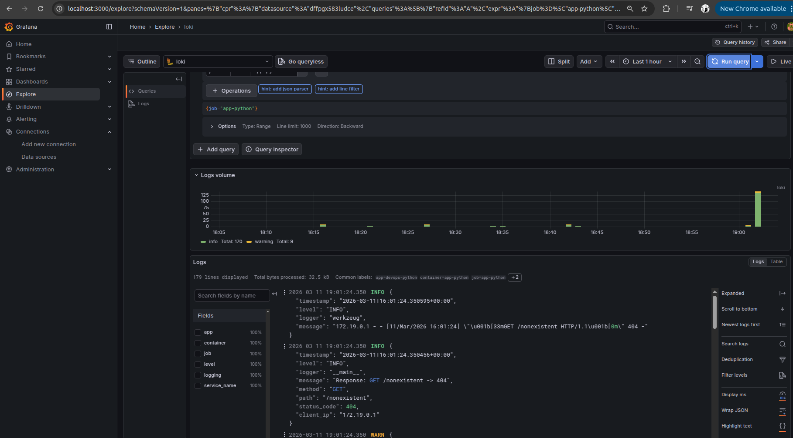
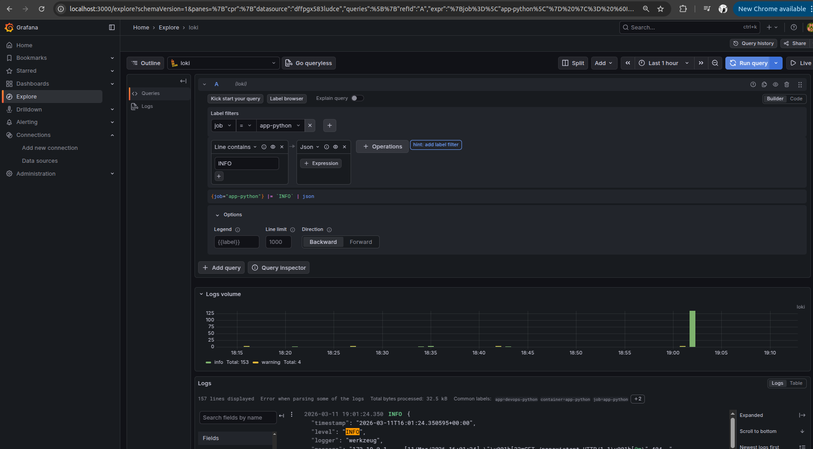
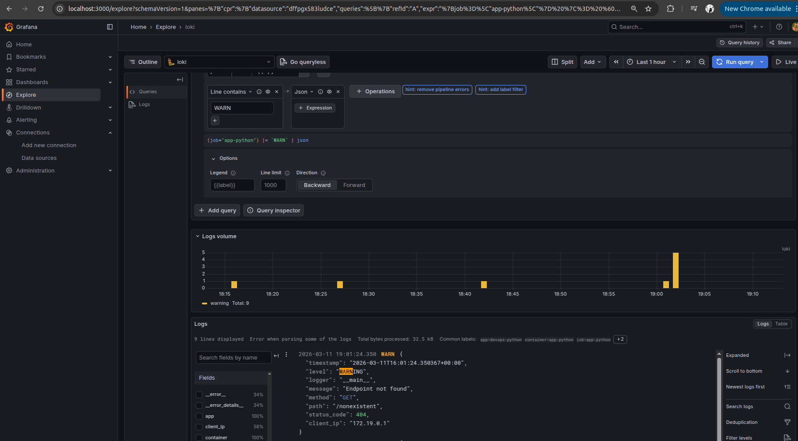
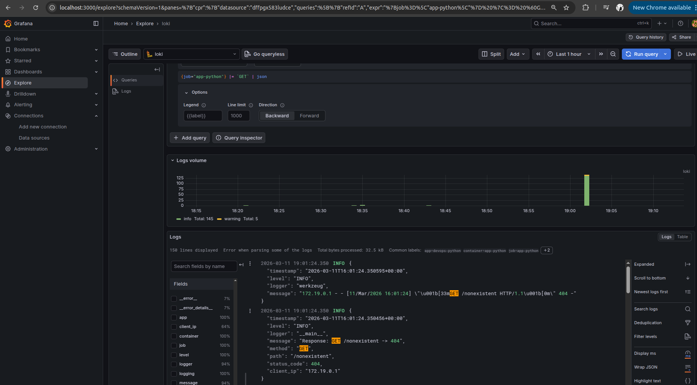
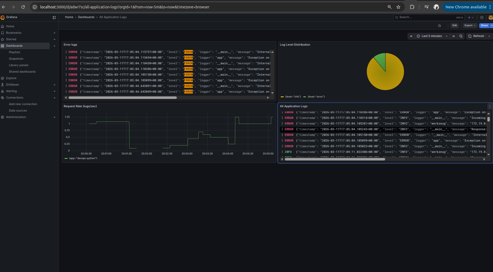
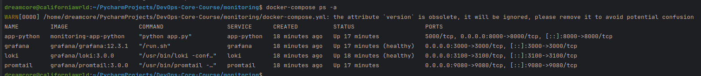
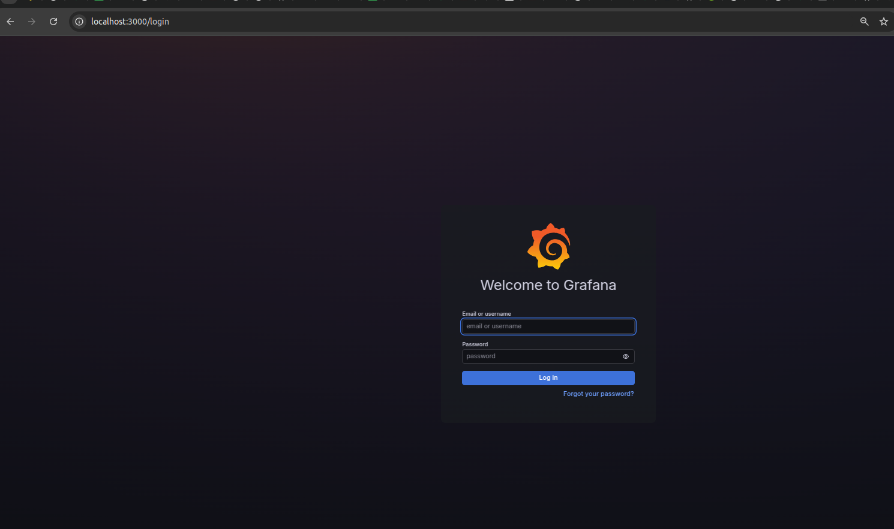

# Lab 7 — Observability & Logging with Loki Stack
## 1. Architecture

```
┌──────────────┐         ┌──────────────┐         ┌──────────────┐
│  app-python  │         │   Promtail   │  push   │    Loki      │
│  :8000       │────────▶│   :9080      │────────▶│    :3100     │
│  (Flask app) │  stdout │  (collector) │  HTTP   │  (TSDB store)│
└──────────────┘         └──────┬───────┘         └──────┬───────┘
                                │                        │
                                │ Docker socket          │ LogQL
                                │ /var/run/docker.sock   │ queries
                                │                        │
                         ┌──────┴───────┐         ┌──────▼───────┐
                         │   Docker     │         │   Grafana    │
                         │   Engine     │         │   :3000      │
                         └──────────────┘         │  (dashboard) │
                                                  └──────────────┘
```
### Data Flow

1. **app-python** writes JSON logs to stdout
2. **Docker Engine** captures container stdout/stderr
3. **Promtail** discovers containers via Docker socket, reads logs, adds labels
4. **Promtail** pushes log entries to **Loki** via HTTP (`/loki/api/v1/push`)
5. **Loki** stores logs using TSDB index + filesystem chunks
6. **Grafana** queries Loki using LogQL and renders dashboards

### Key Differences from Elasticsearch

| Feature | Loki | Elasticsearch |
|---------|------|---------------|
| Indexing | Only labels (metadata) | Full-text indexing |
| Storage | Lightweight, compressed chunks | Heavy index files |
| Query | LogQL (label + line filter) | Lucene / KQL |
| Resources | Low memory footprint | RAM-hungry |

---

## 2. Setup Guide

### Prerequisites

- Docker Engine 20.10+
- Docker Compose v2

### Deployment

```bash
# Clone the repository
git clone https://github.com/blazingSummerSun/DevOps-Core-Course.git
cd DevOps-Core-Course/monitoring

# Create .env file for Grafana credentials
cp .env.example .env
# Edit .env — set your own GF_ADMIN_PASSWORD

# Start the stack
docker compose up -d --build

# Verify all services
docker compose ps
```

### Verify Services

```bash
# Loki readiness
curl http://localhost:3100/ready
# Expected: ready

# Promtail targets
curl http://localhost:9080/targets

# App health
curl http://localhost:8000/health

# Grafana health
curl http://localhost:3000/api/health
```

### Configure Grafana Data Source

1. Open http://localhost:3000
2. Login with credentials from `.env`
3. **Connections** → **Data sources** → **Add data source** → **Loki**
4. URL: `http://loki:3100`
5. Click **Save & Test** → "Data source connected"

---

## 3. Configuration

### Loki (monitoring/loki/config.yml)

**TSDB Storage** — Loki 3.0 recommended index type, up to 10x faster than boltdb-shipper:

```yaml
schema_config:
  configs:
    - from: "2024-01-01"
      store: tsdb
      object_store: filesystem
      schema: v13
      index:
        prefix: index_
        period: 24h
```

**Retention** — 7-day log retention with automated compactor cleanup:

```yaml
limits_config:
  retention_period: 168h

compactor:
  working_directory: /loki/compactor
  compaction_interval: 10m
  retention_enabled: true
  retention_delete_delay: 2h
```

**Why these choices:**
- `schema: v13` — latest schema for Loki 3.0+
- `tsdb` — faster queries, lower memory vs boltdb-shipper
- `filesystem` — suitable for single-instance deployments
- `168h` retention — keeps 1 week of logs, prevents disk exhaustion

### Promtail (monitoring/promtail/config.yml)

**Docker Service Discovery** — auto-discovers containers via Docker socket:

```yaml
scrape_configs:
  - job_name: docker
    docker_sd_configs:
      - host: unix:///var/run/docker.sock
        refresh_interval: 5s
        filters:
          - name: label
            values: ["logging=promtail"]
```

**Relabeling** — extracts meaningful labels from Docker metadata:

```yaml
relabel_configs:
  - source_labels: ["__meta_docker_container_name"]
    regex: "/?(.*)"
    target_label: "container"
  - source_labels: ["__meta_docker_container_label_app"]
    target_label: "app"
```

**Why these choices:**
- Docker SD with `filters` — only scrape containers with `logging=promtail` label
- Relabeling removes leading `/` from container names
- `app` label extracted from Docker container labels for LogQL filtering

---

## 4. Application Logging

### JSON Structured Logging

Implemented a custom `JSONFormatter` class for Python's `logging` module:

```python
class JSONFormatter(logging.Formatter):
    def format(self, record):
        log_entry = {
            "timestamp": datetime.now(timezone.utc).isoformat(),
            "level": record.levelname,
            "logger": record.name,
            "message": record.getMessage(),
        }
        for field in ("method", "path", "status_code",
                       "client_ip", "user_agent", "service"):
            if hasattr(record, field):
                log_entry[field] = getattr(record, field)
        return json.dumps(log_entry)
```

### Logged Events

| Event | Level | Extra Fields |
|-------|-------|-------------|
| App startup | INFO | service, method="STARTUP" |
| Incoming request | INFO | method, path, client_ip, user_agent |
| Response sent | INFO | method, path, status_code, client_ip |
| 404 Not Found | WARNING | method, path, status_code, client_ip |
| 500 Server Error | ERROR | method, path, status_code, client_ip |

### Example Log Output

```json
{
  "timestamp": "2026-03-11T16:31:15.893947+00:00",
  "level": "WARNING",
  "logger": "__main__",
  "message": "Endpoint not found",
  "method": "GET",
  "path": "/nonexistent",
  "status_code": 404,
  "client_ip": "172.19.0.1"
}
```

### Why JSON?

- **Parseable by Loki** — `| json` parser extracts all fields
- **Structured queries** — `| json | method="GET" | status_code=404`
- **No regex needed** — fields are first-class data, not buried in text

---

## 5. Dashboard

### Panel 1: All Application Logs

- **Type:** Logs
- **Query:** `{app=~"devops-.*"}`
- **Purpose:** Shows all recent log entries from application containers
- Useful for real-time log tailing and troubleshooting

### Panel 2: Request Rate (logs/sec)

- **Type:** Time series
- **Query:** `sum by (app) (rate({app=~"devops-.*"} [1m]))`
- **Purpose:** Tracks request volume over time
- Spikes indicate increased traffic or potential issues

### Panel 3: Error & Warning Logs

- **Type:** Logs
- **Query:** `{app=~"devops-.*"} | json | level=~"ERROR"`
- **Purpose:** Filtered view showing only problematic log entries
- Quick way to spot issues without noise from INFO logs

### Panel 4: Log Level Distribution

- **Type:** Pie chart
- **Query:** `sum by (level) (count_over_time({app=~"devops-.*"} | json [5m]))`
- **Purpose:** Visual breakdown of log levels (INFO, WARNING, ERROR)
- Healthy app should show mostly INFO with minimal WARNING/ERROR

---

## 6. Production Config

### Resource Limits

| Service | CPU Limit | Memory Limit | CPU Reserved | Memory Reserved |
|---------|-----------|-------------|-------------|----------------|
| Loki | 1.0 | 1G | 0.25 | 256M |
| Promtail | 0.5 | 512M | 0.1 | 128M |
| Grafana | 1.0 | 512M | 0.25 | 256M |
| app-python | 0.5 | 256M | 0.1 | 128M |

### Security

- **Grafana**: Anonymous auth disabled (`GF_AUTH_ANONYMOUS_ENABLED=false`)
- **Admin password**: Stored in `.env` file, not committed to Git
- **`.env.example`**: Provided as template for new developers
- **Docker socket**: Mounted read-only (`:ro`) — Promtail cannot modify containers

### Log Retention

- **Period**: 168 hours (7 days)
- **Compactor**: Runs every 10 minutes, deletes expired logs after 2h delay
- **Storage**: Named volume `loki-data` persists across restarts

### Restart Policy

All services use `restart: unless-stopped` for automatic recovery.

---

## 7. Testing

### Service Health

```bash
# All services running
docker compose ps

# Loki ready
curl http://localhost:3100/ready

# Grafana healthy
curl http://localhost:3000/api/health

# App responding
curl http://localhost:8000/health

# Promtail targets
curl http://localhost:9080/targets
```

### Generate Test Logs

```bash
# Normal traffic
for i in {1..20}; do curl -s http://localhost:8000/ > /dev/null; done
for i in {1..20}; do curl -s http://localhost:8000/health > /dev/null; done

# 404 errors (WARNING logs)
for i in {1..5}; do curl -s http://localhost:8000/nonexistent > /dev/null; done

# 500 error
for i in {1..5}; do curl -s http://localhost:8000/error > /dev/null; done
```

### Verify Logs in Loki API

```bash
# Check available labels
curl -s http://localhost:3100/loki/api/v1/labels | python3 -m json.tool

# Check app label values
curl -s http://localhost:3100/loki/api/v1/label/app/values | python3 -m json.tool
```

### LogQL Queries

```logql
# All app logs
{app="devops-python"}

# JSON parsing + field filter
{app="devops-python"} | json | method="GET"

# Only warnings and errors
{app="devops-python"} | json | level=~"WARNING|ERROR"

# Filter by path
{app="devops-python"} | json | path="/health"

# Request rate metric
rate({app="devops-python"}[1m])

# Log count by level
sum by (level) (count_over_time({app="devops-python"} | json [5m]))
```

---

## 8. Challenges

| Problem | Cause | Solution |
|---------|-------|----------|
| Promtail fails to start: `read-only file system` | Docker Desktop (macOS/Linux) doesn't expose `/var/lib/docker/containers` on host | Removed `/var/lib/docker/containers` volume mount; Docker SD reads logs via socket API |
| `curl localhost:9080` refused | Promtail port 9080 not exposed in docker-compose | Added `ports: - "9080:9080"` to promtail service |
| No logs in Grafana for `{job="docker"}` | Promtail relabel renames `job` to container name | Used correct labels: `{app="devops-python"}` or `{job="app-python"}` |
| App logs not in JSON format | Container built from cached image with old `app.py` | Rebuilt with `docker compose up -d --build` |


## Screenshot showing logs from at least 3 containers in Grafana Explore.





## Sample of logs
```
dreamcore@californiawrld:~/PycharmProjects/DevOps-Core-Course/monitoring$ docker logs app-python
{"timestamp": "2026-03-11T16:00:06.063333+00:00", "level": "INFO", "logger": "__main__", "message": "Application starting", "method": "STARTUP", "path": "/", "service": "devops-info-service"}
 * Serving Flask app 'app'
 * Debug mode: off
{"timestamp": "2026-03-11T16:00:06.076571+00:00", "level": "INFO", "logger": "werkzeug", "message": "\u001b[31m\u001b[1mWARNING: This is a development server. Do not use it in a production deployment. Use a production WSGI server instead.\u001b[0m\n * Running on all addresses (0.0.0.0)\n * Running on http://127.0.0.1:8000\n * Running on http://172.19.0.5:8000"}
{"timestamp": "2026-03-11T16:00:06.076625+00:00", "level": "INFO", "logger": "werkzeug", "message": "\u001b[33mPress CTRL+C to quit\u001b[0m"}
{"timestamp": "2026-03-11T16:01:02.389358+00:00", "level": "INFO", "logger": "__main__", "message": "Incoming request: GET /", "method": "GET", "path": "/", "client_ip": "172.19.0.1", "user_agent": "curl/7.81.0"}
{"timestamp": "2026-03-11T16:01:02.389784+00:00", "level": "INFO", "logger": "__main__", "message": "Response: GET / -> 200", "method": "GET", "path": "/", "status_code": 200, "client_ip": "172.19.0.1"}
{"timestamp": "2026-03-11T16:01:02.389990+00:00", "level": "INFO", "logger": "werkzeug", "message": "172.19.0.1 - - [11/Mar/2026 16:01:02] \"GET / HTTP/1.1\" 200 -"}
{"timestamp": "2026-03-11T16:01:02.395219+00:00", "level": "INFO", "logger": "__main__", "message": "Incoming request: GET /", "method": "GET", "path": "/", "client_ip": "172.19.0.1", "user_agent": "curl/7.81.0"}
{"timestamp": "2026-03-11T16:01:02.395424+00:00", "level": "INFO", "logger": "__main__", "message": "Response: GET / -> 200", "method": "GET", "path": "/", "status_code": 200, "client_ip": "172.19.0.1"}
{"timestamp": "2026-03-11T16:01:02.395578+00:00", "level": "INFO", "logger": "werkzeug", "message": "172.19.0.1 - - [11/Mar/2026 16:01:02] \"GET / HTTP/1.1\" 200 -"}
{"timestamp": "2026-03-11T16:01:02.400362+00:00", "level": "INFO", "logger": "__main__", "message": "Incoming request: GET /", "method": "GET", "path": "/", "client_ip": "172.19.0.1", "user_agent": "curl/7.81.0"}
{"timestamp": "2026-03-11T16:01:02.400586+00:00", "level": "INFO", "logger": "__main__", "message": "Response: GET / -> 200", "method": "GET", "path": "/", "status_code": 200, "client_ip": "172.19.0.1"}
{"timestamp": "2026-03-11T16:01:02.400733+00:00", "level": "INFO", "logger": "werkzeug", "message": "172.19.0.1 - - [11/Mar/2026 16:01:02] \"GET / HTTP/1.1\" 200 -"}
{"timestamp": "2026-03-11T16:01:02.405844+00:00", "level": "INFO", "logger": "__main__", "message": "Incoming request: GET /", "method": "GET", "path": "/", "client_ip": "172.19.0.1", "user_agent": "curl/7.81.0"}
{"timestamp": "2026-03-11T16:01:02.406023+00:00", "level": "INFO", "logger": "__main__", "message": "Response: GET / -> 200", "method": "GET", "path": "/", "status_code": 200, "client_ip": "172.19.0.1"}
{"timestamp": "2026-03-11T16:01:02.406156+00:00", "level": "INFO", "logger": "werkzeug", "message": "172.19.0.1 - - [11/Mar/2026 16:01:02] \"GET / HTTP/1.1\" 200 -"}
{"timestamp": "2026-03-11T16:01:02.410994+00:00", "level": "INFO", "logger": "__main__", "message": "Incoming request: GET /", "method": "GET", "path": "/", "client_ip": "172.19.0.1", "user_agent": "curl/7.81.0"}
{"timestamp": "2026-03-11T16:01:02.411181+00:00", "level": "INFO", "logger": "__main__", "message": "Response: GET / -> 200", "method": "GET", "path": "/", "status_code": 200, "client_ip": "172.19.0.1"}
{"timestamp": "2026-03-11T16:01:02.411321+00:00", "level": "INFO", "logger": "werkzeug", "message": "172.19.0.1 - - [11/Mar/2026 16:01:02] \"GET / HTTP/1.1\" 200 -"}
{"timestamp": "2026-03-11T16:01:02.416172+00:00", "level": "INFO", "logger": "__main__", "message": "Incoming request: GET /", "method": "GET", "path": "/", "client_ip": "172.19.0.1", "user_agent": "curl/7.81.0"}
{"timestamp": "2026-03-11T16:01:02.416358+00:00", "level": "INFO", "logger": "__main__", "message": "Response: GET / -> 200", "method": "GET", "path": "/", "status_code": 200, "client_ip": "172.19.0.1"}
```

## Logs from Grafana
Since I haven't done extra task in lab 1, I only have logs from 1 application:


## 3 different queries
### {job = "app-python"} |= "INFO" | json


### {job = "app-python"} |= "WARN" | json


### {job = "app-python"} |= "GET" | json


## Dashboards


## docker-compose ps showing all services healthy


## Screenshot of Grafana login page (no anonymous access)
