## 1) Architecture

### Metric flow (pull model)

```mermaid
flowchart LR
  A[Python App (Flask)\nexposes /metrics on :8000] -->|HTTP GET /metrics (scrape)| P[Prometheus\n:9090]
  L[Loki\n:3100] -->|/metrics scrape| P
  G[Grafana\n:3000] -->|/metrics scrape| P
  P -->|PromQL queries| GF[Grafana Dashboards]

  subgraph Docker Compose Network
    A
    P
    GF
    L
    G
  end
```

**How it works (high level):**
- The application **exposes** Prometheus metrics at `GET /metrics`.
- Prometheus **pulls (scrapes)** metrics on a schedule (default configured to **15s**).
- Grafana **queries Prometheus** using **PromQL** and visualizes the results in dashboards.

---

## 2) Application Instrumentation

### What was added

The Python Flask application was instrumented using `prometheus_client` and exposes a `/metrics` endpoint.

**HTTP metrics (RED method):**
- **Rate:** `http_requests_total` *(Counter)*
- **Errors:** `http_requests_total{status=~"5.."}` *(subset of the same Counter)*
- **Duration:** `http_request_duration_seconds` *(Histogram)*
- **Concurrency / saturation signal:** `http_requests_in_progress` *(Gauge)*

**Application-specific metrics:**
- `devops_info_endpoint_calls` *(Counter)* — counts calls per logical endpoint
- `devops_info_system_collection_seconds` *(Histogram)* — measures time spent collecting system info for responses

### Why these metric types

- **Counter** is ideal for counting events that only go up (requests, endpoint calls). It is required for accurate `rate()` and `increase()` computations.
- **Histogram** captures **latency distributions**, enabling percentile calculations (p95/p99) with `histogram_quantile()`.
- **Gauge** represents **current state** (requests in progress) that can go up or down.

### Labeling approach (cardinality)

To avoid high cardinality and TSDB overload:
- Labels are limited to bounded sets: `method`, `endpoint`, `status`.
- `endpoint` is normalized to a stable route pattern when possible (avoid using user IDs, IPs, query params as labels).

---

## 3) Prometheus Configuration

### Scrape targets (jobs)

Prometheus is configured to scrape the following targets:

- **prometheus** (self-scrape): `localhost:9090`
- **app**: `app-python:8000` (`/metrics`)
- **loki**: `loki:3100` (`/metrics`)
- **grafana**: `grafana:3000` (`/metrics`)

### Scrape interval

- `scrape_interval: 15s`
- `evaluation_interval: 15s`

This provides a good balance between freshness and overhead for a lab environment.

### Retention policy

Retention is configured via Prometheus runtime flags:

- `--storage.tsdb.retention.time=15d` (keep 15 days of metrics)
- `--storage.tsdb.retention.size=10GB` (cap TSDB storage at 10GB)

**Why retention matters:**
- prevents unbounded disk growth
- improves query performance (smaller dataset)
- provides predictable resource usage for production-like operation

---

## 4) Dashboard Walkthrough (Custom Application Dashboard)

A custom Grafana dashboard was created using Prometheus as a data source (`http://prometheus:9090`).
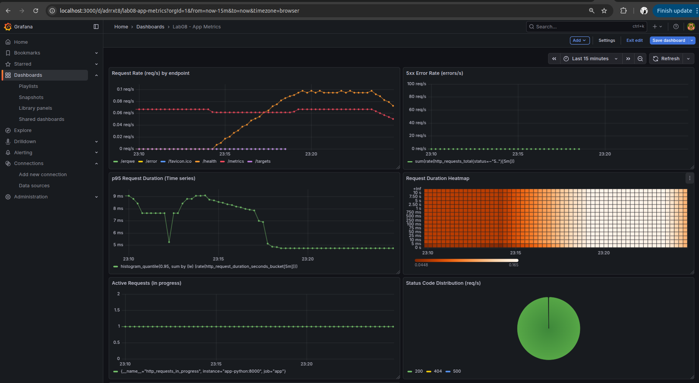
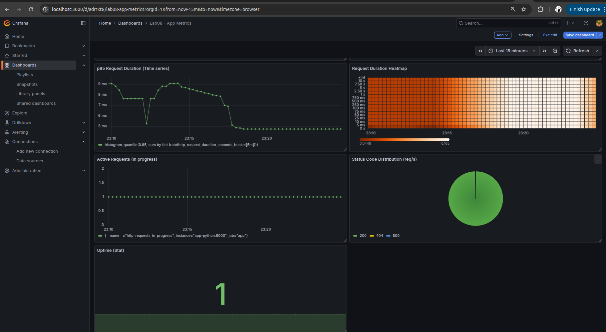


### Panel 1 — Request Rate (req/s) by endpoint
**Purpose:** Shows traffic volume per endpoint (Rate in RED).  
**Query:**
```promql
sum by (endpoint) (rate(http_requests_total[5m]))
```

### Panel 2 — 5xx Error Rate (errors/s)
**Purpose:** Detects server-side failures (Errors in RED).  
**Query:**
```promql
sum(rate(http_requests_total{status=~"5.."}[5m]))
```

### Panel 3 — Request Duration p95 (seconds)
**Purpose:** Tracks tail latency (Duration in RED).  
**Query:**
```promql
histogram_quantile(0.95, sum by (le) (rate(http_request_duration_seconds_bucket[5m])))
```

### Panel 4 — Request Duration Heatmap
**Purpose:** Visualizes full latency distribution over time.  
**Query:**
```promql
sum by (le) (rate(http_request_duration_seconds_bucket[5m]))
```

### Panel 5 — Active Requests (in progress)
**Purpose:** Shows current concurrency / saturation signal.  
**Query:**
```promql
http_requests_in_progress
```

### Panel 6 — Status Code Distribution (req/s)
**Purpose:** Shows the distribution of responses by status class (2xx/4xx/5xx).  
**Query:**
```promql
sum by (status) (rate(http_requests_total[5m]))
```

### Panel 7 — App Uptime (Up/Down)
**Purpose:** Confirms that Prometheus is successfully scraping the app target.  
**Query:**
```promql
up{job="app"}
```

---

## 5) PromQL Examples (5+)

Below are example PromQL queries used to validate the RED method and service health.

1) **Service health (targets up/down)**
```promql
up
```
**Explanation:** Returns `1` if a target is scrapeable and responding; `0` if down.

2) **Request rate (overall)**
```promql
sum(rate(http_requests_total[5m]))
```
**Explanation:** Total requests per second across all endpoints and status codes.

3) **Request rate by endpoint (traffic split)**
```promql
sum by (endpoint) (rate(http_requests_total[5m]))
```
**Explanation:** Identifies the busiest endpoints.

4) **5xx error rate**
```promql
sum(rate(http_requests_total{status=~"5.."}[5m]))
```
**Explanation:** Server-side errors per second.

5) **Error ratio (5xx as a fraction of all traffic)**
```promql
sum(rate(http_requests_total{status=~"5.."}[5m]))
/
sum(rate(http_requests_total[5m]))
```
**Explanation:** Error rate as a ratio (multiply by 100 for percent).

6) **Latency p95**
```promql
histogram_quantile(0.95, sum by (le) (rate(http_request_duration_seconds_bucket[5m])))
```
**Explanation:** 95th percentile request latency derived from histogram buckets.

7) **Concurrency**
```promql
http_requests_in_progress
```
**Explanation:** Number of requests currently being processed (useful for overload detection).

---

## 6) Production Setup (Hardening)

### Health checks

Health checks were added to ensure containers are monitored by Docker and reported as `healthy` only when functional.

- **Prometheus:** `GET /-/healthy`
- **App:** `GET /health` (implemented in the app)
- **Loki:** `GET /ready`
- **Grafana:** `GET /api/health`
- **Promtail:** HTTP endpoint check is omitted since the image does not include common tooling

> Note: Some minimal images do not ship with `curl`. In such cases the healthcheck uses `wget` or a Python one-liner to avoid adding extra packages.

### Resource limits

Resource limits were configured for production-like safety:

- Prometheus: **1 CPU**, **1G RAM**
- Loki: **1 CPU**, **1G RAM**
- Grafana: **0.5 CPU**, **512M RAM**
- App: **0.5 CPU**, **256M RAM**
- Promtail: limited to a small footprint (recommended)

### Retention policies

Prometheus retention is enforced via TSDB flags:

- time retention: **15 days**
- size retention: **10GB**

### Persistent volumes

Named volumes are used so data survives restarts:

- `prometheus-data` → `/prometheus`
- `loki-data` → `/loki`
- `grafana-data` → `/var/lib/grafana`

---

## 7) Testing Results (Screenshots)

These screenshots provided below (9th step)

Required evidence:
- Screenshot: Grafana custom dashboard showing **6+ panels** with live data
- Screenshot: Prometheus `/targets` page showing all targets **UP**
- Screenshot: a successful PromQL query (e.g., `up`, request rate, p95)
- Screenshot: `docker compose ps` showing all containers **healthy**

Suggested additions:
- Screenshot: `curl http://localhost:8000/metrics` output (shows exported metric names)

---

## 8) Challenges & Solutions

### Issue 1 — Prometheus failed to start due to config parsing errors
**Symptom:** Prometheus container exited with YAML parse errors related to retention fields.  
**Root cause:** The Prometheus build used in the lab did not support `storage.tsdb.retention_*` fields in the YAML config.  
**Fix:** Remove retention from `prometheus.yml` and configure retention via runtime flags:
- `--storage.tsdb.retention.time=15d`
- `--storage.tsdb.retention.size=10GB`

### Issue 2 — App target returned 404 during scraping
**Symptom:** Prometheus `/targets` showed `app` target `DOWN` with `404 NOT FOUND`.  
**Root cause:** Prometheus could reach the service, but the metrics endpoint path was incorrect or the app container was not rebuilt with the new `/metrics` route.  
**Fix:** Ensure the app exposes `GET /metrics` and rebuild/recreate the app container so the updated code is running.

### Issue 3 — Containers reported `unhealthy` because `curl` was missing
**Symptom:** `docker compose ps` showed `unhealthy` for services with curl-based healthchecks.  
**Root cause:** Minimal container images may not include `curl`.  
**Fix:** Use `wget` where available, or a Python one-liner in the app container, instead of requiring curl.

---

## 9) Metrics vs Logs (Lab 7 comparison)

Both logs and metrics are required for complete observability:

- **Metrics** answer “how much/how often/how long?”  
  Examples: request rate, error rate, p95 latency, in-progress requests.

- **Logs** answer “what happened and why?” (context and details)  
  Examples: stack traces, error messages, request metadata, debug context.

**Best practice:** Use metrics to detect and quantify issues quickly (dashboards/alerts), then use logs (Loki) to investigate the root cause.


# Output of /metrics endpoint
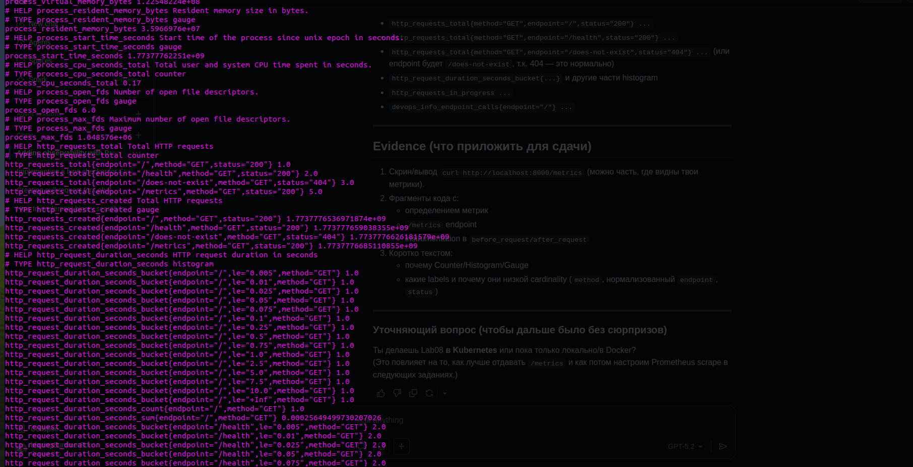
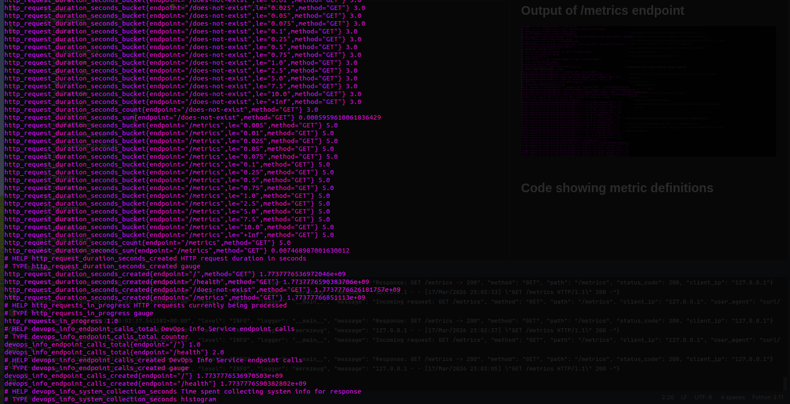
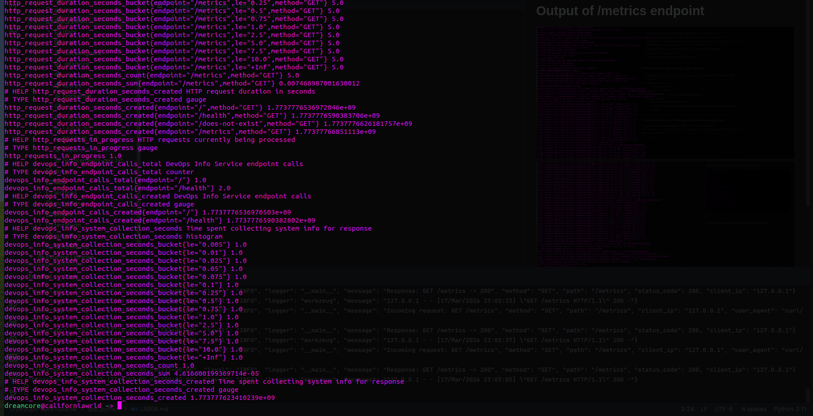
# Code showing metric definitions
```python
from prometheus_client import Counter, Histogram, Gauge

http_requests_total = Counter(
    "http_requests_total",
    "Total HTTP requests",
    ["method", "endpoint", "status"],
)

http_request_duration_seconds = Histogram(
    "http_request_duration_seconds",
    "HTTP request duration in seconds",
    ["method", "endpoint"],
)

http_requests_in_progress = Gauge(
    "http_requests_in_progress",
    "HTTP requests currently being processed",
)

devops_info_endpoint_calls = Counter(
    "devops_info_endpoint_calls",
    "DevOps Info Service endpoint calls",
    ["endpoint"],
)

devops_info_system_collection_seconds = Histogram(
    "devops_info_system_collection_seconds",
    "Time spent collecting system info for response",
)
```

## Monitoring approach: RED method

For request-driven applications, we follow the **RED method**:

- **Rate** — how many requests the service handles (requests/second)
- **Errors** — how many requests fail (error rate)
- **Duration** — how long requests take (latency distribution)

The HTTP metrics below are chosen specifically to support these three dimensions.

---

## Selected metrics and rationale

### 1) `http_requests_total` — Counter (Rate + Errors)

**Type:** `Counter`  
**Why:** A counter is ideal for counting discrete events (HTTP requests). It only increases, which makes it safe and accurate for rate calculations using PromQL functions like `rate()` and `increase()`.

**What it measures:** Total number of HTTP requests processed.

**Labels:**
- `method` — distinguish HTTP methods (GET/POST/etc.)
- `endpoint` — distinguish routes/handlers (kept low-cardinality by using normalized route patterns when possible)
- `status` — HTTP response status code (e.g., `200`, `404`, `500`) for error rate calculations

**How it supports RED:**
- **Rate:** `rate(http_requests_total[5m])`
- **Errors:** filter by `status` (e.g., `status=~"5.."`) to compute error rates

---

### 2) `http_request_duration_seconds` — Histogram (Duration)

**Type:** `Histogram`  
**Why:** Latency must be tracked as a **distribution**, not just an average. Histograms support percentile-style queries (p95/p99) in Prometheus via `histogram_quantile()`, which is essential for SLO-style monitoring and detecting tail latency.

**What it measures:** Duration of HTTP request handling (seconds).

**Labels:**
- `method`
- `endpoint`

**How it supports RED:**
- **Duration:** p95/p99 latency can be queried from histogram buckets.

---

### 3) `http_requests_in_progress` — Gauge (Current load / saturation signal)

**Type:** `Gauge`  
**Why:** A gauge can go up and down and therefore represents current state. In-progress requests is a real-time indicator of concurrency and potential overload (saturation).

**What it measures:** Number of HTTP requests currently being processed.

**Labels:** none  
**Reason for no labels:** Avoid unnecessary cardinality and keep the metric stable. Per-endpoint “in progress” gauges can multiply time series and are typically not required for a baseline lab.

---

## Application-specific (business) metrics

### 4) `devops_info_endpoint_calls` — Counter (feature usage)

**Type:** `Counter`  
**Why:** This is a higher-level usage metric tracking which service endpoint is being used from a business perspective (beyond generic HTTP). It helps validate adoption and correlate load with specific features.

**Labels:**
- `endpoint` — logical endpoint name (kept low-cardinality)

---

### 5) `devops_info_system_collection_seconds` — Histogram (internal operation latency)

**Type:** `Histogram`  
**Why:** In addition to overall HTTP latency, measuring the duration of key internal operations helps isolate where time is spent. Using a histogram provides visibility into variability and tail latency of this internal work.

**What it measures:** Time spent collecting system information for the response (seconds).

---

## Labeling and cardinality best practices

To keep Prometheus performant and dashboards usable, labels are intentionally limited:

- **No high-cardinality labels** (e.g., user IDs, client IPs, request IDs, query parameters).
- `endpoint` is **normalized** to a stable route pattern whenever possible (e.g., `/users/<id>` instead of `/users/123`).
- Labels are restricted to small, bounded sets: `method`, `endpoint`, `status`.

This provides actionable metrics while preventing unbounded time series growth.

##  Screenshot of /targets page showing all targets UP
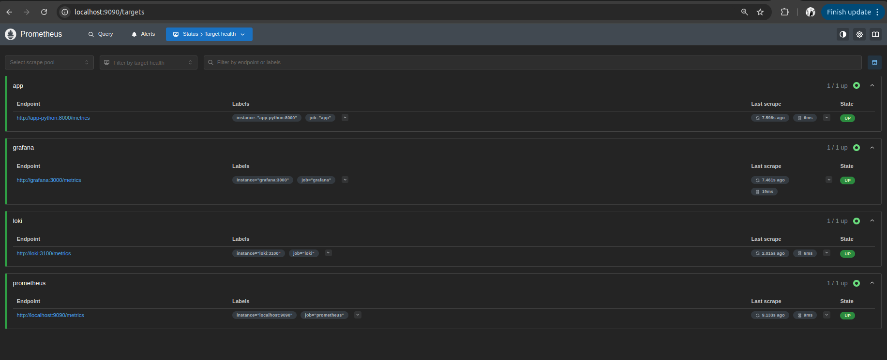

## Screenshot of a successful PromQL query
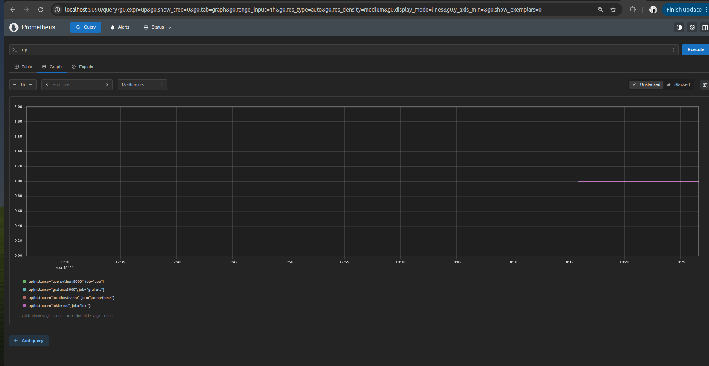

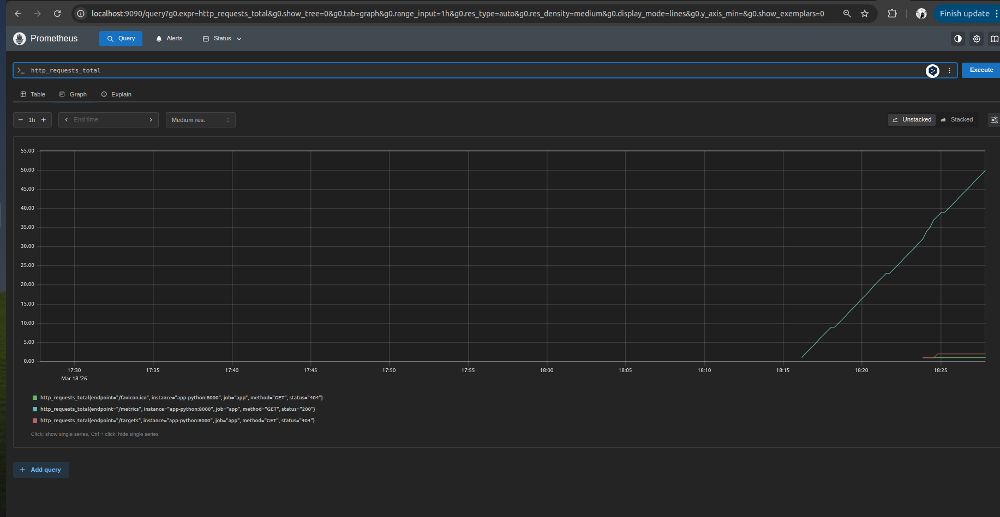

## prometheus.yml configuration file
```yaml
global:
  scrape_interval: 15s
  evaluation_interval: 15s

scrape_configs:
  # Scrape Prometheus itself
  - job_name: "prometheus"
    static_configs:
      - targets: ["localhost:9090"]

  # Scrape Python app metrics
  - job_name: "app"
    metrics_path: "/metrics"
    static_configs:
      - targets: ["app-python:8000"]

  # Scrape Loki metrics
  - job_name: "loki"
    metrics_path: "/metrics"
    static_configs:
      - targets: ["loki:3100"]

  # Scrape Grafana metrics
  - job_name: "grafana"
    metrics_path: "/metrics"
    static_configs:
      - targets: ["grafana:3000"]
```

## Screenshot of your custom application dashboard with live data
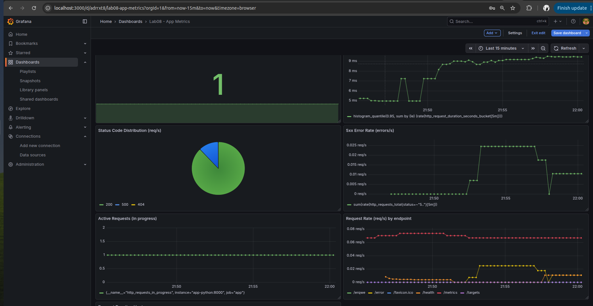

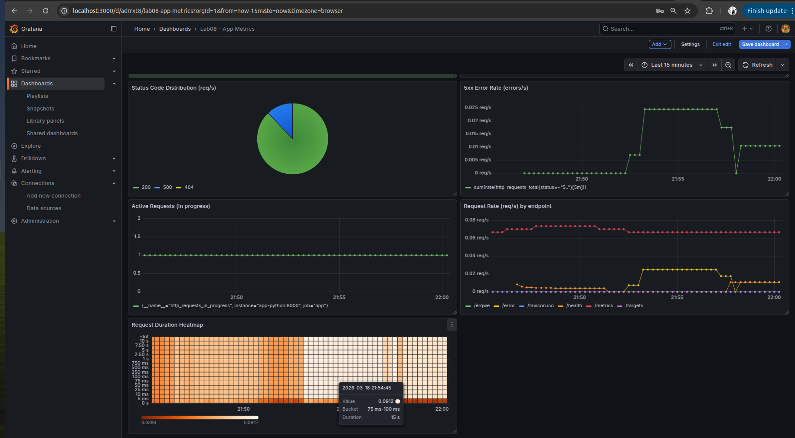

## Exported dashboard JSON file
[dashboard.json](../../app_python/dashboard.json)

## All services are healthy
* except promtail since there were only templates for app-python and prometheus
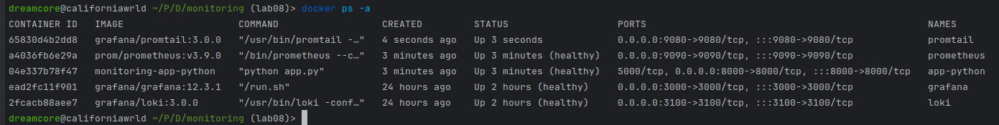

## Documentation of retention policies (Prometheus)

### Prometheus retention configuration

Prometheus stores metrics in its local TSDB (time-series database). To prevent unbounded disk usage and keep query performance stable, retention is explicitly configured via Prometheus startup flags (not inside `prometheus.yml`).

Configured flags in `monitoring/docker-compose.yml` for the `prometheus` service:

- `--storage.tsdb.retention.time=15d`
  - Keep time series data for **15 days**.
- `--storage.tsdb.retention.size=10GB`
  - Limit the TSDB storage to **10 GB** (Prometheus will delete older blocks to stay within the limit).

## Why retention matters

- **Disk space management:** without retention limits, TSDB can grow indefinitely and fill the host disk.
- **Query performance:** smaller datasets generally lead to faster queries and a more responsive UI.
- **Operational predictability:** retention makes storage usage predictable and easier to plan in production environments.

## Proof of persistence
- containers are running
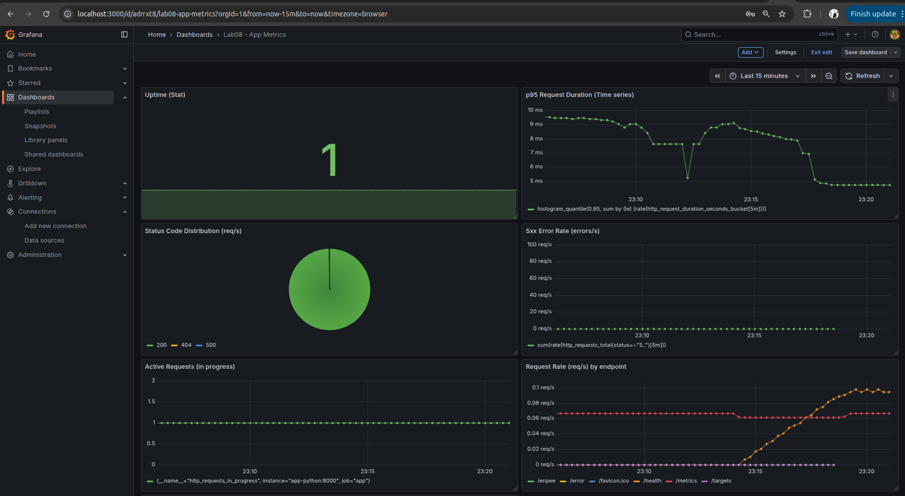

- dashboard still exists even after `docker-compose down` and `docker-compose up -d`
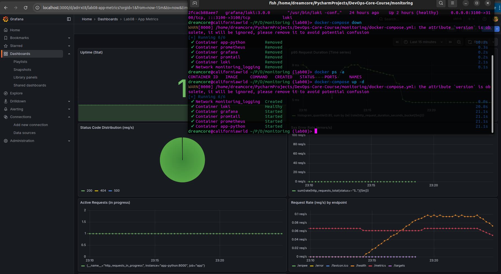